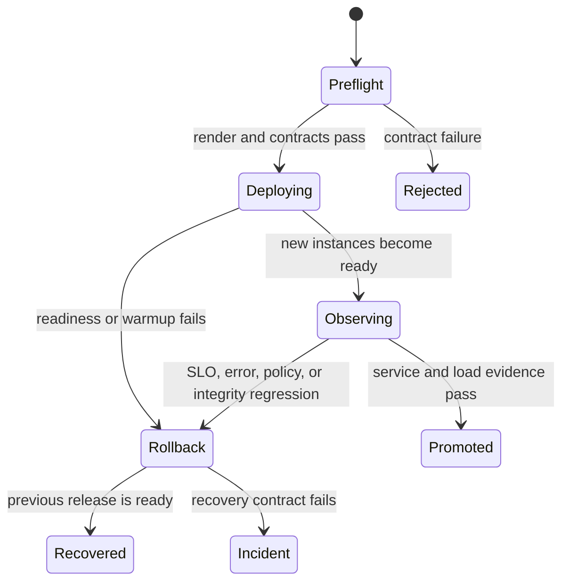

# Rollout Safety

A safe rollout preserves service admission, data availability, security
posture, and recovery authority while the running release changes. Atlas makes
these expectations profile-specific through
`ops/k8s/rollout-safety-contract.json`.

## Profile Safety Modes

| Profile | Delivery mode | Warmup required | Network policy | HPA |
| --- | --- | ---: | --- | --- |
| `ci` | Deployment | no | disabled | disabled |
| `dev` | Deployment | no | disabled | disabled |
| `kind` | Rollout | yes | cluster-aware | disabled |
| `offline` | Deployment | yes | disabled | disabled |
| `perf` | Rollout | no | cluster-aware | enabled |
| `prod` | Rollout | no | cluster-aware | enabled |

Every profile requires a readiness path. Kind requires warmup before promotion;
offline requires prewarming and pinned datasets while forbidding live-catalog
readiness. Performance requires a digest-pinned image and service monitoring.
Production requires HPA and cluster-aware dependency isolation.

## Workload Parity Gate

Atlas can render either a Kubernetes Deployment or an Argo Rollout. These are
different workload implementations, not interchangeable names. Before using a
rollout-enabled profile, prove that its rendered pod template includes the same
required runtime contract as the approved Deployment baseline:

- command and image digest;
- ConfigMap, Secret, and explicit environment sources;
- startup, readiness, and liveness probes;
- container and pod security contexts;
- cache, temporary, audit, and configuration volumes;
- service account, resource requests and limits, scheduling, and priority;
- drain configuration and termination grace period;
- labels and annotations consumed by Services, monitors, and policies.

The checked-in Rollout template is a separate render path and currently
exposes a smaller pod surface than the Deployment template. A
successful Helm render therefore does not establish workload parity. Treat a
rollout-enabled render as non-promotable when any required field above is
absent, even if the Argo controller accepts it. Use a Deployment profile until
the selected Rollout render proves the complete contract.

## Promotion State Machine

Do not promote on pod phase alone. Promotion requires readiness to stabilize,
traffic to reach the new release, expected telemetry to arrive, and the
selected load or resilience evidence to remain inside budget.

The default canary sequence sends 10% traffic, pauses for 60 seconds, sends 50%,
then pauses for 120 seconds. Those values are routing instructions, not an
observation policy. A profile must declare enough request volume and time at
each weight to exercise cheap, heavy, error, and dataset-resolution paths. Low
traffic may require longer pauses or synthetic probes to produce meaningful
evidence.

## Decision Gates

| Gate | Required state | Failure action |
| --- | --- | --- |
| preflight | versions, digests, values, render, policy, and rollback target resolve | reject before mutation |
| admission | workloads schedule with intended identity, security, and dependencies | hold or remove candidate |
| readiness | candidate completes profile-specific startup and enters endpoints | roll back or diagnose readiness |
| traffic | representative request classes reach the candidate | hold; do not infer behavior from idle pods |
| observation | correctness, latency, errors, saturation, and telemetry remain acceptable | drain candidate and roll back |
| recovery | previous release restores traffic and dataset behavior | escalate to incident response |

Each gate has a different rollback cost. Rejecting at preflight avoids cluster
mutation. Failing after traffic shift requires preserving candidate-scoped
signals before draining it. Recovery failure ends the routine rollout path.

## Protect Capacity During Overlap

For a candidate fraction \(w\), observed candidate request rate should be close
to \(w \times R\), where \(R\) is the total request rate for the same route
class. Use this check to prove that service routing actually exercised the
candidate. Compare per-release counts rather than assuming the controller's
declared weight became traffic.

Rollout overlap consumes old and new capacity simultaneously. Check that:

- the cluster can schedule the peak combined replica set;
- PDB and controller availability rules do not deadlock progress;
- HPA signals distinguish candidate saturation from aggregate fleet health;
- cache warmup does not exhaust store, network, memory, or ephemeral-storage
  budgets;
- termination grace exceeds the server drain requirement and any in-flight
  request deadline.

Do not reduce old capacity until the candidate has both readiness and
representative traffic. A ready but cold candidate can shift load into store
fetches and fail only after the previous replicas have already drained.

## Observe During Change

Track at least:

- ready, live, draining, and overload states by release identity;
- request rate, error rate, latency distributions, and heavy-work shedding;
- restart, scheduling, image-pull, and dependency failures;
- warmup and catalog discovery progress where required;
- HPA decisions, replica availability, and PDB constraints;
- audit, authentication, and network-policy failures;
- store integrity and dataset-resolution errors.

Compare the new and previous releases over the same observation window. A
global average can hide a failing candidate behind healthy old replicas.

Every request, metric, log, and trace used for a promotion decision needs a
candidate or baseline release identity. If route-level signals cannot be split
by release, the canary is not observable enough to support promotion.

## Rollback Triggers

Begin rollback when the candidate cannot become ready within the declared
window, loses required policy or configuration, violates latency or error
budgets, cannot resolve governed datasets, or causes cheap-path survival to
fail under load. Also roll back when required telemetry is absent: an
unobservable candidate is not safe to promote.

Stop automatic rollback and escalate to incident response when the previous
release cannot recover, shared data or catalog state may be damaged, or the
rollback would violate a known compatibility boundary.

Rollback is not safe when the previous runtime cannot consume the current
configuration, catalog, or dataset state. Resolve those compatibility
directions during preflight. If shared state changed unexpectedly, freeze the
state and investigate rather than cycling releases.

## Isolate the Rollout Decision

A rollback can restore a workload revision; it cannot reliably undo an
unrelated catalog promotion, credential rotation, admission-policy change, or
storage mutation. Freeze independent control-plane changes from preflight
until the release is promoted or recovered. This preserves one causal change
and one usable rollback target.

| Concurrent change | Default during rollout | Exception proof |
| --- | --- | --- |
| catalog or dataset publication | freeze the active pointer and published object set | publication is the explicit release subject and both compatibility directions are proven |
| credential or trust-root rotation | keep overlap credentials valid | old and new releases authenticate throughout overlap and revocation has a separate gate |
| NetworkPolicy or admission policy | freeze policy revision | policy change is isolated in the rendered diff and denial telemetry is release-scoped |
| autoscaling policy or resource limits | keep the approved capacity model | the rollout is the capacity experiment and abort thresholds account for overlap |
| cache purge or store maintenance | defer until recovery is complete | the action is required to recover and its store-load budget is independently bounded |

If an emergency change breaks this freeze, record its exact time and identity,
hold promotion, and restart the observation window after the system reaches a
known state. Do not attribute a clean aggregate metric to the candidate when
multiple authorities changed underneath it.

## Required Record

Preserve the baseline and target release identities, selected profile, rendered
diff, conformance report, rollout timestamps, probe transitions, relevant
metrics and traces, rollback decision, and final service state. For an upgrade
or rollback claim, the install matrix must also declare the corresponding
lifecycle scenario.

See [Health Readiness and Drain](../observability/health-readiness-and-drain.md)
for endpoint semantics and [Rollout Under Load](../load/rollout-under-load.md)
for traffic evidence.
