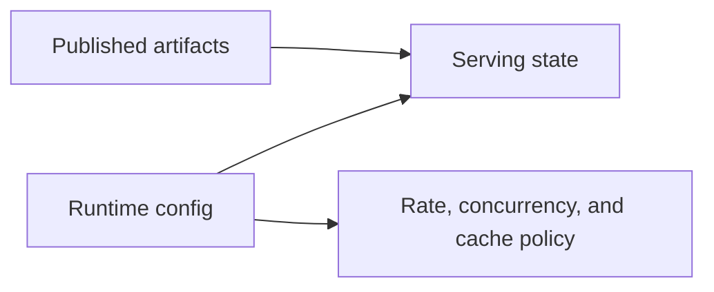
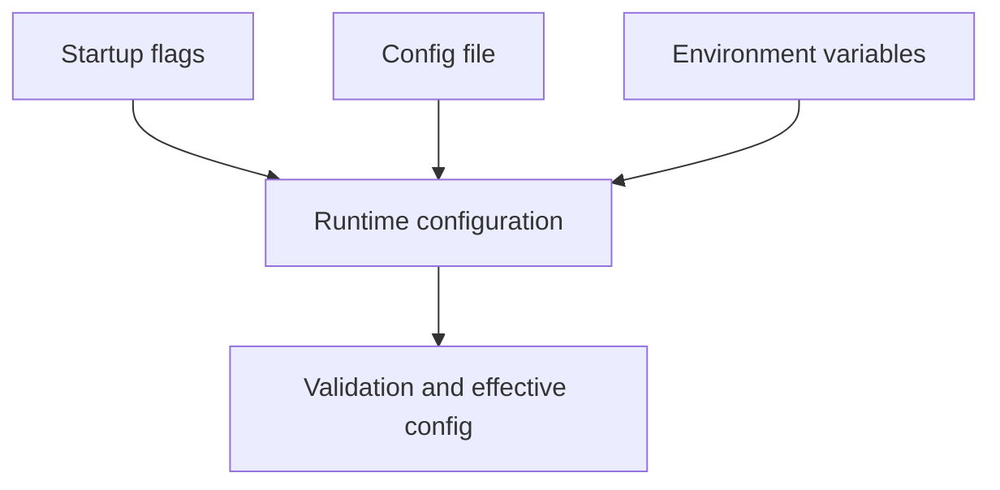

# Runtime Configuration

Runtime configuration controls how Atlas serves, limits, caches, logs, and responds. It does not redefine the content of published artifacts.

That separation matters because operators often have two different failure modes:

- trying to fix data-shape problems with runtime flags
- hiding runtime mistakes behind environment-specific defaults

## Runtime Config Boundary



This boundary diagram shows the line Atlas wants operators to keep clear. Published artifacts define
release content; runtime configuration defines how the server exposes and protects that content.

## The Main Rule

Do not mix runtime configuration with release content configuration.

- published artifacts define what data exists
- runtime config defines how the server behaves around that data
- config should be explicit enough that another operator can explain the running behavior without guessing hidden environment state

## Configuration Inputs



This configuration-input map exists so operators can reason about precedence and visibility. The key
goal is that a running instance should be explainable from explicit inputs rather than hidden host
defaults.

## Operational Practices

- validate config before rollout when possible
- prefer explicit paths and values over environment-dependent assumptions
- keep cache roots and artifact roots clearly separated
- inspect effective config when behavior is surprising
- treat changes to limits, readiness behavior, or cache policy as operational changes that deserve rollout discipline

## Example Runtime Validation

```bash
cargo run -p bijux-atlas --bin bijux-atlas-server -- \
  --store-root artifacts/getting-started/tiny-store \
  --cache-root artifacts/getting-started/server-cache \
  --validate-config
```

## Runtime Config Questions to Ask

- where is the serving store root?
- where does the cache live?
- what are the active runtime limits?
- what logging and telemetry sinks are active?
- how will readiness and overload behave under stress?

## What Runtime Config Cannot Fix

- missing or unpublished dataset artifacts
- incorrect upstream source data
- compatibility changes that should have been handled in contracts or migration paths

## A Good Runtime-Config Check Before Rollout

- can another operator explain the store root, cache root, limits, and telemetry settings?
- can the instance validate the supplied config before serving traffic?
- can you distinguish a config error from a data or catalog error quickly?

## Purpose

This page explains the Atlas material for runtime configuration and points readers to the canonical checked-in workflow or boundary for this topic.

## Source of Truth

- `ops/k8s/charts/bijux-atlas/values.yaml`
- `ops/k8s/charts/bijux-atlas/values.schema.json`
- `ops/k8s/values/profiles.json`
- `ops/k8s/values/documentation-map.json`
- `ops/k8s/tests/manifest.json`

## Runtime Concern Map

| Runtime concern | Owning values area | Main validation path |
| --- | --- | --- |
| cache location and warmup behavior | `cache`, `catalog`, `datasetWarmupJob` | values schema, profile toggles, dataset and readiness checks |
| readiness and probe behavior | `probes`, `server`, `rollout` | render output, readiness tests, rollout review |
| concurrency, limits, and scaling | `resources`, `hpa`, `sequenceRateLimits` | schema validation, autoscaling checks, load evidence |
| metrics and telemetry exposure | `metrics`, `serviceMonitor`, `alertRules` | render output, observability object tests, dashboard and alert review |
| network and identity assumptions | `networkPolicy`, `serviceAccount`, `rbac` | schema validation, security review, conformance tests |

## Invalid Change Patterns

Examples of changes that should be rejected or escalated:

- enabling `image.tag` based promotion in profiles that expect digest-based
  identity
- changing `cache` behavior to cached-only without also satisfying the related
  readiness and warmup expectations
- widening `networkPolicy` or `rbac` in a runtime-focused change that claims to
  be unrelated to security
- changing `probes` or `rollout` behavior without corresponding readiness and
  rollout evidence

## Environment Override Rules

- keep shared defaults in `values.yaml`
- put supported environment intent in the profile values files under
  `ops/k8s/values/`
- avoid silent host- or cluster-specific drift outside those governed values
  files
- treat `ci`, `kind`, `offline`, `perf`, and `prod` as different runtime
  contracts, not cosmetic overlays

## Configuration Drift Validation

Use this path whenever runtime behavior changes or starts to look suspicious:

1. compare the selected profile file to `values.yaml`
2. validate the merged values against `values.schema.json`
3. render and validate the manifests through the Kubernetes control-plane
   targets
4. confirm the relevant runtime tests in `ops/k8s/tests/manifest.json` still
   cover the changed keys
5. use observability and load evidence when the change affects serving behavior

## Stability

This page is part of the canonical Atlas docs spine. Keep it aligned with the current repository behavior and adjacent contract pages.
