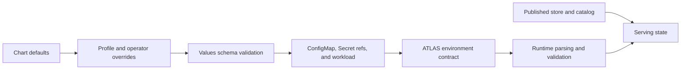
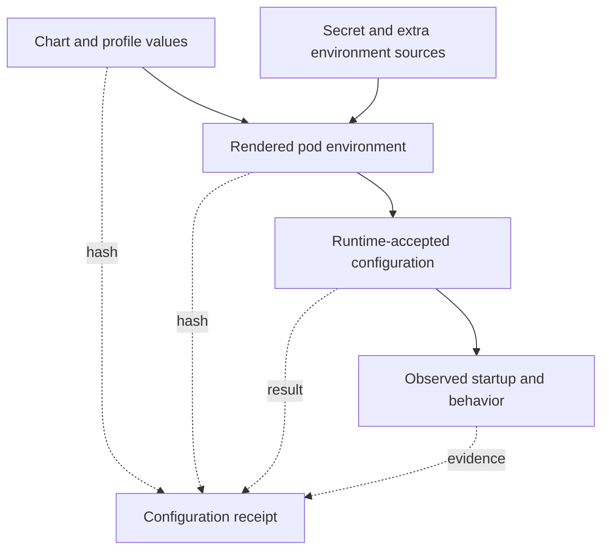

# Runtime Configuration

Kubernetes values control how Atlas exposes and protects published datasets;
they do not change the contents of those datasets. Treat artifact identity and
runtime behavior as separate release inputs.

```mermaid
flowchart LR
    Defaults[Chart defaults] --> Merge[Profile and operator overrides]
    Merge --> Schema[Values schema validation]
    Schema --> Render[ConfigMap, Secret refs, and workload]
    Render --> Env[ATLAS environment contract]
    Env --> Startup[Runtime parsing and validation]
    Artifacts[Published store and catalog] --> Serve[Serving state]
    Startup --> Serve
```

## Authority and Precedence

| Layer | Authority | What it decides |
| --- | --- | --- |
| chart defaults | `ops/k8s/charts/bijux-atlas/values.yaml` | repository default deployment behavior |
| accepted shape | `values.schema.json` | types, enums, required structure, and invalid combinations |
| profile intent | `ops/k8s/values/*.yaml` | supported environment-specific overrides |
| rendered mapping | `templates/configmap.yaml` and workload templates | which values become runtime environment variables |
| runtime contract | `configs/schemas/contracts/env.schema.json` and runtime config code | accepted variables, parsing, defaults, and invariants |

Later Helm values override earlier values. The rendered environment is then
parsed by the server. A value accepted by Helm is not operationally effective
unless the template maps it to the runtime contract.

The chart retains compatibility aliases for cache readiness fields. When both
exist, `cache.cachedOnlyMode` overrides `server.cachedOnlyMode`, and
`cache.readinessRequiresCatalog` overrides
`server.readinessRequiresCatalog`. Avoid setting both locations differently;
the rendered ConfigMap is the decisive view.

Log level requires special attention. The runtime environment contract lists
both `ATLAS_LOG_LEVEL` and `BIJUX_LOG_LEVEL`, while the checked-in ConfigMap
template emits neither. If a deployment needs an explicit level, add the
runtime-consumed key through a reviewed environment source and confirm it in
the effective pod specification. Schema membership alone does not prove that
the chart emits a key or that the server consumes both names identically.

## High-Impact Controls

| Concern | Values | Rendered runtime input | Operational consequence |
| --- | --- | --- | --- |
| admin routes | `server.adminEndpoints.enabled` | `ATLAS_ENABLE_ADMIN_ENDPOINTS` | registers recovery and failure-control routes |
| catalog gate | `server.readinessRequiresCatalog` or cache alias | `ATLAS_READINESS_REQUIRES_CATALOG` | controls whether catalog availability gates readiness |
| cached-only serving | `server.cachedOnlyMode` or cache alias | `ATLAS_CACHED_ONLY_MODE` | changes catalog and cache expectations |
| request budget | `server.requestTimeoutMs` | `ATLAS_REQUEST_TIMEOUT_MS` | bounds request processing time |
| query budget | `server.sqlTimeoutMs` | `ATLAS_SQL_TIMEOUT_MS` | bounds database work |
| response guard | `server.responseMaxBytes` | `ATLAS_RESPONSE_MAX_BYTES` | rejects oversized responses |
| debug datasets | `server.enableDebugDatasets` | `ATLAS_ENABLE_DEBUG_DATASETS` | exposes development-oriented dataset behavior |
| read-only mode | `server.readOnlyFsMode` | `ATLAS_READ_ONLY_FS_MODE` | constrains runtime filesystem assumptions |

Profile differences are contractual. For example, `ci`, `offline`, and
`prod-airgap` select cached-only behavior without catalog-gated readiness;
`perf` uses `/healthz/overload` and different response and SQL budgets; `local`
uses `/healthz` and enables debug datasets. Do not describe these overlays as
cosmetic environment names.

## Classify Configuration Changes

The same YAML edit can have very different runtime consequences. Classify the
change before choosing rollout evidence:

| Class | Examples | Required proof |
| --- | --- | --- |
| admission | authentication mode, admin endpoints, network policy | unauthorized and authorized request behavior; policy isolation |
| dataset availability | store endpoint, cached-only mode, pinned datasets, catalog readiness | cold start, cache miss, catalog loss, and dataset identity checks |
| resource protection | request, SQL, body, response, sequence, and rate limits | boundary requests plus cheap-path survival under rejected heavy work |
| process lifecycle | probes, warmup, drain, termination grace | startup, endpoint transition, in-flight drain, and restart evidence |
| observability | audit, exemplars, metrics monitor, tracing sink | required signals arrive with release and request identity; secrets are redacted |
| capacity | replicas, resources, HPA, PDB, cache sizes | saturation, scaling, eviction, and disruption evidence |

Configuration that crosses classes needs the union of their proofs. A parser
success is necessary but never sufficient for a behavior or capacity change.

## Restart and Rotation Semantics

The ConfigMap is consumed through `envFrom`; environment variables are fixed
when the container starts. Updating the ConfigMap does not reconfigure an
existing Atlas process. A configuration release therefore needs a new pod
template identity or an explicit restart mechanism, followed by verification
that every serving replica uses the intended effective values.

Secret references have the same environment-variable constraint when consumed
as `secretKeyRef`. Rotating the Kubernetes Secret object alone does not update
an already-running process. Plan overlap so old and new credentials remain
valid across the rollout, then prove that old credentials can be revoked after
all old replicas drain.

Mounted configuration may have different filesystem update behavior, but the
server must explicitly reload it before a live update has effect. Unless a
specific reload contract is documented and observed, treat mounted changes as
restart-required.

## Secrets and Mounted Configuration

`envFromSecrets` references Kubernetes Secrets; `configMounts` adds governed
configuration mounts; `extraEnv` adds individual environment entries. These
escape hatches widen the effective configuration beyond the primary values
table. Review them for secret exposure, unknown variables, precedence
collisions, and portability before promotion.

The rendered ConfigMap contains non-secret runtime values. It must not become a
place to embed credentials. Secret references need their own rotation and
access evidence.

Because `extraEnv` is rendered after the ConfigMap reference, duplicate names
can shadow ConfigMap-provided values in the container environment. Reject
duplicates unless the override is the reviewed intent and appears in the
configuration receipt. Prefer one authoritative source for each runtime key.

## Pre-Rollout Proof

1. Merge the selected profile with chart defaults.
2. Validate the result against `values.schema.json`.
3. Render the chart and inspect the ConfigMap, Secret references, probes,
   Service, and workload environment.
4. Confirm every rendered `ATLAS_*` key is accepted by the runtime environment
   contract and that unknown keys fail.
5. Run the server's `--validate-config` path with the intended effective
   environment before serving traffic.
6. When limits, probes, cache, or catalog behavior changes, attach the focused
   readiness, load, or rollout evidence for that concern.
7. Confirm the workload template changes when restart-required configuration
   changes, and verify the effective values on every candidate replica.

Configuration is ready for promotion only when the values source, rendered
environment, runtime parser, and observed behavior agree.

## Effective Configuration Receipt

Retain a configuration receipt with the deployment evidence:

| Identity | Required value |
| --- | --- |
| source | chart version or digest and selected values-file hashes |
| render | Helm version, complete invocation, and rendered-manifest hash |
| workload | image digest, ConfigMap identity, Secret references, and service account |
| runtime | accepted `ATLAS_*` keys and configuration-validation result |
| behavior | probe, limit, cache, catalog, and security observations affected by the change |

Do not place secret values in the receipt. Record Secret names, keys, versions,
or provider identities according to the environment's disclosure policy. The
receipt must let a reviewer reconstruct precedence without exposing
credentials.

```mermaid
flowchart TD
    Values[Chart and profile values] --> Rendered[Rendered pod environment]
    Secrets[Secret and extra environment sources] --> Rendered
    Rendered --> Parsed[Runtime-accepted configuration]
    Parsed --> Observed[Observed startup and behavior]
    Values -. hash .-> Receipt[Configuration receipt]
    Rendered -. hash .-> Receipt
    Parsed -. result .-> Receipt
    Observed -. evidence .-> Receipt
```

A mismatch stops rollout at the owning boundary. Fix values or templates when
rendering is wrong. Fix runtime configuration when parsing is wrong. Investigate
the workload when accepted configuration does not produce the expected
behavior.

## Diagnostic Questions

- Did the intended profile actually win the Helm merge?
- Does the rendered ConfigMap contain the expected effective value?
- Is a compatibility alias overriding the obvious `server` key?
- Is a Secret or `extraEnv` entry changing the same variable?
- Is the failure about runtime behavior, or about missing published catalog or
  store state that configuration cannot repair?

## Authorities

- `ops/k8s/charts/bijux-atlas/values.yaml`
- `ops/k8s/charts/bijux-atlas/values.schema.json`
- `ops/k8s/charts/bijux-atlas/templates/configmap.yaml`
- `ops/k8s/values/profiles.json`
- `ops/k8s/tests/manifest.json`
- `configs/schemas/contracts/env.schema.json`
