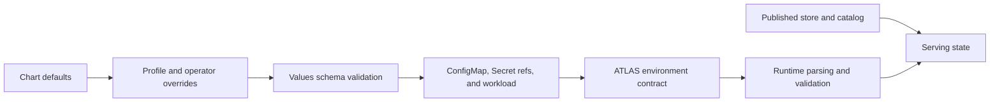

# Runtime Configuration

Kubernetes values control how Atlas exposes and protects published datasets;
they do not change the contents of those datasets. Treat artifact identity and
runtime behavior as separate release inputs.

```mermaid
flowchart LR
    Defaults[Chart defaults] --> Merge[Profile and operator overrides]
    Merge --> Schema[Values schema validation]
    Schema --> Render[ConfigMap, Secret refs, and workload]
    Render --> Env[ATLAS environment contract]
    Env --> Startup[Runtime parsing and validation]
    Artifacts[Published store and catalog] --> Serve[Serving state]
    Startup --> Serve
```

## Authority and Precedence

| Layer | Authority | What it decides |
| --- | --- | --- |
| chart defaults | `ops/k8s/charts/bijux-atlas/values.yaml` | repository default deployment behavior |
| accepted shape | `values.schema.json` | types, enums, required structure, and invalid combinations |
| profile intent | `ops/k8s/values/*.yaml` | supported environment-specific overrides |
| rendered mapping | `templates/configmap.yaml` and workload templates | which values become runtime environment variables |
| runtime contract | `configs/schemas/contracts/env.schema.json` and runtime config code | accepted variables, parsing, defaults, and invariants |

Later Helm values override earlier values. The rendered environment is then
parsed by the server. A value accepted by Helm is not operationally effective
unless the template maps it to the runtime contract.

The chart retains compatibility aliases for cache readiness fields. When both
exist, `cache.cachedOnlyMode` overrides `server.cachedOnlyMode`, and
`cache.readinessRequiresCatalog` overrides
`server.readinessRequiresCatalog`. Avoid setting both locations differently;
the rendered ConfigMap is the decisive view.

## High-Impact Controls

| Concern | Values | Rendered runtime input | Operational consequence |
| --- | --- | --- | --- |
| admin routes | `server.adminEndpoints.enabled` | `ATLAS_ENABLE_ADMIN_ENDPOINTS` | registers recovery and failure-control routes |
| catalog gate | `server.readinessRequiresCatalog` or cache alias | `ATLAS_READINESS_REQUIRES_CATALOG` | controls whether catalog availability gates readiness |
| cached-only serving | `server.cachedOnlyMode` or cache alias | `ATLAS_CACHED_ONLY_MODE` | changes catalog and cache expectations |
| request budget | `server.requestTimeoutMs` | `ATLAS_REQUEST_TIMEOUT_MS` | bounds request processing time |
| query budget | `server.sqlTimeoutMs` | `ATLAS_SQL_TIMEOUT_MS` | bounds database work |
| response guard | `server.responseMaxBytes` | `ATLAS_RESPONSE_MAX_BYTES` | rejects oversized responses |
| debug datasets | `server.enableDebugDatasets` | `ATLAS_ENABLE_DEBUG_DATASETS` | exposes development-oriented dataset behavior |
| read-only mode | `server.readOnlyFsMode` | `ATLAS_READ_ONLY_FS_MODE` | constrains runtime filesystem assumptions |

Profile differences are contractual. For example, `ci`, `offline`, and
`prod-airgap` select cached-only behavior without catalog-gated readiness;
`perf` uses `/healthz/overload` and different response and SQL budgets; `local`
uses `/healthz` and enables debug datasets. Do not describe these overlays as
cosmetic environment names.

## Secrets and Mounted Configuration

`envFromSecrets` references Kubernetes Secrets; `configMounts` adds governed
configuration mounts; `extraEnv` adds individual environment entries. These
escape hatches widen the effective configuration beyond the primary values
table. Review them for secret exposure, unknown variables, precedence
collisions, and portability before promotion.

The rendered ConfigMap contains non-secret runtime values. It must not become a
place to embed credentials. Secret references need their own rotation and
access evidence.

## Pre-Rollout Proof

1. Merge the selected profile with chart defaults.
2. Validate the result against `values.schema.json`.
3. Render the chart and inspect the ConfigMap, Secret references, probes,
   Service, and workload environment.
4. Confirm every rendered `ATLAS_*` key is accepted by the runtime environment
   contract and that unknown keys fail.
5. Run the server's `--validate-config` path with the intended effective
   environment before serving traffic.
6. When limits, probes, cache, or catalog behavior changes, attach the focused
   readiness, load, or rollout evidence for that concern.

Configuration is ready for promotion only when the values source, rendered
environment, runtime parser, and observed behavior agree.

## Diagnostic Questions

- Did the intended profile actually win the Helm merge?
- Does the rendered ConfigMap contain the expected effective value?
- Is a compatibility alias overriding the obvious `server` key?
- Is a Secret or `extraEnv` entry changing the same variable?
- Is the failure about runtime behavior, or about missing published catalog or
  store state that configuration cannot repair?

## Authorities

- `ops/k8s/charts/bijux-atlas/values.yaml`
- `ops/k8s/charts/bijux-atlas/values.schema.json`
- `ops/k8s/charts/bijux-atlas/templates/configmap.yaml`
- `ops/k8s/values/profiles.json`
- `ops/k8s/tests/manifest.json`
- `configs/schemas/contracts/env.schema.json`
