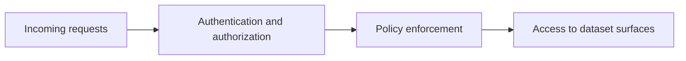
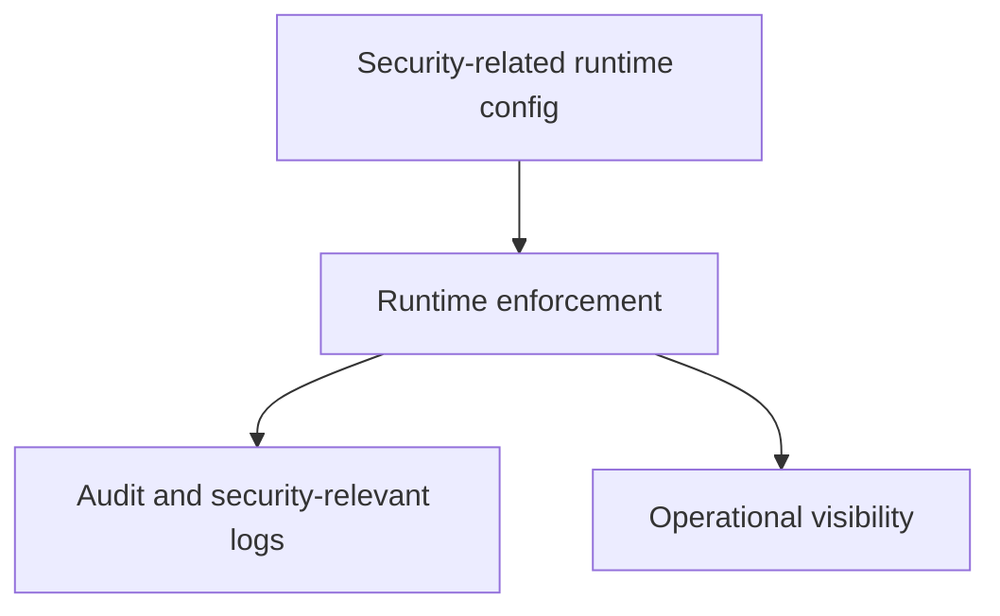

# Security Operations

Security operations in Atlas are about making runtime boundaries, authentication behavior, and sensitive data handling explicit and reviewable.

## Security Surface

This security surface diagram keeps request handling honest. Security decisions happen before access
to dataset surfaces, and they should be explainable from explicit runtime behavior rather than
deployment folklore.

## Security Operations Model

This operations model shows that security is not just about accepting or rejecting requests. It also
depends on configuration clarity, auditability, and the ability to observe the runtime safely.

## Operator Priorities

- understand which routes are intentionally exempt from auth
- understand how boundary identity headers are expected in proxied modes
- review policy and runtime config together, not in isolation
- treat logs and traces as part of security investigation, not only uptime investigation

## Practical Advice

- use explicit runtime configuration for security-sensitive behavior
- avoid undocumented assumptions about reverse proxies or header injection
- verify health routes and protected routes separately
- preserve auditability when diagnosing incidents

## Useful Security Checks

- confirm which routes are intentionally unauthenticated
- confirm which headers or proxy assumptions are required in your environment
- confirm that security-relevant logs are present before an incident happens

## Purpose

This page explains the Atlas material for security operations and points readers to the canonical checked-in workflow or boundary for this topic.

## Source of Truth

- `ops/k8s/profile-security-contract.json`
- `ops/k8s/admin-endpoints-exceptions.json`
- `ops/k8s/examples/networkpolicy/`
- `ops/k8s/values/profiles.json`
- `ops/k8s/values/prod-airgap.yaml`
- `ops/k8s/values/perf.yaml`

## What Is Governed

The Kubernetes security surface is governed by profile rules, network policy
examples, values restrictions, and explicit exception tracking. For example,
`ops/k8s/profile-security-contract.json` currently requires
`podSecurityContext.runAsNonRoot=true` for production-oriented profiles such as
`prod`, `prod-minimal`, `prod-ha`, and `prod-airgap`.

## Secure Deploy Checklist

- confirm the selected profile satisfies the profile security contract
- verify debug or admin surfaces are disabled unless there is a governed
  exception
- confirm the network policy mode matches the intended environment
- verify the service account and RBAC scope stayed aligned with the chart’s
  least-privilege assumptions
- confirm observability coverage exists for authentication, policy, and audit
  signals

## Secure Review Checklist

- inspect changes to `networkPolicy`, `serviceAccount`, `rbac`, `securityContext`,
  `podSecurityContext`, `envFromSecrets`, and `audit`
- review `ops/k8s/examples/networkpolicy/cluster-aware.yaml`,
  `custom.yaml`, `disabled.yaml`, and `internet-only.yaml` against the profile
  intent before allowing broader egress or ingress
- confirm any admin endpoint exception is explicit, bounded, and reviewed
- escalate high-risk profile changes in `perf`, `prod`, or air-gapped paths

## Security Incident Triage

When a security issue lands in the Kubernetes slice:

1. confirm whether the affected profile violated the security contract or used
   an approved exception
2. inspect the rendered network and identity resources
3. capture a debug bundle if cluster state may change during investigation
4. review observability evidence for audit trails and exposure scope
5. remove or expire temporary exceptions once the incident is contained

## Stability

This page is part of the canonical Atlas docs spine. Keep it aligned with the current repository behavior and adjacent contract pages.
