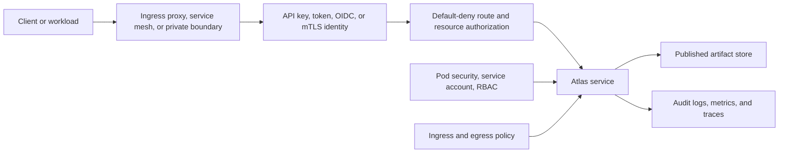
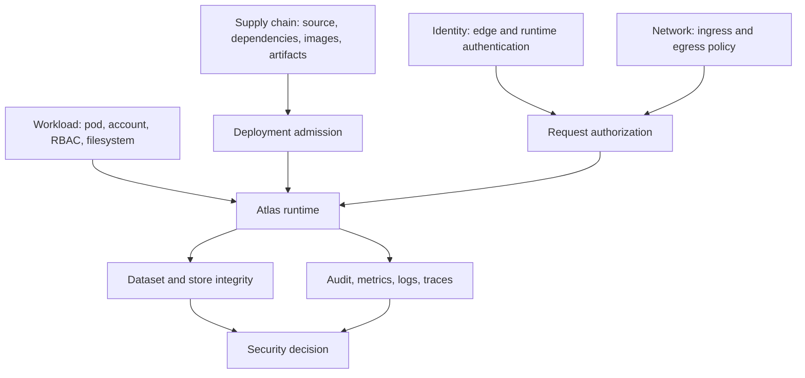
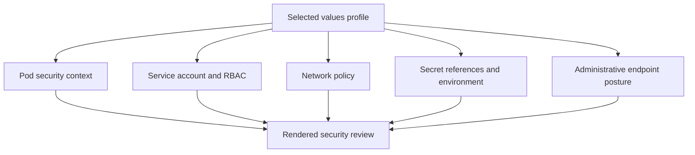

# Security Operations

Atlas security spans exposure, identity, authorization, workload confinement,
network policy, secret delivery, audit evidence, artifact integrity, and supply
chain controls. A secure deployment aligns all of these boundaries with one
named profile.

## Defense Boundaries

```mermaid
flowchart LR
    Client[Client or workload] --> Edge[Ingress proxy, service mesh, or private boundary]
    Edge --> Identity[API key, token, OIDC, or mTLS identity]
    Identity --> Authz[Default-deny route and resource authorization]
    Authz --> Runtime[Atlas service]
    Runtime --> Store[Published artifact store]
    Runtime --> Audit[Audit logs, metrics, and traces]
    Workload[Pod security, service account, RBAC] --> Runtime
    Network[Ingress and egress policy] --> Runtime
```

Atlas supports built-in authentication, but the declared default stance is an
internal service boundary. Deployments exposed beyond a private trusted network
must remain behind an ingress authentication proxy, service mesh, or equivalent
institutional control.

## Security Planes

```mermaid
flowchart TB
    Supply[Supply chain: source, dependencies, images, artifacts] --> Deploy[Deployment admission]
    Identity[Identity: edge and runtime authentication] --> Request[Request authorization]
    Network[Network: ingress and egress policy] --> Request
    Workload[Workload: pod, account, RBAC, filesystem] --> Runtime[Atlas runtime]
    Deploy --> Runtime
    Request --> Runtime
    Runtime --> Data[Dataset and store integrity]
    Runtime --> Evidence[Audit, metrics, logs, traces]
    Data --> Decision[Security decision]
    Evidence --> Decision
```

Each plane can fail independently. A signed image does not prove safe runtime
authorization. A default-deny policy does not prove secret custody. A confined
pod can still serve substituted dataset bytes. Qualification requires the
planes needed by the selected exposure model to agree.

## Follow a Control to Enforcement

Security intent can be lost between source policy and live behavior. Review
each required control through the complete chain instead of accepting one
artifact as proof for every boundary.

| Boundary | Question | Evidence |
| --- | --- | --- |
| declared. | Is the control present in the selected profile and policy sources? | Values, policy identity, exception ledger, and source digest. |
| rendered. | Did the merged inputs produce the intended workload and network objects? | Manifest inventory and semantic diff. |
| admitted. | Did the cluster accept the same security fields without mutation or rejection? | Admission response and stored object identity. |
| effective. | Does the running workload use the intended identity, privilege, reachability, and authorization? | Positive and negative live checks. |
| observable. | Can denied, allowed, rotated, and exceptional use be attributed? | Audit event, release identity, principal class, and correlation record. |
| recoverable. | Can the control be restored after rollback or credential revocation? | Reversal exercise and restored-state evidence. |

A gap at one boundary narrows the claim. For example, a rendered NetworkPolicy
proves configuration intent; only admission plus reachability tests prove the
selected cluster enforces it. Preserve the first boundary that disagrees so a
later live success does not hide configuration drift.

## Threat-to-Control Map

| Threat | Preventive boundary | Detection and retained evidence |
| --- | --- | --- |
| unauthenticated external access | private service exposure, edge identity, runtime auth mode | denied-request audit fields, ingress and runtime auth decisions |
| excessive principal authority | default-deny authorization and narrow service identities | principal, action, resource, route, and decision records |
| administrative route exposure | disabled route registration, isolated service path, governed exception | rendered flag, route probe, reachability test, exception expiry |
| workload escape or privilege | non-root security context, constrained service account and RBAC | rendered workload review and admission-policy result |
| unauthorized dependency access | ingress and egress policy plus backend credentials | policy inventory, rejected connections, backend audit records |
| artifact substitution | immutable manifests, hashes, signatures, and provenance | verifier result bound to image and dataset identities |
| secret disclosure | secret references, redaction, least privilege, and rotation | access audit and rotation record without secret material |

Security evidence must not reproduce credentials, bearer tokens, private keys,
or unredacted request content. Preserve identifiers, decision metadata, and
secret version references instead.

## Credential Lifecycle

Treat credential delivery as an operational lifecycle rather than a static
Secret reference:

| Boundary | Evidence |
| --- | --- |
| issuance | issuer, principal, scope, validity window, and non-secret version identity |
| delivery | Secret or provider reference, service account, mount or environment target |
| consumption | effective auth mode and successful least-privilege route tests |
| rotation | overlap policy, rollout identity, old-version rejection, and recovery path |
| revocation | revocation time, affected principals, cache behavior, and denied-request evidence |
| disposal | workload termination, volume or environment removal, and retention decision |

Never log credential values to prove rotation. Use version references and
controlled positive and negative authorization tests.

## Identity and Authorization

`ATLAS_AUTH_MODE` selects the runtime authentication mode. Supported models are
API key, token, OIDC, and mTLS. Authentication establishes the principal;
authorization evaluates principal, action, resource kind, and route.

| Route class | Action and resource | Allowed principals |
| --- | --- | --- |
| health, readiness, overload, metrics, version, OpenAPI | `catalog.read` on service namespace | authentication-exempt at the runtime route boundary |
| catalog and dataset queries | `catalog.read` or `dataset.read` | user, service account, operator, release automation |
| routes recognized by the runtime admin classifier | `ops.admin` on service namespace | runtime assigns the operator principal after the configured authentication checks |
| enabled routes missing from that classifier | currently fall through to `dataset.read` on dataset identity | must not be treated as safely authorized administrative routes |

The embedded policy defaults to deny. Invalid embedded authorization contracts
also fail closed. Authentication-exempt service routes still require network
exposure review because exemption changes application authorization, not who can
reach the service.

For release or exposure decisions, preserve an authorization trace rather than
only a route response: authentication mode, non-secret principal identity,
route class, action, resource kind and identity, policy version, allow or deny
verdict, request correlation, runtime release, and dataset identity where
applicable. The [Identity, Authorization, and Audit](../security/identity-authorization-and-audit.md)
guide defines the positive, negative, rotation, and audit-continuity cases.

## Administrative Surfaces

Debug, cluster, recovery, failure-injection, chaos, and echo routes are only
registered when administrative endpoints are enabled. The feature switch adds
26 routes as one group; it cannot enable a single bounded route.

The current authorization classifier does not cover the full registered set.
Replica listing, replica health, replica failover, replica diagnostics,
recovery execution, recovery diagnostics, failure injection, and chaos
execution are omitted from `route_is_admin_endpoint`. They therefore receive
the ordinary `dataset.read` action instead of `ops.admin`. In addition, routes
that are recognized as administrative are assigned the embedded `operator`
principal after the configured authentication checks; operator identity is not
derived from a distinct external role assertion at that point.

Treat this as an unresolved authorization boundary. Do not expose enabled
administrative routes through shared or public ingress. Network isolation and
route-specific positive and negative tests are mandatory evidence, not
compensating prose.

`ops/k8s/admin-endpoints-exceptions.json` is the exception ledger. An exception
must identify its scope, owner, justification, and expiry through the governed
contract. The committed ledger currently contains no exceptions.

## Kubernetes Workload Security

```mermaid
flowchart TD
    Profile[Selected values profile] --> Pod[Pod security context]
    Profile --> SA[Service account and RBAC]
    Profile --> Net[Network policy]
    Profile --> Secret[Secret references and environment]
    Profile --> Admin[Administrative endpoint posture]
    Pod --> Review[Rendered security review]
    SA --> Review
    Net --> Review
    Secret --> Review
    Admin --> Review
```

Production-oriented profiles—`prod`, `prod-minimal`, `prod-ha`, and
`prod-airgap`—must keep `podSecurityContext.runAsNonRoot=true`. Review changes
to container and pod security contexts, service accounts, RBAC, ingress,
network policy, secret references, volumes, and administrative endpoints as one
security boundary.

Air-gapped deployment adds a supply-chain requirement: images, charts,
artifacts, SBOMs, checksums, and verification tools must all be locally
available and pinned. “No runtime egress” is insufficient if installation or
verification quietly requires a network call.

## Secure Deployment Review

1. Resolve the exact profile and values files; do not review defaults in
   isolation from overlays.
2. Render the chart and inspect workload identity, privilege, mounts, secrets,
   ingress, and egress.
3. Confirm the authentication placement and `ATLAS_AUTH_MODE` match the network
   boundary.
4. Verify default-deny authorization and test service, dataset, and admin route
   classes separately.
5. Confirm admin endpoints are disabled. If an exception is proposed, compare
   the complete registered route set with the runtime authorization classifier
   and test every reachable route; the current classifier is incomplete.
6. Validate audit fields, authentication decisions, authorization decisions,
   and trace linkage before promotion.
7. Bind the rendered security evidence, policy snapshots, SBOMs, and artifact
   checksums into the release evidence set.

## Security Acceptance Boundary

A profile is not security-qualified merely because it renders or runs as
non-root. Qualification requires the selected exposure model, identity mode,
authorization policy, administrative-route posture, workload confinement,
network policy, secrets path, and artifact verification to agree. With the
current admin-classification gap, a profile enabling administrative endpoints
cannot claim complete route-level authorization from the embedded policy.
Any unverified boundary is a recorded exception or a failed promotion
condition; silence is not an implicit pass.

For every accepted boundary, retain both a preventive-control result and a
detection result. Rendered non-root settings are preventive evidence; admission
and live workload identity show enforcement. A policy file is preventive
intent; denied and permitted route tests plus audit events show behavior.

## Security Incident Containment

Preserve the rendered manifest, active profile, policy snapshots, audit logs,
trace IDs, and affected release identity before changing the deployment. Drain
or isolate the affected workload, revoke or narrow credentials at their owning
boundary, and distinguish policy failure from identity spoofing or network
exposure. Temporary exceptions must be governed and removed after containment.

Continue with [Admin Endpoint Exceptions](admin-endpoints-exceptions.md),
[Identity, Authorization, and Audit](../security/identity-authorization-and-audit.md),
[Data Protection and Cryptographic Custody](../security/data-protection-and-cryptographic-custody.md),
[Runtime Configuration](runtime-configuration.md), and
[Signing and Provenance](../release/signing-and-provenance.md).
