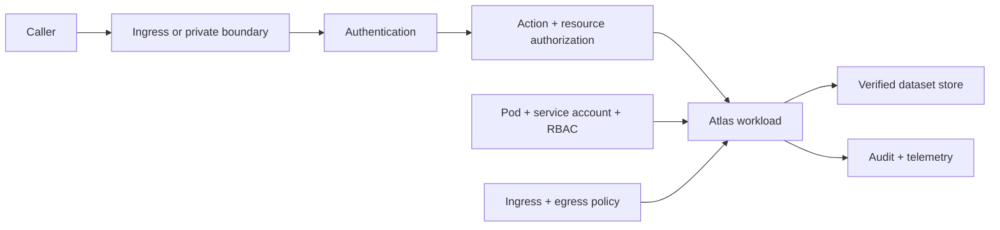

# Security operations

Atlas security is an end-to-end deployment property. Exposure, caller
identity, route authorization, workload identity, network policy, secret
delivery, dataset integrity, audit, and artifact trust must agree for one named
profile and target.

```mermaid
flowchart LR
    Client[Caller] --> Edge[Ingress or private boundary]
    Edge --> Identity[Authentication]
    Identity --> Authz[Action + resource authorization]
    Authz --> Runtime[Atlas workload]
    Runtime --> Store[Verified dataset store]
    Workload[Pod + service account + RBAC] --> Runtime
    Network[Ingress + egress policy] --> Runtime
    Runtime --> Audit[Audit + telemetry]
```

Built-in authentication does not turn a public deployment into a complete edge
security design. Exposure beyond a private trusted network requires a governed
ingress identity boundary, service mesh, or equivalent institutional control.

## Follow each control to live behavior

| Boundary | Question | Evidence |
| --- | --- | --- |
| declared | Does selected policy require the control? | Values, source digest, policy, and exception ledger |
| rendered | Did merged inputs create the intended objects? | Manifest inventory and semantic diff |
| admitted | Did the cluster accept the same claim-bearing fields? | Admission result and stored-object identity |
| effective | Does the workload use the intended identity, privilege, and reachability? | Live positive and negative checks |
| observable | Are allowed, denied, rotated, and exceptional actions attributable? | Correlated audit, logs, metrics, and traces |
| recoverable | Can rollback, revocation, or restoration re-establish the control? | Reversal exercise and restored-state evidence |

A rendered NetworkPolicy proves intent. Admission plus connectivity tests prove
the selected target enforced it. A denied request proves little without route,
principal, action, resource, policy, and audit identity.

## Keep principals separate

| Principal | Established by | Does not prove |
| --- | --- | --- |
| caller | API key, token, proxy, OIDC, or mTLS | Workload access to dependencies |
| authorization | Route class, action, resource, role, and policy | An upstream identity provider asserted an operator role |
| workload | Service account, RBAC, and pod identity | The caller was authorized |
| dependency | Store, Redis, registry, or telemetry credential | Another dependency has equivalent privilege |

`ATLAS_AUTH_MODE` supports API key, token, OIDC, and mTLS modes. Authentication
establishes caller context; authorization evaluates action and resource under
default-deny policy. Invalid embedded authorization contracts fail closed.

## Administrative-route boundary

Enabling administrative endpoints registers 26 debug, cluster, replica,
recovery, fault, chaos, and echo routes at once. The current classifier marks
only 18 as administrative. Four replica routes, two recovery routes, failure
injection, and chaos execution fall through to `dataset.read` instead of
`ops.admin`.

Recognized administrative routes are assigned the embedded `operator`
principal after configured authentication checks. That is an application
classification result, not proof of an externally asserted operator role.

Keep the route group disabled for security-qualified profiles. Any exceptional
activation must isolate reachability and exercise all 26 routes with permitted,
forbidden, audit, and removal evidence. The checked-in exception ledger is
currently empty.

## Workload and credential review

Production-oriented profiles—`prod`, `prod-minimal`, `prod-ha`, and
`prod-airgap`—require `podSecurityContext.runAsNonRoot=true`. Review the
effective combination of:

- container and pod security contexts;
- service account and RBAC;
- volumes, filesystem, and secret references;
- ingress, egress, and dependency reachability;
- administrative-route posture;
- image, chart, dataset, SBOM, checksum, and provenance identity.

Credential evidence records issuer, principal, scope, non-secret version,
delivery target, rotation overlap, old-version denial, revocation, and disposal.
Never retain bearer tokens, API keys, private keys, or secret values as proof.

Air-gapped qualification must show that installation and verification tools,
not only runtime images, resolve locally without hidden network calls.

## Acceptance sequence

1. Resolve profile, overlays, target, and exposure model.
2. Render and inspect workload, identity, secrets, network, ingress, and egress.
3. Compare rendered, admitted, and effective claim-bearing fields.
4. Exercise service, dataset, and administrative route classes separately.
5. Verify allowed and denied audit records without secret material.
6. Prove credential rotation or revocation and rollback where required.
7. Bind security results, exceptions, SBOMs, and hashes to the release packet.

A non-root pod is not a security verdict. Any unverified boundary is an
explicit exception or a failed promotion condition.

Continue with [Admin Endpoint Exceptions](admin-endpoints-exceptions.md),
[Identity, Authorization, and Audit](../security/identity-authorization-and-audit.md),
[Data Protection and Cryptographic Custody](../security/data-protection-and-cryptographic-custody.md),
and [Signing and Provenance](../release/signing-and-provenance.md).
