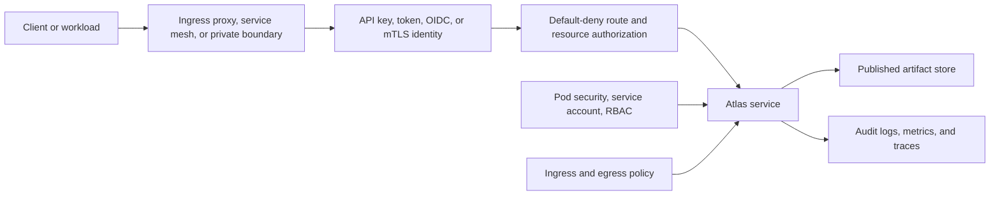
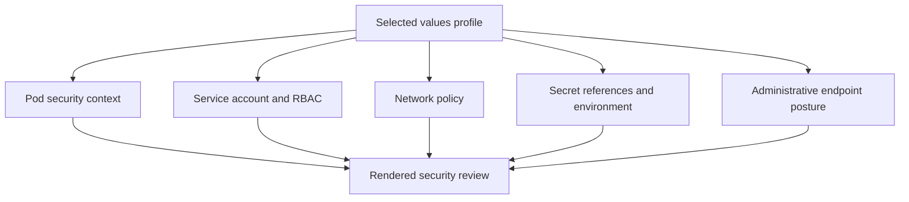

# Security Operations

Atlas security spans exposure, identity, authorization, workload confinement,
network policy, secret delivery, audit evidence, artifact integrity, and supply
chain controls. A secure deployment aligns all of these boundaries with one
named profile.

## Defense Boundaries

```mermaid
flowchart LR
    Client[Client or workload] --> Edge[Ingress proxy, service mesh, or private boundary]
    Edge --> Identity[API key, token, OIDC, or mTLS identity]
    Identity --> Authz[Default-deny route and resource authorization]
    Authz --> Runtime[Atlas service]
    Runtime --> Store[Published artifact store]
    Runtime --> Audit[Audit logs, metrics, and traces]
    Workload[Pod security, service account, RBAC] --> Runtime
    Network[Ingress and egress policy] --> Runtime
```

Atlas supports built-in authentication, but the declared default stance is an
internal service boundary. Deployments exposed beyond a private trusted network
must remain behind an ingress authentication proxy, service mesh, or equivalent
institutional control.

## Threat-to-Control Map

| Threat | Preventive boundary | Detection and retained evidence |
| --- | --- | --- |
| unauthenticated external access | private service exposure, edge identity, runtime auth mode | denied-request audit fields, ingress and runtime auth decisions |
| excessive principal authority | default-deny authorization and narrow service identities | principal, action, resource, route, and decision records |
| administrative route exposure | disabled route registration, isolated service path, governed exception | rendered flag, route probe, reachability test, exception expiry |
| workload escape or privilege | non-root security context, constrained service account and RBAC | rendered workload review and admission-policy result |
| unauthorized dependency access | ingress and egress policy plus backend credentials | policy inventory, rejected connections, backend audit records |
| artifact substitution | immutable manifests, hashes, signatures, and provenance | verifier result bound to image and dataset identities |
| secret disclosure | secret references, redaction, least privilege, and rotation | access audit and rotation record without secret material |

Security evidence must not reproduce credentials, bearer tokens, private keys,
or unredacted request content. Preserve identifiers, decision metadata, and
secret version references instead.

## Identity and Authorization

`ATLAS_AUTH_MODE` selects the runtime authentication mode. Supported models are
API key, token, OIDC, and mTLS. Authentication establishes the principal;
authorization evaluates principal, action, resource kind, and route.

| Route class | Action and resource | Allowed principals |
| --- | --- | --- |
| health, readiness, overload, metrics, version, OpenAPI | `catalog.read` on service namespace | authentication-exempt at the runtime route boundary |
| catalog and dataset queries | `catalog.read` or `dataset.read` | user, service account, operator, release automation |
| debug and administrative routes | `ops.admin` or `dataset.ingest` | operator and release automation only |

The embedded policy defaults to deny. Invalid embedded authorization contracts
also fail closed. Authentication-exempt service routes still require network
exposure review because exemption changes application authorization, not who can
reach the service.

## Administrative Surfaces

Debug, cluster, recovery, failure-injection, chaos, and echo routes are only
registered when administrative endpoints are enabled. They require operator
authority and should not share broad public ingress with dataset queries.

`ops/k8s/admin-endpoints-exceptions.json` is the exception ledger. An exception
must identify its scope, owner, justification, and expiry through the governed
contract. The committed ledger currently contains no exceptions.

## Kubernetes Workload Security

```mermaid
flowchart TD
    Profile[Selected values profile] --> Pod[Pod security context]
    Profile --> SA[Service account and RBAC]
    Profile --> Net[Network policy]
    Profile --> Secret[Secret references and environment]
    Profile --> Admin[Administrative endpoint posture]
    Pod --> Review[Rendered security review]
    SA --> Review
    Net --> Review
    Secret --> Review
    Admin --> Review
```

Production-oriented profiles—`prod`, `prod-minimal`, `prod-ha`, and
`prod-airgap`—must keep `podSecurityContext.runAsNonRoot=true`. Review changes
to container and pod security contexts, service accounts, RBAC, ingress,
network policy, secret references, volumes, and administrative endpoints as one
security boundary.

Air-gapped deployment adds a supply-chain requirement: images, charts,
artifacts, SBOMs, checksums, and verification tools must all be locally
available and pinned. “No runtime egress” is insufficient if installation or
verification quietly requires a network call.

## Secure Deployment Review

1. Resolve the exact profile and values files; do not review defaults in
   isolation from overlays.
2. Render the chart and inspect workload identity, privilege, mounts, secrets,
   ingress, and egress.
3. Confirm the authentication placement and `ATLAS_AUTH_MODE` match the network
   boundary.
4. Verify default-deny authorization and test service, dataset, and admin route
   classes separately.
5. Confirm admin endpoints are disabled or covered by a current exception.
6. Validate audit fields, authentication decisions, authorization decisions,
   and trace linkage before promotion.
7. Bind the rendered security evidence, policy snapshots, SBOMs, and artifact
   checksums into the release evidence set.

## Security Acceptance Boundary

A profile is not security-qualified merely because it renders or runs as
non-root. Qualification requires the selected exposure model, identity mode,
authorization policy, administrative-route posture, workload confinement,
network policy, secrets path, and artifact verification to agree. Any
unverified boundary is a recorded exception or a failed promotion condition;
silence is not an implicit pass.

## Security Incident Containment

Preserve the rendered manifest, active profile, policy snapshots, audit logs,
trace IDs, and affected release identity before changing the deployment. Drain
or isolate the affected workload, revoke or narrow credentials at their owning
boundary, and distinguish policy failure from identity spoofing or network
exposure. Temporary exceptions must be governed and removed after containment.

Continue with [Admin Endpoint Exceptions](admin-endpoints-exceptions.md),
[Runtime Configuration](runtime-configuration.md), and
[Signing and Provenance](../release/signing-and-provenance.md).
