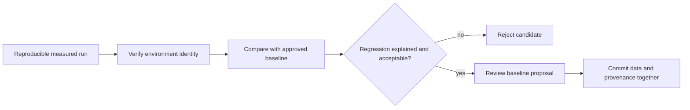
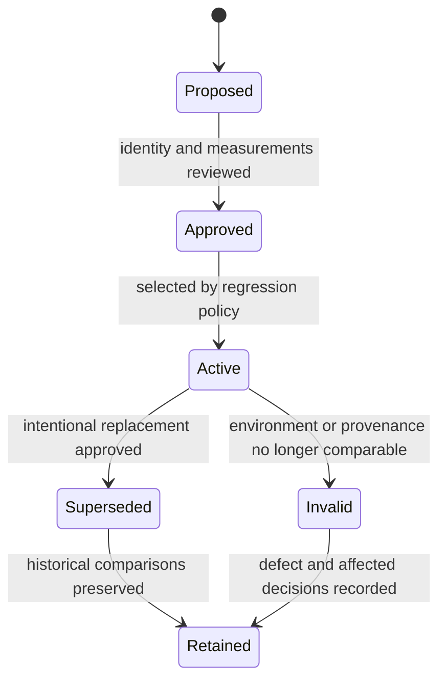

# Baseline Management

A performance baseline is an approved comparison point with a reproducible
environment identity. It is not automatically a measured capacity claim, and
it must not be refreshed merely to make a regression disappear.

## Current Baseline Status

Atlas contains three committed baseline files:

| Baseline | Coverage | Current provenance |
| --- | --- | --- |
| `ci-runner.json` | `mixed` and `cheap-only-survival` | `approved-threshold-bootstrap`, captured 2026-02-18 |
| `local.json` | `mixed` and `cheap-only-survival` | `approved-threshold-bootstrap`, captured 2026-02-18 |
| `system-load-baseline.json` | 15 system workload and pressure suites | Checked-in medium-tier reference without capture timestamp or tool inventory |

The CI and local rows are bootstrap values aligned to the scenario thresholds.
They are deterministic comparison fixtures, not observations from a documented
benchmark run. The system baseline also mirrors declared scenario budgets and
lacks the environment detail required for an empirical capacity claim.

The generated system summary reports `stable` with zero regressions while both
its baseline and candidate profile are `system-load-baseline`. That proves the
comparison machinery is deterministic; it does not prove a new candidate build
has preserved performance.

## Approval Flow

## Baseline Lifecycle

Never overwrite baseline history in place. A new reference should preserve the
old identity, comparison, rationale, and effective boundary so reviewers can
distinguish product movement from a changed yardstick.

## Minimum Baseline Identity

A measured baseline should record:

- source revision, Atlas release, image digest, and chart/profile identity;
- dataset release, dataset tier, and pinned query pack;
- scenario and suite registry versions;
- node, CPU, memory, storage, and network characteristics;
- Kubernetes and dependency topology;
- cache state, warmup state, duration, target rate, and concurrency;
- K6, Kind, kubectl, Helm, and relevant runtime tool versions;
- raw result locations and the command that produced the summary;
- capture time, reviewer, and approval rationale.

Without those fields, keep the artifact labeled as a fixture or qualified
reference. Do not promote it to measured production evidence through prose.

## When a Baseline May Change

Approve a new baseline only after a reproducible run shows an intentional
change in the service or measurement environment. Compare the candidate against
both absolute scenario budgets and the previous baseline. Explain latency,
throughput, failure-rate, CPU, and memory movement independently.

Reject a baseline update when the only rationale is a failing regression gate,
the workload identity changed without a new baseline name, raw results are
missing, or the candidate has weaker behavior with no accepted user tradeoff.

Invalidate rather than refresh a baseline when its provenance is false, its
raw inputs are missing, or its environment can no longer be reconstructed.
Changes to dataset scale, query pack, architecture, resource class, cache
policy, storage topology, or measurement toolchain require an explicit
comparability decision before the baseline remains active.

## Approval Bias Controls

- Choose repetition count and aggregation before observing the candidate.
- Retain every comparable run, including aborted and unfavorable samples.
- Separate product changes from simultaneous environment or threshold changes.
- Require a reviewer who can evaluate the user-visible performance tradeoff.
- Do not select a new baseline from the same candidate solely because it failed
  against the active reference.

## Comparison Evidence

Preserve the old baseline, candidate result, deterministic delta report,
absolute threshold verdict, environment manifest, and approval record. The
regression contract currently limits p99 latency growth to 15%, throughput loss
to 10%, error-rate increase to 2%, CPU saturation to 90%, and memory growth to
20%.

Use [Performance and Load](performance-and-load.md) for complete run identity
and [Thresholds and Budgets](thresholds-and-budgets.md) for decision order.
