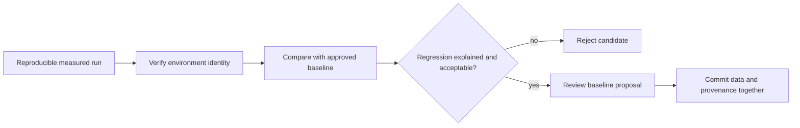
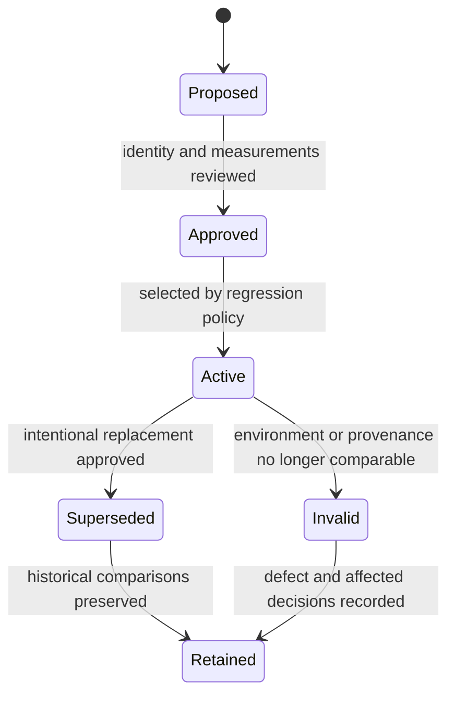
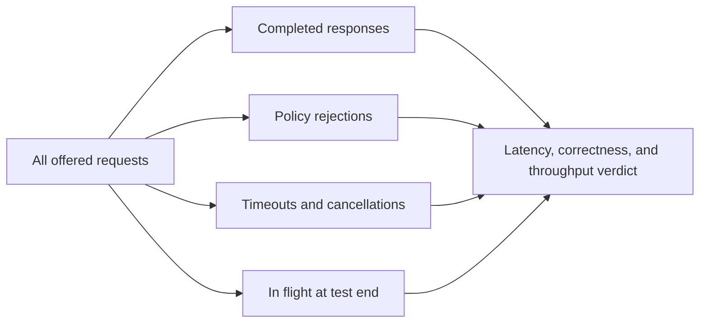

# Baseline Management

A performance baseline is an approved comparison point with a reproducible
environment identity. It is not automatically a measured capacity claim, and
it must not be refreshed merely to make a regression disappear.

## Current Baseline Status

Atlas contains three committed baseline files:

| Baseline | Coverage | Current provenance |
| --- | --- | --- |
| `ci-runner.json` | `mixed` and `cheap-only-survival` | `approved-threshold-bootstrap`, captured 2026-02-18 |
| `local.json` | `mixed` and `cheap-only-survival` | `approved-threshold-bootstrap`, captured 2026-02-18 |
| `system-load-baseline.json` | 15 system workload and pressure suites | Checked-in medium-tier reference without capture timestamp or tool inventory |

The CI and local rows are bootstrap values aligned to the scenario thresholds.
They are deterministic comparison fixtures, not observations from a documented
benchmark run. The system baseline also mirrors declared scenario budgets and
lacks the environment detail required for an empirical capacity claim.

The generated system summary reports `stable` with zero regressions while both
its baseline and candidate profile are `system-load-baseline`. That proves the
comparison machinery is deterministic; it does not prove a new candidate build
has preserved performance.

## Approval Flow

## Baseline Lifecycle

Never overwrite baseline history in place. A new reference should preserve the
old identity, comparison, rationale, and effective boundary so reviewers can
distinguish product movement from a changed yardstick.

## Minimum Baseline Identity

A measured baseline should record:

- source revision, Atlas release, image digest, and chart/profile identity;
- dataset release, dataset tier, and pinned query pack;
- scenario and suite registry versions;
- node, CPU, memory, storage, and network characteristics;
- Kubernetes and dependency topology;
- cache state, warmup state, duration, target rate, and concurrency;
- K6, Kind, kubectl, Helm, and relevant runtime tool versions;
- raw result locations and the command that produced the summary;
- capture time, reviewer, and approval rationale.

Without those fields, keep the artifact labeled as a fixture or qualified
reference. Do not promote it to measured production evidence through prose.

## Establish a Measured Reference

Use a declared sampling protocol rather than selecting one favorable run:

1. Freeze source, image, chart, dataset, query pack, scenario, thresholds,
   resources, topology, and tool versions.
2. Define warmup, cache state, repetition count, run duration, and aggregation
   before measuring the candidate.
3. Execute the full repetition set in a stable environment and retain every
   result.
4. Reject invalid samples only for predeclared reasons such as workload-driver
   failure, lost telemetry, or unconfirmed environment identity.
5. Aggregate each metric with its declared statistic; do not mix the best
   latency sample with the best throughput sample from another run.
6. Compare the proposed reference with the prior baseline and absolute budgets,
   then record approval and effective scope.

For latency, retain the distribution or histogram inputs used to calculate
percentiles, not only the displayed p95 or p99. For throughput and failure rate,
retain offered load, completed work, rejected work, and their denominators. For
CPU and memory, retain per-replica samples and resource limits so saturation is
reconstructable.

## Preserve Rejected and Censored Work

Latency percentiles over successful responses can improve while the system is
dropping its slowest work. Keep completed, rejected, timed-out, cancelled, and
still-in-flight requests in the same measurement accounting.

| Outcome | Required measurement treatment |
| --- | --- |
| completed | include latency and correctness verdict in the declared distribution |
| policy rejection | retain response class, decision latency, route class, and offered-load denominator |
| client timeout | retain the timeout bound as censored work; do not discard it from failure accounting |
| server or transport failure | retain elapsed time, error class, and whether work continued after the client left |
| unfinished at test end | report residual concurrency and drain outcome separately from completed throughput |

Record both offered and achieved rate. A candidate that completes less work is
not comparable merely because the remaining successful sample has similar
percentiles. If the load generator cannot account for every offered request,
mark the run incomplete rather than estimating a favorable denominator.

## Comparability Decision

Evaluate identity before calculating deltas:

| Difference | Default disposition | Why |
| --- | --- | --- |
| source or image | comparable candidate | the product change under evaluation |
| dataset contents or scale | new baseline family | query cost and cache behavior changed |
| query pack or traffic mix | new baseline family | the measured workload changed |
| CPU, memory, replicas, or node class | capacity experiment | resource supply changed |
| cache warmup or persistence mode | separate operating condition | cold and warm behavior answer different questions |
| Kubernetes, storage, network, or dependency topology | qualified until equivalence is proven | infrastructure can dominate the result |
| measurement tool or percentile method | invalid comparison unless cross-calibrated | the measuring instrument changed |

A new baseline family should use a durable name derived from the operating
condition, not a chronological suffix. Preserve the superseded family when its
environment remains supported.

## When a Baseline May Change

Approve a new baseline only after a reproducible run shows an intentional
change in the service or measurement environment. Compare the candidate against
both absolute scenario budgets and the previous baseline. Explain latency,
throughput, failure-rate, CPU, and memory movement independently.

Reject a baseline update when the only rationale is a failing regression gate,
the workload identity changed without a new baseline name, raw results are
missing, or the candidate has weaker behavior with no accepted user tradeoff.

Invalidate rather than refresh a baseline when its provenance is false, its
raw inputs are missing, or its environment can no longer be reconstructed.
Changes to dataset scale, query pack, architecture, resource class, cache
policy, storage topology, or measurement toolchain require an explicit
comparability decision before the baseline remains active.

## Requalify Before Comparison

A baseline does not become invalid merely because time passed, and it does not
remain valid merely because its file is still selected. Before every governed
comparison, reproduce its identity fingerprint and classify any drift.

| Requalification result | Disposition |
| --- | --- |
| identity matches and raw lineage remains available. | Use the active baseline and record the verification time. |
| product revision differs while the environment and workload match. | Treat the run as the intended candidate comparison. |
| infrastructure differs but equivalence is measured. | Use a qualified comparison and retain the calibration evidence. |
| workload, dataset scale, cache condition, or resource class differs. | Select or establish a separate baseline family. |
| provenance, raw samples, or environment identity cannot be verified. | Mark the baseline invalid for release claims and preserve it for history. |
| budgets changed without a new measured reference. | Evaluate absolute policy separately; do not rewrite the baseline result. |

Record the requalification verdict even when nothing drifted. This prevents a
historical baseline from silently crossing runner-image, toolchain, cluster,
or dataset changes that alter the measurement boundary.

## Approval Bias Controls

- Choose repetition count and aggregation before observing the candidate.
- Retain every comparable run, including aborted and unfavorable samples.
- Separate product changes from simultaneous environment or threshold changes.
- Require a reviewer who can evaluate the user-visible performance tradeoff.
- Do not select a new baseline from the same candidate solely because it failed
  against the active reference.
- Do not discard the first, slowest, or post-restart sample unless the sampling
  protocol declared that exclusion before execution.
- Do not aggregate percentiles by averaging percentile values across runs;
  retain per-run verdicts or merge compatible underlying distributions.

## Comparison Evidence

Preserve the old baseline, candidate result, deterministic delta report,
absolute threshold verdict, environment manifest, and approval record. The
regression contract currently limits p99 latency growth to 15%, throughput loss
to 10%, error-rate increase to 2%, CPU saturation to 90%, and memory growth to
20%.

Use [Performance and Load](performance-and-load.md) for complete run identity
and [Thresholds and Budgets](thresholds-and-budgets.md) for decision order.

## Baseline Receipt

The approval record should make four questions answerable without repository
archaeology:

- What exact system and workload were measured?
- Which raw samples produced every committed value?
- Why was the reference accepted, superseded, or invalidated?
- Which profiles, datasets, scenarios, and release decisions may use it?

If any answer depends on an unretained dashboard or personal environment, the
baseline is not durable release evidence.
