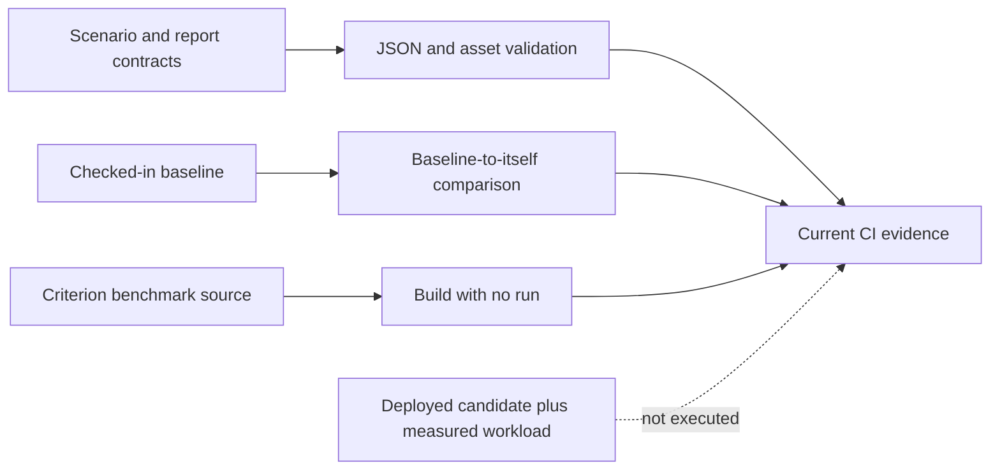

# Benchmark CI

Atlas has four performance-oriented GitHub Actions workflows. Their names are
broader than the evidence they currently produce: none of the four executes a
live k6 scenario, provisions a deployment, or records a measured candidate
benchmark in CI.

## Evidence by Lane

| Workflow | Work actually performed | Proof level |
| --- | --- | --- |
| `load-system-ci.yml` | JSON parsing, baseline self-comparison, manifest and baseline tests | contract and fixture integrity |
| `performance-regression-ci.yml` | report parsing, baseline self-comparison, `perf validate`, asset tests | policy and checked-in report integrity |
| `ingest-benchmark-ci.yml` | build `ingest_throughput` with `--no-run`; run a fixture test | benchmark compilation and fixture logic |
| `query-benchmark-ci.yml` | build `query_patterns` with `--no-run`; run a threshold sanity test | benchmark compilation and threshold logic |

The load, performance, and query lanes respond to their owned paths on pull
requests and pushes to `main`; ingest responds to pull requests. Performance
also runs daily, and performance and ingest allow manual dispatch.

The self-comparisons prove that the comparison path accepts the checked-in
baseline. They cannot detect a candidate performance regression because both
arguments identify the same file.

## What a Performance Claim Requires

A candidate regression claim needs evidence that the existing lanes do not yet
assemble:

1. exact source, binary, dataset, profile, and environment identities
2. a named scenario and query set
3. a fresh baseline run or an approved comparable baseline
4. a fresh candidate run
5. raw metrics and a schema-valid summary
6. a comparison that evaluates baseline versus candidate
7. retained artifacts and an exit status tied to the decision

Until that chain exists in a workflow, these lanes should not be cited as proof
that current throughput or latency budgets passed. They remain useful guards
against broken manifests, unreadable reports, unbuildable benchmarks, and
invalid comparison machinery.

## Trigger and Gate Limits

The load and performance workflows still list
`docs/04-operations/performance-and-load.md` in their path filters. That path is
not present in the current documentation tree, so edits to the canonical load
handbook do not trigger those workflows through that entry.

The four job names are not listed in `.github/required-status-checks.md`.
Repository or organization settings can impose additional checks outside the
checkout, but the checked-in required-status document does not establish these
lanes as merge gates. Verify live branch protection before describing any lane
as required.

## Reading a Green Run

A green run supports only the claims in the “Proof level” column. In
particular:

- `cargo bench --no-run` proves compilation, not measured speed
- a fixture test proves comparison behavior for its fixture, not deployed load
- valid checked-in JSON proves serialization shape, not freshness
- a baseline self-comparison proves zero difference against itself
- a scheduled workflow is not automatically a benchmark if its steps do not
  execute a workload

## Authorities

- `.github/workflows/load-system-ci.yml`
- `.github/workflows/performance-regression-ci.yml`
- `.github/workflows/ingest-benchmark-ci.yml`
- `.github/workflows/query-benchmark-ci.yml`
- `ops/load/ci/load-harness-ci-scenario.json`
- `ops/load/contracts/performance-regression-ci-contract.json`
- `.github/required-status-checks.md`
