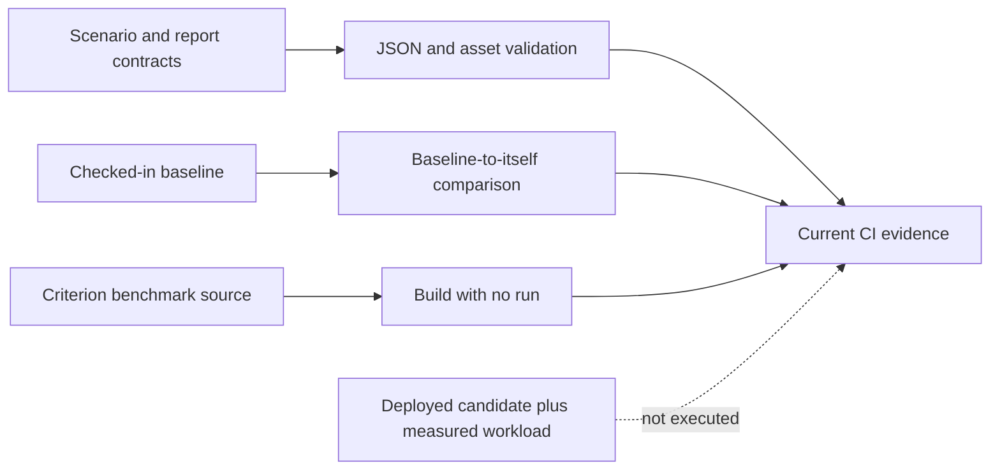
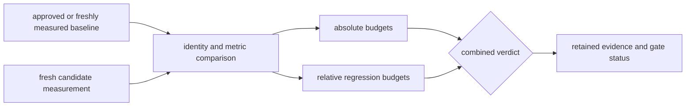
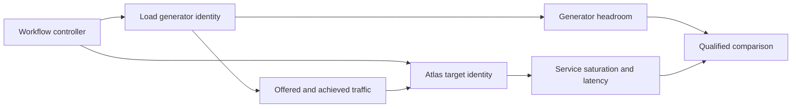

# Benchmark CI

Atlas has four performance-oriented GitHub Actions workflows. Their names are
broader than the evidence they currently produce: none of the four executes a
live k6 scenario, provisions a deployment, or records a measured candidate
benchmark in CI.

## Evidence by Lane

| Workflow | Work actually performed | Proof level |
| --- | --- | --- |
| Load system | Parse assets, self-compare, test fixtures | contract integrity |
| Performance | Parse reports, self-compare, validate | policy integrity |
| Ingest | Build without running; test a fixture | build integrity |
| Query | Build without running; test thresholds | build integrity |

The load, performance, and query lanes respond to their owned paths on pull
requests and pushes to `main`; ingest responds to pull requests. Performance
also runs daily, and performance and ingest allow manual dispatch.

The self-comparisons prove that the comparison path accepts the checked-in
baseline. They cannot detect a candidate performance regression because both
arguments identify the same file.

## What a Performance Claim Requires

A candidate regression claim needs evidence that the existing lanes do not yet
assemble:

1. exact source, binary, dataset, profile, and environment identities
2. a named scenario and query set
3. a fresh baseline run or an approved comparable baseline
4. a fresh candidate run
5. raw metrics and a schema-valid summary
6. a comparison that evaluates baseline versus candidate
7. retained artifacts and an exit status tied to the decision

Until that chain exists in a workflow, these lanes should not be cited as proof
that current throughput or latency budgets passed. They remain useful guards
against broken manifests, unreadable reports, unbuildable benchmarks, and
invalid comparison machinery.

## Candidate Measurement Lane

A regression gate becomes performance evidence only when it measures the
checked-out candidate and compares it with a compatible baseline.

The lane must fail when the candidate is missing, stale, or incomparable. Build
success, fixture validation, and baseline self-comparison cannot synthesize a
candidate measurement or downgrade its absence to a warning.

Observe generator and target resources separately. A runner-limited result is
evidence about the harness, while a target-limited result may support an Atlas
capacity claim only when the generator retained declared headroom.

## Separate the Generator from the Target

A workflow that drives load and hosts Atlas on the same runner couples their
CPU, memory, network, storage, and process scheduling. Contention can look like
a product regression, while generator saturation can silently reduce offered
load and make the target look faster.

Retain separate resource telemetry and clocks for the generator and target.
The generator needs headroom at the maximum offered rate, stable connection and
timeout policy, and an accounted request denominator. The target needs an
independent resource envelope, release identity, and dependency telemetry.

If co-location is intentional for a developer benchmark, label the result as a
whole-runner experiment and compare only with the same topology. Do not use it
as evidence of target capacity. A governed CI gate should also retry only under
a predeclared infrastructure-failure policy; rerunning noisy measurements until
one passes biases the retained result.

## Trigger and Gate Limits

The load and performance workflows watch the canonical
`docs/bijux-atlas-ops/load/**` handbook path alongside their executable assets.
Documentation that changes a load contract therefore receives the same focused
fixture and policy checks as the corresponding operational surface.

The four job names are not listed in `.github/required-status-checks.md`.
Repository or organization settings can impose additional checks outside the
checkout, but the checked-in required-status document does not establish these
lanes as merge gates. Verify live branch protection before describing any lane
as required.

## Reading a Green Run

A green run supports only the claims in the “Proof level” column. In
particular:

- `cargo bench --no-run` proves compilation, not measured speed
- a fixture test proves comparison behavior for its fixture, not deployed load
- valid checked-in JSON proves serialization shape, not freshness
- a baseline self-comparison proves zero difference against itself
- a scheduled workflow is not automatically a benchmark if its steps do not
  execute a workload

## Require Candidate Freshness

A measured workflow must reject reused results whose candidate, environment,
or policy identity differs from the checked-out revision. Cache hits may reuse
compiled inputs, but they must not reuse the measurement verdict.

Retain source and binary digests, workflow run identity, runner image, dataset,
scenario, raw-result hash, threshold hash, baseline identity, and measurement
time. A green re-evaluation of an old candidate file proves only that the old
file still parses under the current evaluator.

## Authorities

- `.github/workflows/load-system-ci.yml`
- `.github/workflows/performance-regression-ci.yml`
- `.github/workflows/ingest-benchmark-ci.yml`
- `.github/workflows/query-benchmark-ci.yml`
- `ops/load/ci/load-harness-ci-scenario.json`
- `ops/load/contracts/performance-regression-ci-contract.json`
- `.github/required-status-checks.md`
