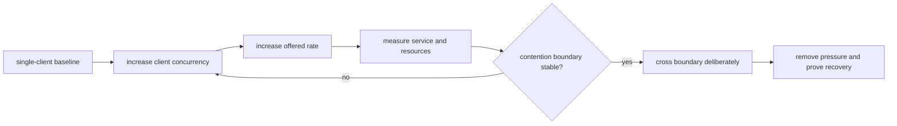

# Concurrency and Saturation

Concurrency testing locates the point where clients begin competing for Atlas
admission, CPU, store access, cache space, and database work. The useful result
is a repeatable operating envelope and controlled overload behavior, not a peak
request count.

## Declared scenario shapes

`ops/load/generated/concurrency-stress-scenarios.json` catalogs three shapes:

| Scenario | Workload | Concurrency role |
| --- | --- | --- |
| `load-single-client-baseline` | query | low-contention reference |
| `load-multi-client-concurrency` | mixed | shared-resource contention |
| `load-saturation-stress` | mixed | pressure at or beyond intended limits |

These records contain no target rate, duration, client count, query mix,
dataset, resource profile, or threshold. They are catalog entries, not
executable load suites. None is present in `ops/load/load.toml`, so `ops load
run` cannot execute these IDs directly.

Do not treat the generated file as performance evidence. A governed experiment
must add the missing parameters and preserve the actual harness result.

## Build the saturation curve

Change one pressure dimension at a time. Fix the release, dataset, query
corpus, cache state, resources, and dependency versions. Report offered rate
and completed throughput separately; queues can make them diverge sharply.

For each point, record:

- clients, arrival model, target rate, duration, and request-class mix;
- p50, p95, and p99 latency plus status and error classes;
- completed throughput, in-flight work, queues, and overload state;
- CPU use and throttling, memory, cache growth, store latency, and connections;
- replica count, HPA actions, and workload distribution;
- query correctness and response-size bounds.

## Protected behavior under overload

Atlas separates cheap and heavy query admission. Saturation evidence should
show that heavy work is rejected with the declared policy response while cheap
health, readiness, version, and catalog paths retain their contract. Observe
the response code and error envelope; timeouts alone are uncontrolled failure.

After load stops, verify that queues drain, overload state clears, memory and
cache settle inside expected bounds, and normal requests recover. A service
that meets peak thresholds but does not recover has failed the experiment.

## Make a capacity claim

Report three regions: normal operation, onset of contention, and controlled
overload. Use the lowest repeatable boundary across valid repetitions. Bind the
claim to its latency, error, resource, traffic-mix, and correctness conditions.

Reject a result when parameters are missing, correctness changes, protected
paths collapse, telemetry cannot identify the bottleneck, or repetitions move
the boundary materially without explanation.

Use [Baseline management](baseline-management.md) for comparison custody and
[Thresholds and budgets](thresholds-and-budgets.md) for approval semantics.
