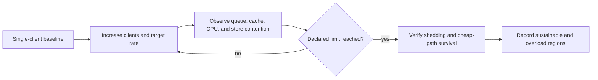

# Concurrency and Saturation

Concurrency testing asks how Atlas behaves as independent clients compete for
CPU, store access, cache space, queues, and admission capacity. The goal is to
locate controlled limits and prove service survival, not simply maximize
parallel requests.

## Declared Stress Profiles

`ops/load/generated/concurrency-stress-scenarios.json` defines three workload
shapes:

| Scenario | Workload | Concurrency profile | Role |
| --- | --- | --- | --- |
| `load-single-client-baseline` | query | `single_client` | Low-contention reference |
| `load-multi-client-concurrency` | mixed | `multi_client` | Normal shared-resource contention |
| `load-saturation-stress` | mixed | `saturation` | Pressure at or beyond intended limits |

These entries name the shapes but do not include target rates or durations.
Every executable run must supply the remaining harness fields:
`duration_secs`, `target_rps`, `ingest_ops_per_sec`, and
`query_mix_read_ratio`.

## Saturation Curve

Increase one pressure dimension at a time before combining them. If client
count, request mix, dataset, cache state, and resources all change together,
the result cannot identify the controlling limit.

## Signals That Explain the Curve

Measure latency distributions, completed throughput, failure rate, in-flight
work, queue depth, overload state, and response codes by request class. Correlate
those with CPU throttling, memory and cache growth, store latency, connection
pressure, and replica count.

For saturation scenarios, verify these behaviors explicitly:

- heavy requests are rejected with declared policy codes rather than hanging;
- cheap health, readiness, version, and catalog paths remain within their
  survival contract;
- queue and overload metrics become visible before uncontrolled collapse;
- response size and memory remain bounded;
- the service returns to normal after pressure is removed.

## Capacity Claims

Report at least three regions: normal operation, the onset of contention, and
controlled overload. State the lowest repeatable boundary, not the best single
sample. A throughput claim without its latency, error, resource, and traffic
mix constraints is incomplete.

Fail the review when correctness changes under concurrency, required signals
are absent, protected paths collapse with heavy traffic, memory remains elevated
after recovery, or repeated runs produce materially different boundaries.

Use [Baseline Management](baseline-management.md) for reference approval and
[Failure Injection Load](failure-injection-load.md) when concurrency is combined
with dependency or infrastructure faults.
