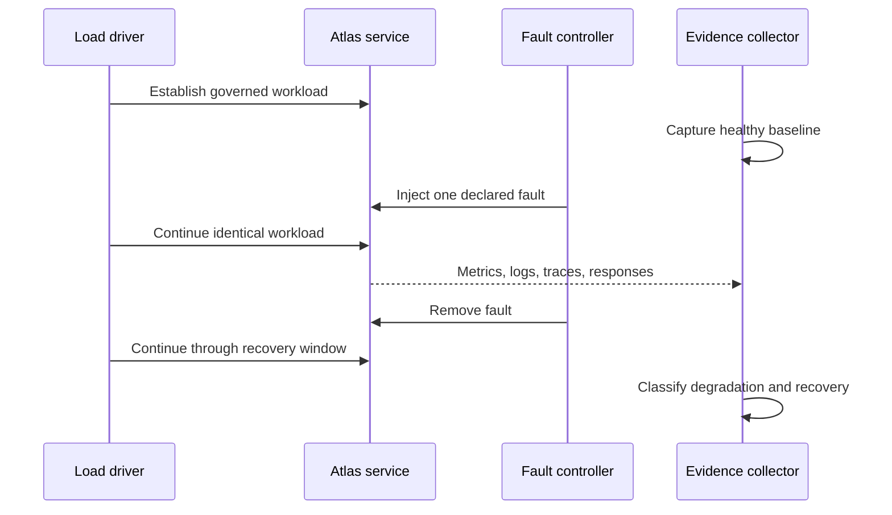

# Failure Injection Under Load

Resilience is a time-bounded claim: Atlas must preserve correctness, expose the
fault, shed work deliberately, and recover after the fault is removed. A load
run without a controlled fault measures capacity. A fault test without traffic
does not establish service behavior under pressure.

## Experiment Shape

Record the fault mechanism, injection and removal timestamps, workload and
query-pack identities, release and profile, and the exact threshold contract.
Changing traffic at the same time as the fault makes the result ambiguous.

## Governed Fault Surfaces

The end-to-end injection catalog defines process termination during ingest and
query, shard corruption, disk-full and read-only storage, network partition,
downstream timeout, invalid configuration, missing artifacts, and constrained
memory. Each mechanism has an expected behavior: controlled failure, bounded
latency, isolation, explicit diagnostics, or preserved state.

The load catalog exercises a narrower set of pressure experiments:

| Scenario | Pressure question | Required observation |
| --- | --- | --- |
| `store-outage-under-spike` | Cached survival during a store outage and traffic spike | Cached requests return `200` or `304`; uncached work fails explicitly. |
| `noisy-neighbor-cpu-throttle` | Cheap-path survival during CPU contention | Cheap requests succeed; heavy work may return `503`. |
| `pod-churn` | Can Kubernetes replace serving instances without an uncontrolled outage? | Readiness, error, latency, and recovery evidence. |
| `load-under-rollout` | Can a candidate enter service under steady traffic? | Per-release readiness and service evidence through promotion. |
| `load-under-rollback` | Can the previous release resume service under steady traffic? | Restored behavior and absence of partial release state. |

Do not claim that every end-to-end fault is tested under load. The injection
catalog and load catalog are separate authorities; a combined claim requires a
run record that names both mechanisms.

## Store-Outage Budget

The governed `store-outage-under-spike` thresholds are:

| Signal | Maximum |
| --- | ---: |
| p95 latency | 1,500 ms |
| p99 latency | 3,000 ms |
| Error rate | 10% |

These limits bound degradation; they do not permit wrong answers. A response
inside the latency budget still fails if it violates the API contract, hides
the outage, or returns data whose integrity cannot be established.

## Verdict

A passing run demonstrates all of the following:

- the pre-fault interval was healthy and comparable to the selected baseline;
- the intended fault occurred and was visible in telemetry;
- protected traffic retained its declared contract;
- rejected or degraded work failed explicitly and within budget;
- no partial write, corrupt cache entry, or false success was observed;
- recovery completed within the recorded window after fault removal; and
- the evidence bundle contains `result.json`, `summary.md`, failure
  classification, metrics, configuration, and logs.

Treat a missing signal as an evidence failure. A fault that cannot be observed
or a recovery that cannot be timed is not a resilience proof.

Use [Pod Churn Resilience](pod-churn-resilience.md) for instance replacement
and [Rollout Under Load](rollout-under-load.md) for release changes.
