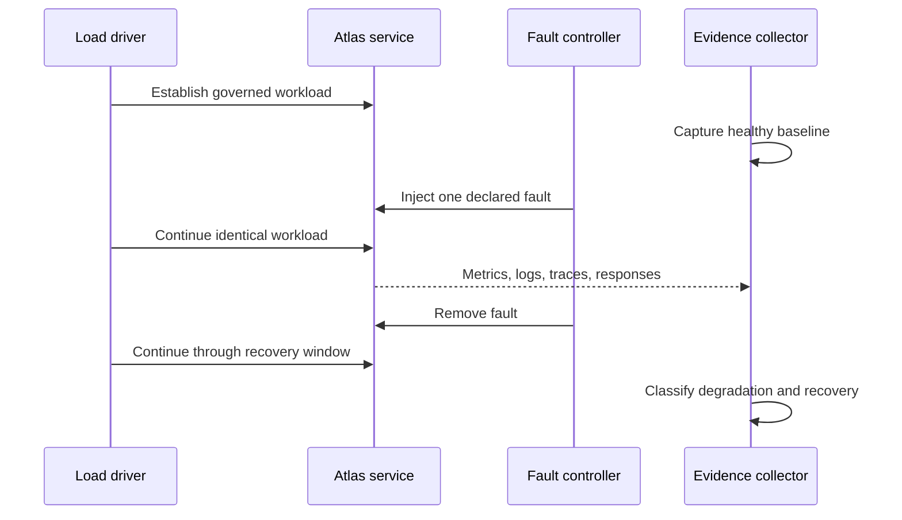
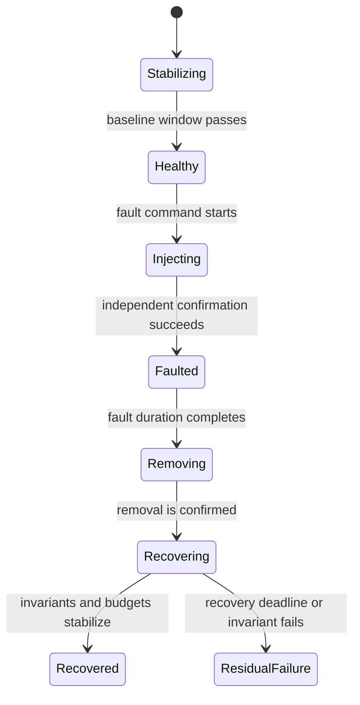

# Failure Injection Under Load

Resilience is a time-bounded claim: Atlas must preserve correctness, expose the
fault, shed work deliberately, and recover after the fault is removed. A load
run without a controlled fault measures capacity. A fault test without traffic
does not establish service behavior under pressure.

## Experiment Shape

Record the fault mechanism and the injection and removal timestamps. Preserve
the workload, query-pack, release, profile, and threshold identities with the
same record. Changing traffic at the same time as the fault makes the result
ambiguous.

## Experimental Controls

| Control | Why it matters |
| --- | --- |
| healthy pre-fault interval | proves the environment can support the workload before injection |
| one named fault | keeps cause and blast radius attributable |
| fixed workload and query pack | prevents demand changes from masking degradation |
| independent fault confirmation | proves the intended mechanism occurred |
| protected and shed request classes | distinguishes survival from deliberate rejection |
| explicit removal event | anchors the recovery-time measurement |
| post-recovery observation window | detects flapping, stale cache state, and delayed failure |

Abort when the baseline is already unhealthy or the fault cannot be confirmed.
Also abort when telemetry loses the required window or cleanup cannot restore
the starting condition. Classify those outcomes as findings, not failed
resilience claims against the product.

## Declare the Blast Radius

Before injection, define what may fail and what must remain protected:

| Boundary | Declare before the run | Evidence during the run |
| --- | --- | --- |
| target | pods, dependency, network path, shard, volume, or resource pool | independent confirmation that only the intended target changed |
| scope | one replica, one dataset, one availability zone, or the whole service | release-, replica-, and dataset-scoped signals |
| protected traffic | cheap reads, cached datasets, health, audit, or control operations | success, latency, and correctness for each protected class |
| shed traffic | heavy query, uncached fetch, ingest, or administrative work | explicit status and error code within the rejection budget |
| protected state | manifests, SQLite artifacts, catalogs, locks, and cache entries | hashes, lifecycle state, and absence of partial publication |
| dependencies | store, catalog, Redis, DNS, telemetry, and cluster control plane | dependency-specific fault and recovery signals |

A global error rate cannot establish containment. Segment the workload by route
class, dataset, cache state, release, and replica wherever the experiment's
claim depends on those boundaries.

## Fault Timeline

Use one monotonic experiment clock and record at least these markers:

Measure fault-detection time from confirmed injection to the first required
signal. Measure degraded-service duration from confirmed injection to restored
user behavior. Measure recovery time from confirmed removal to stable
invariants. These quantities should not share one ambiguous `recovery_ms`
field.

## Governed Fault Surfaces

The end-to-end injection catalog defines process termination during ingest and
query, shard corruption, disk-full and read-only storage, network partition,
downstream timeout, invalid configuration, missing artifacts, and constrained
memory. Each mechanism has an expected behavior: controlled failure, bounded
latency, isolation, explicit diagnostics, or preserved state.

The load catalog exercises a narrower set of pressure experiments:

| Scenario | Pressure question | Required observation |
| --- | --- | --- |
| `store-outage-under-spike` | Cached survival during a store outage and traffic spike | Cached requests return `200` or `304`; uncached work fails explicitly. |
| `noisy-neighbor-cpu-throttle` | Cheap-path survival during CPU contention | Cheap requests succeed; heavy work may return `503`. |
| `pod-churn` | Can Kubernetes replace serving instances without an uncontrolled outage? | Readiness, error, latency, and recovery evidence. |
| `load-under-rollout` | Can a candidate enter service under steady traffic? | Per-release readiness and service evidence through promotion. |
| `load-under-rollback` | Can the previous release resume service under steady traffic? | Restored behavior and absence of partial release state. |

Do not claim that every end-to-end fault is tested under load. The injection
catalog and load catalog are separate authorities; a combined claim requires a
run record that names both mechanisms.

## Preserve Degradation Semantics

Classify each request outcome as correct success, deliberate rejection,
dependency failure, timeout, transport failure, or incorrect success. Only the
first two can satisfy a designed degradation contract. A fast `200` can still
contain stale, partial, cross-dataset, or unverifiable content. That outcome is
more severe than a bounded explicit rejection.

For cache-related experiments, divide requests into cached-before-fault,
uncached-before-fault, and populated-during-fault cohorts. This reveals whether
the service preserved known-good data, attempted unsafe cache fills, or hid
store loss behind stale state.

## Store-Outage Budget

The governed `store-outage-under-spike` thresholds are:

| Signal | Maximum |
| --- | ---: |
| p95 latency | 1,500 ms |
| p99 latency | 3,000 ms |
| Error rate | 10% |

These limits bound degradation; they do not permit wrong answers. A response
inside the latency budget still fails if it violates the API contract, hides
the outage, or returns data whose integrity cannot be established.

## Verdict

A passing run demonstrates all of the following:

- the pre-fault interval was healthy and comparable to the selected baseline;
- the intended fault occurred and was visible in telemetry;
- protected traffic retained its declared contract;
- rejected or degraded work failed explicitly and within budget;
- no partial write, corrupt cache entry, or false success was observed;
- recovery completed within the recorded window after fault removal; and
- the evidence bundle contains `result.json`, `summary.md`, failure
  classification, metrics, configuration, and logs.

Treat a missing signal as an evidence failure. A fault that cannot be observed
or a recovery that cannot be timed is not a resilience proof.

## Cleanup Is Part of the Verdict

After fault removal, prove more than request recovery:

- injected network, process, storage, and resource controls are absent;
- replica count, routing, HPA, PDB, and readiness return to the declared state;
- store and catalog identities match the pre-fault authority;
- no publication lock, partial object, poisoned cache entry, or quarantined
  artifact was silently cleared;
- telemetry pipelines contain the full pre-fault, fault, and recovery windows;
- a second healthy observation window passes without delayed retries, memory
  growth, or repeated breaker transitions.

If cleanup cannot be proven, isolate the environment. Do not reuse it for a
baseline or another resilience experiment because residual state destroys
comparability.

## Data Integrity Boundary

Capacity and availability budgets never authorize unverifiable data. If shard,
manifest, catalog, or cache integrity is uncertain, stop promotion and isolate
the affected state. Recovery evidence must establish the selected release and
artifact hashes before normal traffic resumes; a low error rate cannot
compensate for responses from ambiguous state.

Use [Pod Churn Resilience](pod-churn-resilience.md) for instance replacement
and [Rollout Under Load](rollout-under-load.md) for release changes.
