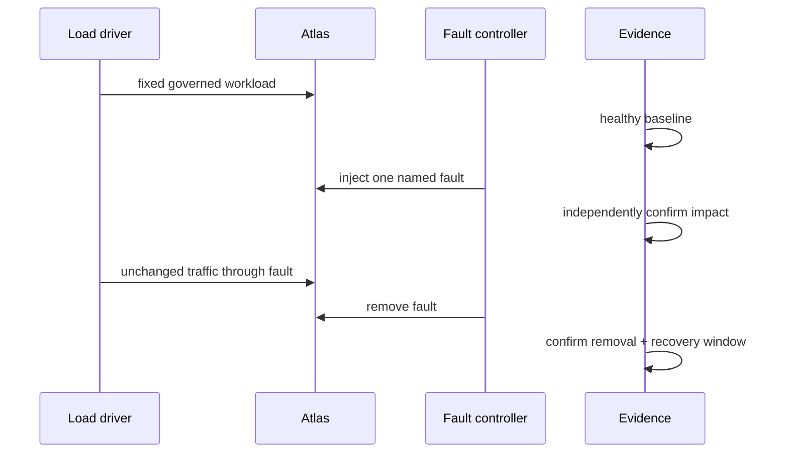
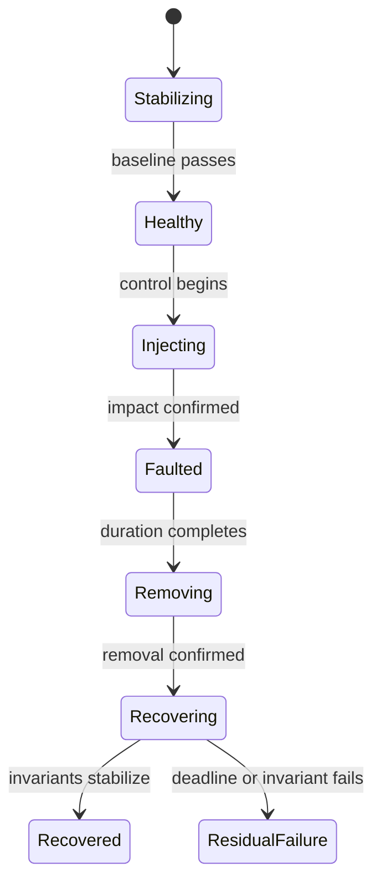

# Failure injection under load

A resilience experiment asks whether Atlas preserves correctness, exposes a
confirmed fault, degrades deliberately, and recovers while governed traffic
continues. Load without a fault measures capacity. A fault without traffic does
not establish user-visible behavior under pressure.

## Controlled experiment

| Control | Why it is required |
| --- | --- |
| healthy pre-fault interval | Proves the target carried the workload before injection |
| one named fault | Keeps cause and blast radius attributable |
| fixed workload and query corpus | Prevents demand change from masking degradation |
| independent impact confirmation | Proves the controller changed the intended boundary |
| protected and shed classes | Separates survival from deliberate rejection |
| confirmed removal | Establishes the start of recovery measurement |
| post-recovery window | Detects flapping, stale state, and delayed retries |

Abort when baseline is unhealthy, impact cannot be confirmed, required
telemetry disappears, offered load collapses, cleanup fails, or data identity
becomes uncertain. These are invalid or escaped experiments, not product
resilience failures.

## Define the blast radius

Before injection, record:

- exact pod, dependency, network path, shard, volume, or resource pool;
- affected release, dataset, replica, zone, and tenant boundary;
- protected cheap, cached, health, audit, and control traffic;
- work allowed to shed, including expected status and error classes;
- manifests, catalogs, locks, artifacts, and cache state that must remain
  authoritative;
- a cleanup path that does not depend on the disrupted component.

A global error rate cannot prove containment. Segment results by release,
dataset, replica, route class, and cache condition wherever the claim depends
on them.

## Measure one timeline

Measure detection from confirmed impact to first required signal, degradation
from confirmed impact to restored user behavior, and recovery from confirmed
removal to stable invariants. Do not collapse all three into one ambiguous
duration.

## Prove fault fidelity

| Evidence point | Required fact |
| --- | --- |
| controller | Action, target, start, duration, and requested cleanup |
| dependency or resource | Independent confirmation of the intended impact |
| Atlas detection | First metric, event, trace, health, or breaker transition |
| clients | Correct success, deliberate rejection, dependency failure, timeout, transport failure, or incorrect success |
| protection | Timeout, breaker, cache, admission, or shedding policy that acted |
| removal | Independent confirmation that the fault ended |
| residual state | Replicas, catalog, store, caches, locks, and telemetry returned to authoritative state |

A quick `200` with stale, partial, cross-dataset, or unverifiable content is
more severe than a bounded explicit rejection. Availability budgets never
authorize ambiguous data.

## Current governed scenarios

| Scenario | Question | Current expectation |
| --- | --- | --- |
| `store-outage-under-spike` | Can verified cached data survive store loss and a traffic spike? | Cached requests return `200` or `304`; uncached work fails explicitly |
| `noisy-neighbor-cpu-throttle` | Do cheap routes survive CPU contention? | Cheap work succeeds; heavy work may shed with `503` |
| `pod-churn` | Does instance replacement preserve bounded service? | Readiness, error, latency, and recovery are recorded |
| `load-under-rollout` | Can a candidate enter service under attributed traffic? | Requires an executable rollout controller |
| `load-under-rollback` | Can the prior release recover under traffic? | Requires an executable rollback controller |

The injection catalog is broader than the load catalog. A combined claim needs
a run that names both the fault mechanism and load scenario. The current
rollout and rollback entries lack their declared runner files and therefore do
not supply executed evidence.

The store-outage budget is p95 ≤ 1,500 ms, p99 ≤ 3,000 ms, and error rate ≤ 10%.
These limits bound degradation; they do not permit incorrect answers.

## Transfer escaped experiments to incident response

Stop offered load, fence mutation, preserve the original clock, and transfer
authority when impact escapes the declared boundary, cleanup cannot restore
state, protected traffic exceeds its abort budget, an undeclared tenant or
dependency is affected, or integrity becomes uncertain.

Retain experiment ID, release, dataset, controller action, confirmed target,
offered load, first escaped impact, active protections, cleanup attempts, and
last trusted state. The incident timeline begins with the original experiment;
do not reset it or continue injecting faults for diagnostic convenience.

Cleanup is part of the verdict. Prove injected controls are absent, replicas
and routing match intent, store and catalog identities agree, no partial object
or poisoned cache was silently cleared, telemetry covers every window, and a
second healthy observation remains stable.

Use [Pod Churn Resilience](pod-churn-resilience.md) for instance replacement
and [Rollout Under Load](rollout-under-load.md) for release changes.
