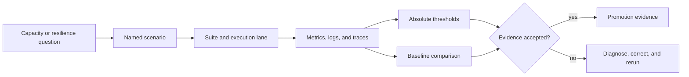
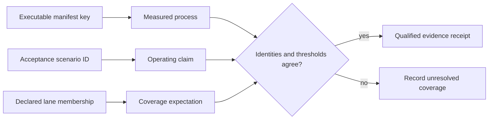
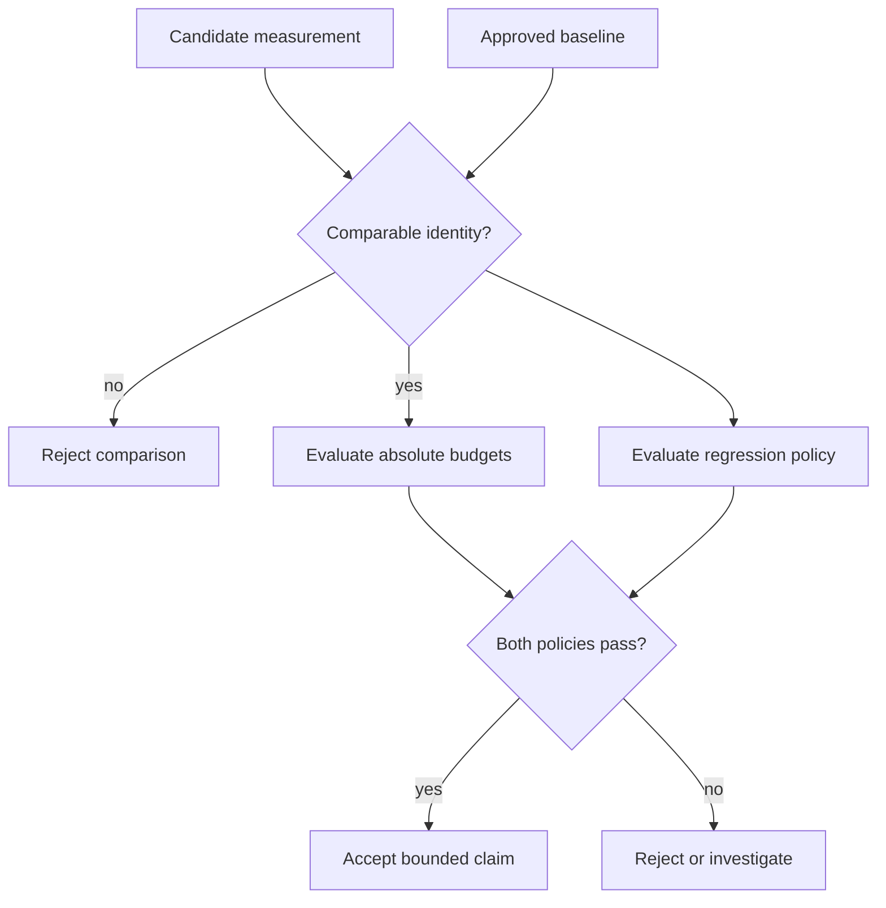
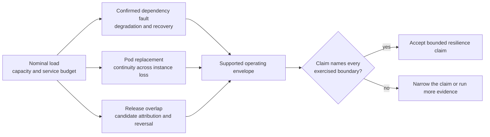

# Load and Performance Assurance

Atlas load evidence answers an operational question: will a named deployment
remain useful under the traffic, contention, failure, and delivery conditions
it is expected to face?

The answer is never a single throughput number. It binds a scenario, pinned
queries, deployment profile, required metrics, absolute budgets, and an
approved baseline.

## From Workload to Decision

The scenario registry preserves workload identity. Suites decide where and how
often scenarios run. Threshold files define acceptable service behavior.
Baselines make regressions visible. Generated reports carry the result into
rollout and release review.

## Distinguish the Three Selection Surfaces

Atlas currently has three load-selection vocabularies. They overlap, but they
are not interchangeable:

| Selection surface | Examples | What selection means |
| --- | --- | --- |
| executable `ops load` manifest | `mixed`, `diff_heavy`, `hpa_validation_short` | one of three entries that `ops load plan`, `run`, and `report` can resolve from `ops/load/load.toml` |
| acceptance scenario registry | `mixed`, `diff-heavy`, `pod-churn`, `load-under-rollout` | one of 40 declared operating experiments with lanes, metrics, and budgets |
| lane metadata | `smoke`, `full`, `nightly`, `load-nightly` | intended scenario membership, not an executable command or execution receipt |

The underscores in two executable names and hyphens in their acceptance IDs
are significant. A report must preserve the exact selected manifest key and,
when it makes an acceptance claim, the separately resolved scenario ID. Do not
infer that a lane executed because a similarly named manifest entry passed.

## Valid Comparison Model

A comparison is valid only when scenario, query pack, dataset, profile,
resource limits, runtime mode, warmup, sample window, and relevant dependency
versions are compatible. A faster result from smaller data or a different
workload is not a regression improvement.

Absolute and relative policies answer different questions. Absolute budgets
protect the service objective. Baselines detect movement inside that envelope.
A candidate must satisfy both when both are required.

## What Atlas Exercises

| Risk | Evidence family |
| --- | --- |
| Ordinary mixed traffic | smoke and pull-request scenarios using the pinned query pack |
| Cold and warm behavior | startup, prefetch, steady-state, and cache-stampede scenarios |
| Resource contention | CPU, disk I/O, thread-pool, cache, and shard hot-spot stress |
| Dependency degradation | store outage and optional Redis behavior |
| Delivery disruption | pod churn, rollout, rollback, and artifact reload under traffic |
| Long-duration drift | stability, memory-growth, leak-detection, and soak scenarios |
| Abuse resistance | response-size, malicious-input, injection, and denial-of-service suites |

Heavy work is allowed to shed under declared overload policy. Cheap health,
readiness, version, and catalog paths have separate survival expectations. A
healthy overload result proves controlled degradation, not the absence of
rejections.

## The Resilience Envelope

Resilience is established by a connected series of experiments, not by
extrapolating one healthy load run. Each experiment changes one operating
condition while keeping workload and evidence identity controlled.

| Experiment | Controlled change | Claim it can support | Claim it cannot support alone |
| --- | --- | --- | --- |
| nominal saturation | offered load and concurrency | capacity knee, overload policy, and cheap-path survival | behavior during dependency or orchestration failure |
| dependency fault | one confirmed dependency or resource fault | containment, explicit degradation, and timed recovery | instance replacement or release compatibility |
| pod churn | one selected serving instance is removed and replaced | endpoint withdrawal, capacity continuity, and replacement readiness | node, zone, or repeated-churn resilience |
| rollout and rollback | candidate and previous releases overlap under attributed traffic | mixed-version capacity, candidate behavior, and reversal | safety of an unattributed candidate or incompatible state change |

The supported envelope is the intersection of these bounded claims. Keep
invalid, aborted, and failed experiments in the evidence record: they describe
where measurement authority ended or where the operating envelope was
exceeded.

## Select Evidence by Question

- Start with [Performance and Load](performance-and-load.md) to identify the
  workload family and evidence identity.
- Use [Scenario Registry](scenario-registry.md) and
  [Load Suites](load-suites.md) to find the exact executable contract.
- Read [Thresholds and Budgets](thresholds-and-budgets.md) before interpreting
  latency, failure rate, or survival signals.
- Use [Baseline Management](baseline-management.md) and
  [Benchmark CI](benchmark-ci.md) for candidate-versus-reference decisions.
- Use [Concurrency Stress](concurrency-stress.md) for saturation and shared
  resource behavior.
- Use [Failure Injection Load](failure-injection-load.md),
  [Pod Churn Resilience](pod-churn-resilience.md), and
  [Rollout Under Load](rollout-under-load.md) for controlled degradation and
  recovery.

## Evidence Authority

- `ops/load/scenario-registry.json` anchors scenario discovery.
- `ops/load/suites/suites.json` declares membership, required metrics, and
  must-pass behavior.
- `ops/load/queries/pinned-v1.json` fixes request identity.
- `ops/load/thresholds/` and `ops/load/contracts/` define pass boundaries.
- `ops/load/baselines/` holds approved comparison points.
- `ops/load/generated/` holds derived coverage and summary material.

A run is suitable for promotion only when those identities agree with the
environment and report being reviewed.

## Evidence Layers

Load assurance has four independent layers. A complete decision preserves the
result of each layer instead of collapsing them into one pass flag.

| Layer | Required proof | Failure means |
| --- | --- | --- |
| Workload identity | scenario, query corpus, dataset, traffic model, and cache state match the claim | the run answered a different question |
| Measurement validity | the generator sustained the declared offer, required telemetry exists, and clocks and windows are usable | the result is invalid, not a product failure |
| Service behavior | latency, completed work, errors, resource use, and recovery satisfy absolute budgets | the deployment does not meet its operating contract |
| Comparative behavior | candidate and approved baseline are compatible and regression limits pass | the candidate moved outside the accepted change envelope |

This separation matters during saturation. A client that cannot generate the
target rate can make the server appear fast, while a server that sheds
expensive work can preserve cheap routes exactly as designed. Offered,
admitted, completed, rejected, and timed-out work therefore belong in the same
record.

## Match the Claim to the Experiment

| Decision | Minimum suitable evidence |
| --- | --- |
| Release regression | repeated candidate and approved-baseline runs with matching identities |
| Capacity limit | a controlled saturation curve showing the knee, resource constraint, and failure behavior |
| Overload safety | survival signals for cheap routes plus declared rejection behavior for expensive work |
| Rollout safety | traffic before, during, and after the change, including availability and recovery |
| Endurance | a duration long enough to expose drift, with resource slope and steady workload identity |

A smoke result supports fast confidence only. It does not establish a capacity
ceiling, sustained stability, or resilience under an unexercised fault.

Failed, aborted, and invalid runs remain useful evidence. Classify harness,
environment, telemetry, threshold, and product failures separately. Do not
convert an incomplete run into a product pass, and do not use repeated reruns
to select a favorable sample without preserving the full series.

## Publish a Bounded Claim

A load verdict should end with one sentence that names its boundary: candidate
identity, target profile, dataset, workload, offered load, duration, cache
condition, dependency state, accepted metrics, and observation window. Include
the last sustainable point and first rejected point for capacity work, or the
confirmed fault and recovery invariant for resilience work.

Avoid broad conclusions such as “Atlas handles production load.” A valid run
supports only the exercised environment and conditions. Wider claims require
evidence across the additional scale, topology, failure domain, and duration
being asserted.
