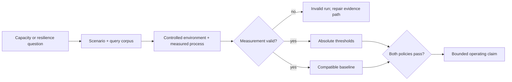
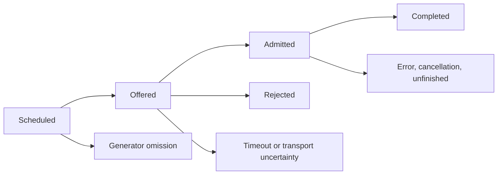

# Load and performance assurance

Atlas load evidence establishes a bounded operating envelope for a named
release, dataset, topology, and workload. It is not a freestanding throughput
number. A defensible verdict preserves workload identity, measurement validity,
absolute budgets, baseline compatibility, and the full offered population.

## From experiment to verdict

| Layer | Required identity | Failure means |
| --- | --- | --- |
| workload | Scenario, query corpus, dataset, traffic model, cache condition, and fault | The run answered a different question |
| measurement | Offered rate, generator capacity, clocks, window, and required telemetry | The result is invalid, not a product verdict |
| service | Latency, completed work, errors, rejection classes, resources, and recovery | The deployment missed an absolute contract |
| comparison | Compatible approved baseline and regression policy | Relative movement is unacceptable or incomparable |

Absolute budgets protect service objectives. Baselines detect movement within
those bounds. When policy requires both, the candidate must pass both.

## Keep selection identities distinct

| Surface | Examples | Meaning |
| --- | --- | --- |
| executable manifest | `mixed`, `diff_heavy`, `hpa_validation_short` | Key resolved by `ops load` from `load.toml` |
| acceptance registry | `mixed`, `diff-heavy`, `pod-churn`, `load-under-rollout` | Declared operating experiment with metrics and budgets |
| lane metadata | `smoke`, `full`, `nightly`, `load-nightly` | Expected membership, not an execution receipt |

Underscores and hyphens are significant. A report must preserve the exact
manifest key and, for an acceptance claim, its separately resolved registry ID.
A lane did not execute merely because a similarly named manifest entry passed.

## Account for offered work

Record counts and reason classes for every edge. Report attempts separately
from user operations so retries cannot manufacture throughput. Latency
percentiles must not make timeouts disappear by using successful responses as
the implicit population. If the accounting identities do not close within a
declared tolerance, classify the run as invalid.

## Resilience is an intersection

| Experiment | Claim it can support | Claim it cannot support alone |
| --- | --- | --- |
| nominal saturation | Capacity knee, overload policy, and cheap-path survival | Dependency or orchestration failure behavior |
| dependency fault | Confirmed degradation, containment, and timed recovery | Instance replacement or release compatibility |
| pod churn | Withdrawal, capacity continuity, and replacement readiness | Node, zone, or repeated-churn resilience |
| rollout and rollback | Attributed mixed-version capacity and reversal | Safety of an untested or unattributed change |

The operating envelope is the intersection of exercised claims. Preserve
failed, aborted, and invalid experiments; they show where the envelope or
measurement authority ended.

## Current execution boundary

The acceptance registry declares `load-under-rollout` and
`load-under-rollback` as required nightly script scenarios, but both reference
runner paths that are absent from the repository. Their registration and
thresholds express intended coverage; they do not prove executable rollout or
rollback load control. Promotion requiring either claim remains blocked until
a real runner emits candidate- and target-bound results.

## Route by question

| Question | Read |
| --- | --- |
| Which workload family answers the decision? | [Performance and Load](performance-and-load.md) |
| Which experiment and lane are intended? | [Scenario Registry](scenario-registry.md) and [Load Suites](load-suites.md) |
| What constitutes a pass? | [Thresholds and Budgets](thresholds-and-budgets.md) |
| Is the baseline compatible and approved? | [Baseline Management](baseline-management.md) |
| Where does saturation begin? | [Concurrency Stress](concurrency-stress.md) |
| How does a confirmed dependency fault change behavior? | [Failure Injection Load](failure-injection-load.md) |
| Does instance replacement preserve service? | [Pod Churn Resilience](pod-churn-resilience.md) |
| Is a release change safe under attributed traffic? | [Rollout Under Load](rollout-under-load.md) |

A final claim should name the candidate, target profile, dataset, workload,
offered load, duration, cache condition, dependency state, accepted metrics,
and observation window. “Handles production load” is not an evidence-backed
claim; the exercised boundary is.
