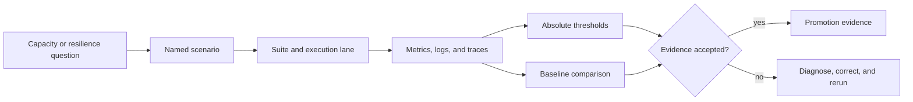

# Load and Performance Assurance

Atlas load evidence answers an operational question: will a named deployment
remain useful under the traffic, contention, failure, and delivery conditions
it is expected to face?

The answer is never a single throughput number. It binds a scenario, pinned
queries, deployment profile, required metrics, absolute budgets, and an
approved baseline.

## From Workload to Decision

The scenario registry preserves workload identity. Suites decide where and how
often scenarios run. Threshold files define acceptable service behavior.
Baselines make regressions visible. Generated reports carry the result into
rollout and release review.

## What Atlas Exercises

| Risk | Evidence family |
| --- | --- |
| Ordinary mixed traffic | smoke and pull-request scenarios using the pinned query pack |
| Cold and warm behavior | startup, prefetch, steady-state, and cache-stampede scenarios |
| Resource contention | CPU, disk I/O, thread-pool, cache, and shard hot-spot stress |
| Dependency degradation | store outage and optional Redis behavior |
| Delivery disruption | pod churn, rollout, rollback, and artifact reload under traffic |
| Long-duration drift | stability, memory-growth, leak-detection, and soak scenarios |
| Abuse resistance | response-size, malicious-input, injection, and denial-of-service suites |

Heavy work is allowed to shed under declared overload policy. Cheap health,
readiness, version, and catalog paths have separate survival expectations. A
healthy overload result proves controlled degradation, not the absence of
rejections.

## Select Evidence by Question

- Start with [Performance and Load](performance-and-load.md) to identify the
  workload family and evidence identity.
- Use [Scenario Registry](scenario-registry.md) and
  [Load Suites](load-suites.md) to find the exact executable contract.
- Read [Thresholds and Budgets](thresholds-and-budgets.md) before interpreting
  latency, failure rate, or survival signals.
- Use [Baseline Management](baseline-management.md) and
  [Benchmark CI](benchmark-ci.md) for candidate-versus-reference decisions.
- Use [Concurrency Stress](concurrency-stress.md) for saturation and shared
  resource behavior.
- Use [Failure Injection Load](failure-injection-load.md),
  [Pod Churn Resilience](pod-churn-resilience.md), and
  [Rollout Under Load](rollout-under-load.md) for controlled degradation and
  recovery.

## Evidence Authority

- `ops/load/scenario-registry.json` anchors scenario discovery.
- `ops/load/suites/suites.json` declares membership, required metrics, and
  must-pass behavior.
- `ops/load/queries/pinned-v1.json` fixes request identity.
- `ops/load/thresholds/` and `ops/load/contracts/` define pass boundaries.
- `ops/load/baselines/` holds approved comparison points.
- `ops/load/generated/` holds derived coverage and summary material.

A run is suitable for promotion only when those identities agree with the
environment and report being reviewed.
