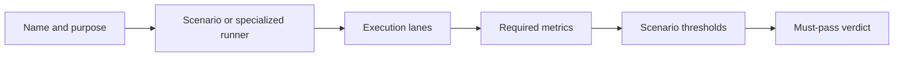
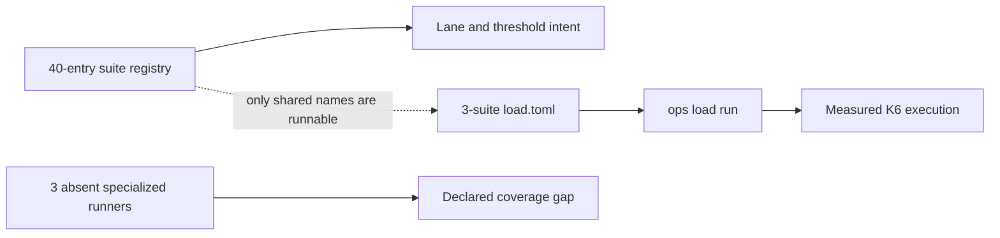
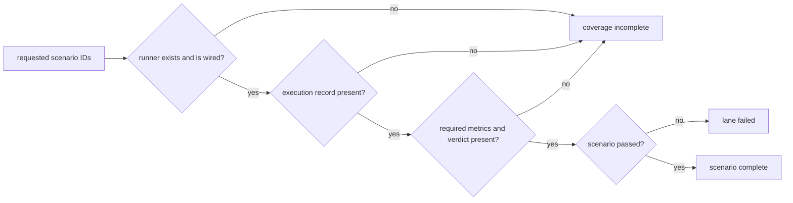

# Load Suite Catalog

The load suite registry is the executable acceptance catalog for Atlas
performance and resilience. It currently declares 40 scenarios. Thirty-nine are
must-pass; `redis-optional` is comparative rather than release-blocking.

## Lane Coverage

| Lane | Declared scenarios | Intended decision |
| --- | ---: | --- |
| `smoke` | 2 | Fast mixed-traffic and cheap-path survival confidence |
| `pr` | 2 | Pull-request regression signal for the same focused surface |
| `load-ci` | 2 | Dedicated CI execution of the focused load gate |
| `full` | 32 | Broad capacity, pressure, resilience, and delivery review |
| `hpa-validation` | 1 | Focused autoscaling behavior |
| `nightly` | 40 | Complete scheduled load catalog |
| `load-nightly` | 40 | Complete dedicated load lane |

Lane membership is declared per scenario in
`ops/load/suites/suites.json`. Do not infer that a scenario ran because a lane
name sounds broad; preserve the selected scenario list in the report.

## Suite Contract

Each registry entry binds:

- a durable scenario name and operating question;
- a K6 script or specialized runner;
- the lanes in which it must execute;
- metrics that must be present for evidence to be complete;
- absolute latency, failure, startup, memory, or survival budgets;
- whether failure blocks the suite.

The registry uses the pinned request set at
`ops/load/queries/pinned-v1.json`. A workload with different requests is a
different experiment and cannot silently reuse the same baseline.

## Current Executable Boundary

The 40-entry registry contains 37 K6 entries and three specialized `script`
entries. It is broader than the manifest consumed by `ops load run`:
`ops/load/load.toml` currently wires only `mixed`, `diff_heavy`, and
`hpa_validation_short` to K6 scripts.

The three specialized registry entries are `cold-start-prefetch-5pods`,
`load-under-rollout`, and `load-under-rollback`. Their runner paths point to
Python files under an absent historical source layout. They are specifications,
not executable runners in the current repository.

Before reporting lane coverage, intersect the requested registry members with
the executable manifest and verify every referenced file. A generated catalog
summary can be complete while the execution surface remains much smaller.

## Reconcile Declared and Executed Coverage

A lane name is a selection request, not proof of execution. Reconciliation must
join the requested registry members to runnable implementations and then to
records emitted by the same run.

| Evidence set | Required meaning | Failure meaning |
| --- | --- | --- |
| Requested | Exact selected registry members | Selection is unknown |
| Runnable | Every member has a wired runner | Coverage is not executable |
| Executed | Every runner has a record | Execution or reporting stopped |
| Metrics | Every required metric is present | Execution is incomplete |
| Verdicts | Policy evaluated every metric record | Acceptance is undecided |

The absent specialized runners currently prevent complete execution of
`full`, `nightly`, and `load-nightly`. A report for any of those lanes must name
the missing IDs and fail coverage; silently reducing the selected set changes
the experiment.

Classify each incomplete member as unresolved runner, runner start failure,
interrupted execution, missing metric, invalid record, or threshold failure.
Preserve every attempt. Replacing a failed attempt with a successful retry
removes evidence about instability and is not an acceptable reconciliation.

## Scenario Families

- Core service: `mixed`, `cheap-only-survival`, warm steady state, and cold
  start.
- Cache and store: stampede, cache thrashing, artifact reload, dataset churn,
  Redis comparison, and store outage.
- Query shape: sharded fanout, hot spots, diff-heavy, cursor stress, and mixed
  gene/sequence traffic.
- Capacity: read-heavy, write-heavy, ingest/query, CPU, disk I/O, and thread
  exhaustion.
- Delivery: pod churn, rollout, rollback, HPA validation, and multi-release
  access.
- Endurance: long-running stability, memory-leak detection, and soak.
- Security: response abuse, denial-of-service resilience, malicious input,
  injection, penetration simulation, and regression suites.

## Accepting a Suite Result

A suite result is valid only when the scenario identity, runner, query pack,
profile, required metrics, and threshold version are recorded together. Missing
metrics fail completeness even if the process exits successfully. Must-pass
scenarios block the enclosing lane when their contract fails.

`ops/load/generated/load-summary.json` currently reports complete scenario
coverage and a deterministic seed of `11001`. That generated inventory proves
registry coverage; it does not prove that a particular workload execution
passed.

Use [Thresholds and Budgets](thresholds-and-budgets.md) for pass semantics and
[Baseline Management](baseline-management.md) for regression comparisons.
