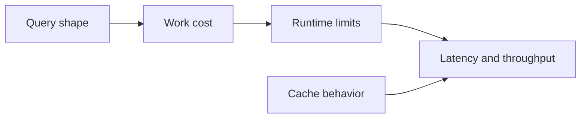
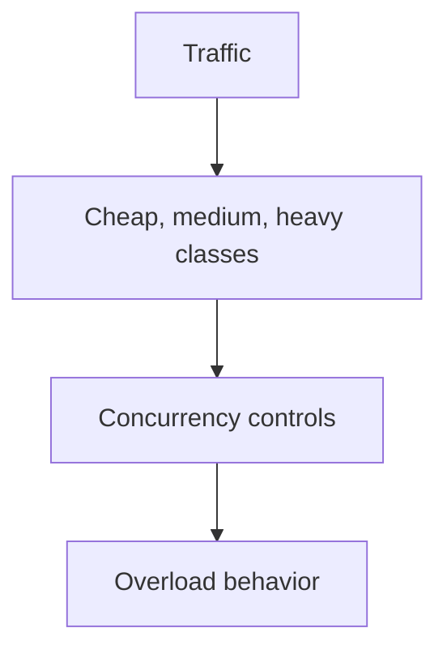

# Performance and Load

Atlas performance should be evaluated in terms of query shape, artifact layout, cache behavior, and runtime limits, not only raw request-per-second numbers.

## Performance Model

This performance model shows why Atlas performance cannot be summarized by one throughput number. The
cost of work depends on query shape, limits, and cache behavior together.

## Load Model

This load model explains why Atlas talks about traffic classes instead of treating all requests as
equal. Different classes stress the runtime differently and can trigger different guardrails.

## What Usually Drives Performance

- whether queries are explicit and selective
- whether caches are warm
- whether store access is healthy
- whether runtime concurrency limits match actual traffic shape

## Operator Advice

- measure realistic request mixes, not only synthetic happy-path queries
- observe overload and readiness under stress, not only average latency
- correlate load results with request class and policy behavior

## What Good Performance Means

Good performance is not just “fast.” It is:

- predictable under expected traffic
- explicit about overload behavior
- observable during degradation
- recoverable after stress

## A Better Performance Question

Instead of asking only “how fast is Atlas,” ask “how predictable is Atlas under the traffic mix we
actually expect to send?”

## Purpose

This page explains the Atlas material for performance and load and points readers to the canonical checked-in workflow or boundary for this topic.

## Source of Truth

- `ops/load/suites/suites.json`
- `ops/load/scenario-registry.json`
- `ops/load/queries/pinned-v1.json`
- `ops/load/contracts/k6-thresholds.v1.json`
- `ops/load/contracts/performance-regression-ci-contract.json`
- `ops/load/contracts/performance-regression-thresholds.json`
- `ops/load/baselines/`

## How to Run a Meaningful Performance Review

1. choose the scenario family that matches the real workload under review
2. use the pinned query pack in `ops/load/queries/pinned-v1.json` unless the
   review explicitly requires another dataset or query shape
3. confirm the suite thresholds and baseline before running the workload
4. compare the candidate result against the approved baseline rather than
   relying on one standalone run
5. review observability and rollout evidence when the performance result will
   influence promotion

## Cross-Linked Control Surfaces

- thresholds and budgets decide whether the candidate behavior is acceptable
- baselines decide what “better,” “worse,” or “unchanged” means for a review
- the scenario registry keeps workload identity stable
- the regression contracts decide when CI should fail

## Stability

This page is part of the canonical Atlas docs spine. Keep it aligned with the current repository behavior and adjacent contract pages.
