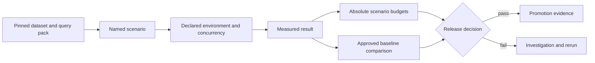
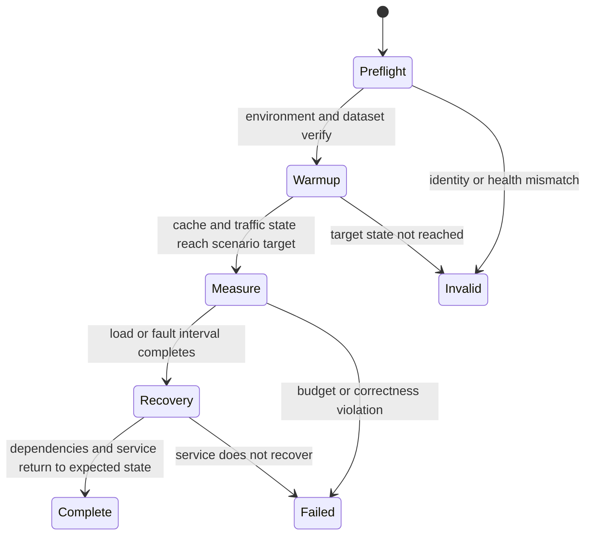

# Performance and Load

Atlas treats performance as a release property, not a single requests-per-second
number. A credible result identifies the dataset, query pack, cache state,
deployment profile, concurrency, failure conditions, and acceptance budgets.

The checked-in load system covers steady traffic, saturation, component failure,
deployment churn, long-running stability, and deliberate abuse. It measures
both how quickly Atlas answers and how predictably it degrades.

## The Measurement Contract

```mermaid
flowchart LR
    I["Pinned dataset and query pack"] --> S["Named scenario"]
    S --> E["Declared environment and concurrency"]
    E --> R["Measured result"]
    R --> A["Absolute scenario budgets"]
    R --> B["Approved baseline comparison"]
    A --> D{"Release decision"}
    B --> D
    D -->|pass| P["Promotion evidence"]
    D -->|fail| X["Investigation and rerun"]
```

`ops/load/scenario-registry.json` owns scenario identity. The suite registry in
`ops/load/suites/suites.json` binds each scenario to its purpose, runner,
expected metrics, execution lanes, and pass budgets. The pinned request corpus
is `ops/load/queries/pinned-v1.json`.

A run without these identities can still help exploration, but it is not
comparable release evidence.

## Measurement Phases

```mermaid
stateDiagram-v2
    [*] --> Preflight
    Preflight --> Warmup: environment and dataset verify
    Warmup --> Measure: cache and traffic state reach scenario target
    Measure --> Recovery: load or fault interval completes
    Recovery --> Complete: dependencies and service return to expected state
    Preflight --> Invalid: identity or health mismatch
    Warmup --> Invalid: target state not reached
    Measure --> Failed: budget or correctness violation
    Recovery --> Failed: service does not recover
```

Exclude preflight and warmup from a steady-state window unless the scenario is
explicitly measuring startup. Preserve them as separate evidence because a
candidate that takes too long to become measurable may still violate an
operational objective.

## Workload Families

| Family | Representative scenarios | Question answered |
| --- | --- | --- |
| Fast confidence | `mixed`, `cheap-only-survival` | Are ordinary requests healthy, and do cheap routes survive overload? |
| Cache and startup | `warm-steady-state-p99`, `cold-start-p99`, `stampede` | Are startup, warm-cache latency, and concurrent misses bounded? |
| Resource pressure | `cpu-saturation`, `disk-io-saturation`, `thread-pool-exhaustion` | Does the runtime shed or queue work without uncontrolled collapse? |
| Data shape | `sharded-fanout`, `shard-hot-spot`, `diff-heavy`, `mixed-gene-sequence` | How do shard locality and expensive query shapes affect service budgets? |
| Dependency failure | `store-outage-under-spike`, `redis-optional` | Does the declared degradation policy hold when an optional or critical path fails? |
| Delivery safety | `pod-churn`, `load-under-rollout`, `load-under-rollback`, `artifact-reload` | Can the service remain useful while its runtime or artifact set changes? |
| Endurance | `long-running-stability`, `memory-leak-detection`, `soak-30m` | Do latency, errors, and memory remain bounded over time? |
| Adversarial pressure | response abuse and the security suites | Do input and denial-of-service guardrails remain effective under traffic? |

The harness contract also names three workload kinds—query, ingest, and
mixed—and three concurrency profiles: single client, multiple clients, and
saturation. This prevents a result from hiding its traffic shape behind a
generic benchmark label.

## What a Valid Run Records

A comparable run must preserve:

- the Atlas revision and deployment profile;
- dataset and release identity, including the pinned query set;
- scenario name, duration, target rate, and concurrency profile;
- cache state and the health of MinIO, Redis, and other active dependencies;
- latency distributions, failure rate, throughput, and scenario-specific
  signals;
- the threshold set and approved baseline used for the decision;
- logs, metrics, traces, and failure-injection timing when degradation is part
  of the scenario.

Expected metrics are contractual. A run that omits a required signal is
incomplete; the missing measurement must not be interpreted as a pass.

## Traffic and Measurement Validity

The traffic model is part of the workload identity:

| Model | What remains fixed | Primary risk when interpreting it |
| --- | --- | --- |
| Closed loop | concurrent clients wait for a response before issuing more work | latency growth reduces offered load and can hide saturation |
| Open loop | arrivals continue at the declared rate independently of response time | generator lag or dropped arrivals can hide the intended pressure |
| Trace replay | request timing and mix follow a recorded corpus | the trace may not represent the target dataset or deployment |

Record which model the runner implements. For rate-driven work, preserve both
the intended and achieved arrival rate. For concurrency-driven work, preserve
active clients, completed requests, and queueing. A candidate and baseline are
not equivalent merely because they use the same nominal concurrency value.

Client health is also evidence. CPU saturation, connection exhaustion, clock
skew, network limits, or backpressure in the load generator can cap the offered
load before Atlas reaches its own limit. When that happens, classify the run as
measurement-limited and move or resize the generator before drawing a capacity
conclusion.

For latency, avoid coordinated-omission bias: the recorded population must
account for work that arrived or should have arrived while the service was
slow. Preserve timeouts and rejected requests as outcomes; excluding them
changes the user population and can make a degraded service look healthy.

## Invalidate Before Comparing

Stop the comparison and retain the run as diagnostic evidence when any of the
following occurs:

- the target dataset, query corpus, deployment profile, or traffic model does
  not match the approved baseline;
- the generator misses its declared offer or becomes the bottleneck;
- required latency, throughput, failure, resource, or recovery signals are
  absent or have an ambiguous time window;
- an unrelated dependency fault or rollout overlaps the measurement window;
- warmup never reaches the scenario's required state; or
- clocks cannot align load events with metrics, logs, traces, and injected
  faults.

Invalidation protects the claim. It is not a mechanism for discarding an
unfavorable product result: budget violations observed in a valid run remain
failures and must stay in the retained series.

## Reading Results

Judge each candidate twice:

1. Compare it with the absolute budgets for its named scenario.
2. Compare it with the approved baseline under the regression contract.

A result passes only when both decisions pass. This catches a candidate that is
inside a broad service limit but has regressed materially, and a candidate that
matches a weak baseline while still violating the service budget.

Interpret latency together with throughput and failure rate. A lower percentile
is not an improvement if the server completed less work or rejected a larger
share of requests. Under overload, also verify that heavy work was shed as
declared and cheap health and catalog routes remained available.

One run can establish a deterministic threshold failure, but a close
candidate-versus-baseline decision should include repeated comparable runs and
the full distribution. Report run-to-run spread and outliers rather than
selecting the most favorable sample. Operational budgets remain hard
boundaries even when average behavior looks better.

For a capacity claim, increase load across multiple points and identify the
knee where latency, queueing, rejection, or resource use changes materially.
Report the last sustainable point and the first unsustainable point. A single
high-load sample cannot show whether the result is stable, near a cliff, or
already generator-limited.

## Choosing an Execution Scope

Use the smallest suite that answers the operational question:

- `smoke` or `pr` for fast confidence in the mixed and cheap-survival paths;
- `full` for scenario-specific capacity, resilience, or delivery decisions;
- `nightly` and `load-nightly` for soak, memory growth, and broad stress
  coverage.

Do not use a smoke pass to support a production capacity claim. Conversely, a
local documentation or configuration review does not need to repeat the whole
load estate.

## Evidence Locations

- scenario registry: `ops/load/scenario-registry.json`
- suite membership and expected metrics: `ops/load/suites/suites.json`
- pinned requests: `ops/load/queries/pinned-v1.json`
- absolute budgets: `ops/load/thresholds/` and
  `ops/load/contracts/k6-thresholds.v1.json`
- regression limits: `ops/load/contracts/performance-regression-thresholds.json`
- approved references: `ops/load/baselines/`

See [Thresholds and Budgets](thresholds-and-budgets.md) for the exact decision
order and current global limits.
