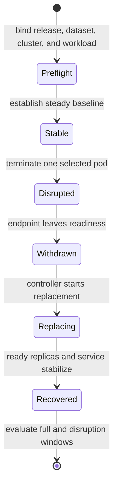
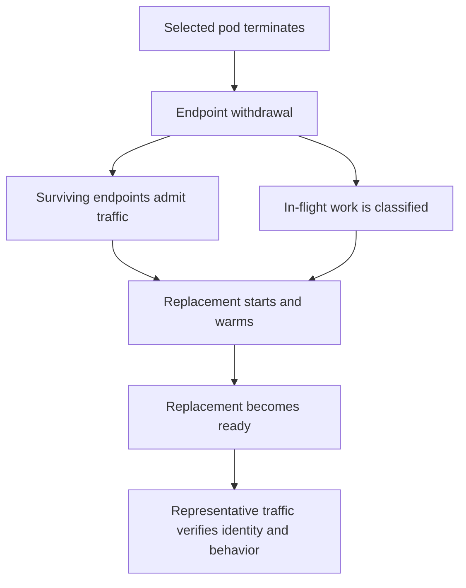
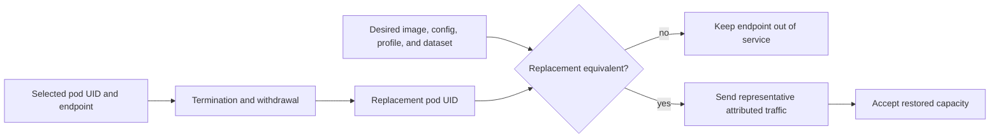

# Pod Churn Resilience

Pod-churn testing asks whether Atlas preserves correct, bounded service while
Kubernetes removes and replaces an instance. The governed suite defines a
steady `warm-steady.js` workload and these ceilings:

| Signal | Maximum |
| --- | ---: |
| p95 latency | 1,200 ms |
| p99 latency | 2,500 ms |
| error rate | 3% |

The same values appear in the suite registry, dedicated threshold file, and k6
threshold contract. That agreement defines the budget. It is not evidence that
a churn experiment ran.

## Current Execution Boundary

`pod-churn` is registered in `ops/load/suites/suites.json` and its scenario
requires Kubernetes. It is not present in `ops/load/load.toml`, which is the
manifest consumed by `bijux-atlas-dev ops load run`. The checked-in k6 script
generates steady traffic, but it does not delete a pod or correlate Kubernetes
events.

As a result, `ops load run pod-churn` is not a working end-to-end harness today.
Do not present the registry entry, generated manifest, or a plain
`warm-steady.js` result as pod-churn evidence. A valid run needs an external or
future governed orchestrator that performs and records the disruption.

## Required Experiment Sequence

Use one run identity for workload output and cluster evidence. Keep workload
rate, request mix, dataset, and resource settings constant from baseline
through recovery. Record the exact disruption command and selected pod UID.

## Observe the Transition

Correlate monotonic timestamps for:

- request latency, failures, status classes, and correctness checks;
- desired, available, ready, terminating, and restarting replicas;
- readiness changes and endpoint membership;
- pod deletion, replacement scheduling, image pull, and start events;
- PDB and HPA decisions;
- connection resets and drain behavior;
- return to the pre-disruption ready count and stable request budget.

Aggregate thresholds apply to the complete scenario. Also calculate the
baseline, disruption, and recovery windows separately. A short blackout can be
hidden by a long healthy baseline.

## Account for Service Continuity

Replica recovery and request continuity are related but distinct. A complete
run accounts for what happened to traffic and authority while Kubernetes
changed the serving population.

| Continuity boundary | Before termination | During withdrawal and replacement | Recovery proof |
| --- | --- | --- | --- |
| request admission | offered and admitted rates are stable | new work stops reaching the withdrawn endpoint | admitted rate and routing stabilize |
| in-flight work | active connections and long requests are identified | completions, explicit cancellations, and resets are classified | no orphaned work or retry storm remains |
| serving capacity | ready endpoints sustain the governed workload | surviving capacity and any deliberate shedding remain within budget | declared ready count sustains the same workload |
| cache and store | cache state and authoritative store identity are recorded | cold-path pressure and store access remain attributable | cache behavior settles without hiding store or dataset changes |
| dataset authority | release, catalog, manifest, and dataset hashes agree | every successful response retains the same authority | replacement serves the bound identities |
| replacement readiness | no replacement is yet needed | scheduling, startup, warmup, and readiness are timed separately | the new endpoint receives representative traffic correctly |

Do not infer clean draining from a low aggregate error rate. The workload may
have retried a reset, the withdrawn endpoint may have completed work after its
readiness changed, or surviving replicas may have hidden a replacement that
never served a representative request.

## Prove Replacement Equivalence

Kubernetes restoring the desired replica count is controller success. Atlas
recovery additionally requires the replacement to join with the intended
release, configuration, dataset, dependency, and traffic identities.

Retain the old and replacement pod UIDs, node and failure-domain placement,
image ID, configuration digest, dataset and catalog identity, readiness
transition, cache condition, and first attributed request. A replacement on
the same node does not support a node-loss claim; a replacement that inherits
a warm volume does not establish cold-start behavior.

Require the new endpoint to serve enough identified traffic to exercise the
protected request classes. Ready replicas can reach the target count while a
selector, endpoint, or connection-reuse defect continues routing all work to
the survivors.

## Acceptance Decision

Accept only when the declared thresholds pass, responses remain correct,
traffic does not reach a withdrawn endpoint, replacement capacity stabilizes,
and the timeline is complete. Missing cluster events or release identity makes
the run inconclusive, even if k6 reports green.

A single pod replacement proves only that bounded path. It does not establish
node-loss, zone-loss, repeated-churn, or arbitrary disruption-rate resilience.
Declare a new experiment when cadence or overlap changes.

Use [Health, readiness, and drain](../observability/health-readiness-and-drain.md)
for probe semantics and [Debug bundles](../kubernetes/debug-bundles.md) to
preserve failures before cluster state disappears.
