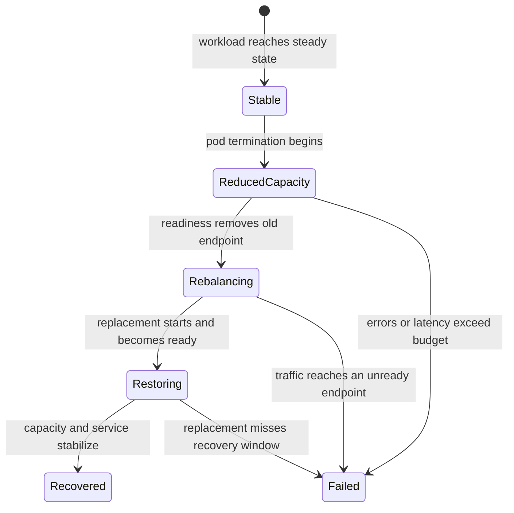

# Pod Churn Resilience

The `pod-churn` scenario asks whether Atlas can keep serving governed traffic
while Kubernetes removes and replaces instances. It requires Kubernetes and
uses the `warm-steady.js` workload, so the churn event is measured against an
already-active service rather than startup traffic.

## Churn Timeline

Capture the stable interval before terminating a pod. Record each termination,
endpoint removal, replacement start, readiness transition, and return to the
stable replica count. Keep load parameters unchanged through the recovery
window.

## Acceptance Budget

| Signal | Maximum |
| --- | ---: |
| p95 latency | 1,200 ms |
| p99 latency | 2,500 ms |
| Error rate | 3% |

The budget applies to the complete governed scenario. Also inspect the churn
window directly: an acceptable aggregate can conceal a short request blackout.

## Evidence to Correlate

- request latency, failures, and status classes over the same timeline;
- desired, available, ready, terminating, and restarting replicas;
- readiness and endpoint membership transitions;
- connection resets, draining behavior, and requests sent to unready pods;
- PDB decisions and unschedulable or image-pull delays;
- HPA activity when the selected profile enables autoscaling; and
- the time from pod loss to restored ready capacity and steady service.

A single controlled replacement proves one recovery path. Repeated churn is a
different experiment and must record cadence, number of replacements, and
whether events overlap. Do not generalize a one-pod result to node loss,
availability-zone loss, or arbitrary disruption rates.

## Failure Conditions

Fail the scenario when latency or errors exceed budget, traffic reaches a pod
after readiness withdrawal, replacement capacity does not stabilize, or
correctness changes during churn. Missing readiness or event evidence also
invalidates the result because it prevents attribution of the service impact.

Use [Health, Readiness, and Drain](../observability/health-readiness-and-drain.md)
for probe semantics and [Rollout Safety](../kubernetes/rollout-safety.md) for
profile-specific delivery controls.
