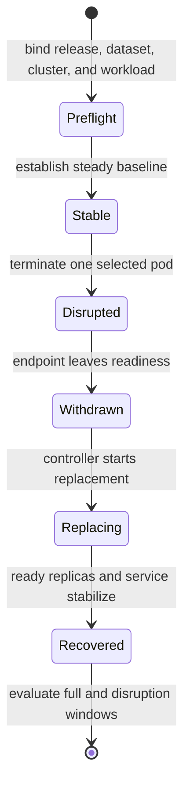

# Pod Churn Resilience

Pod-churn testing asks whether Atlas preserves correct, bounded service while
Kubernetes removes and replaces an instance. The governed suite defines a
steady `warm-steady.js` workload and these ceilings:

| Signal | Maximum |
| --- | ---: |
| p95 latency | 1,200 ms |
| p99 latency | 2,500 ms |
| error rate | 3% |

The same values appear in the suite registry, dedicated threshold file, and k6
threshold contract. That agreement defines the budget. It is not evidence that
a churn experiment ran.

## Current execution boundary

`pod-churn` is registered in `ops/load/suites/suites.json` and its scenario
requires Kubernetes. It is not present in `ops/load/load.toml`, which is the
manifest consumed by `bijux-atlas-dev ops load run`. The checked-in k6 script
generates steady traffic, but it does not delete a pod or correlate Kubernetes
events.

As a result, `ops load run pod-churn` is not a working end-to-end harness today.
Do not present the registry entry, generated manifest, or a plain
`warm-steady.js` result as pod-churn evidence. A valid run needs an external or
future governed orchestrator that performs and records the disruption.

## Required experiment sequence

Use one run identity for workload output and cluster evidence. Keep workload
rate, request mix, dataset, and resource settings constant from baseline
through recovery. Record the exact disruption command and selected pod UID.

## Observe the transition

Correlate monotonic timestamps for:

- request latency, failures, status classes, and correctness checks;
- desired, available, ready, terminating, and restarting replicas;
- readiness changes and endpoint membership;
- pod deletion, replacement scheduling, image pull, and start events;
- PDB and HPA decisions;
- connection resets and drain behavior;
- return to the pre-disruption ready count and stable request budget.

Aggregate thresholds apply to the complete scenario. Also calculate the
baseline, disruption, and recovery windows separately. A short blackout can be
hidden by a long healthy baseline.

## Acceptance decision

Accept only when the declared thresholds pass, responses remain correct,
traffic does not reach a withdrawn endpoint, replacement capacity stabilizes,
and the timeline is complete. Missing cluster events or release identity makes
the run inconclusive, even if k6 reports green.

A single pod replacement proves only that bounded path. It does not establish
node-loss, zone-loss, repeated-churn, or arbitrary disruption-rate resilience.
Declare a new experiment when cadence or overlap changes.

Use [Health, readiness, and drain](../observability/health-readiness-and-drain.md)
for probe semantics and [Debug bundles](../kubernetes/debug-bundles.md) to
preserve failures before cluster state disappears.
