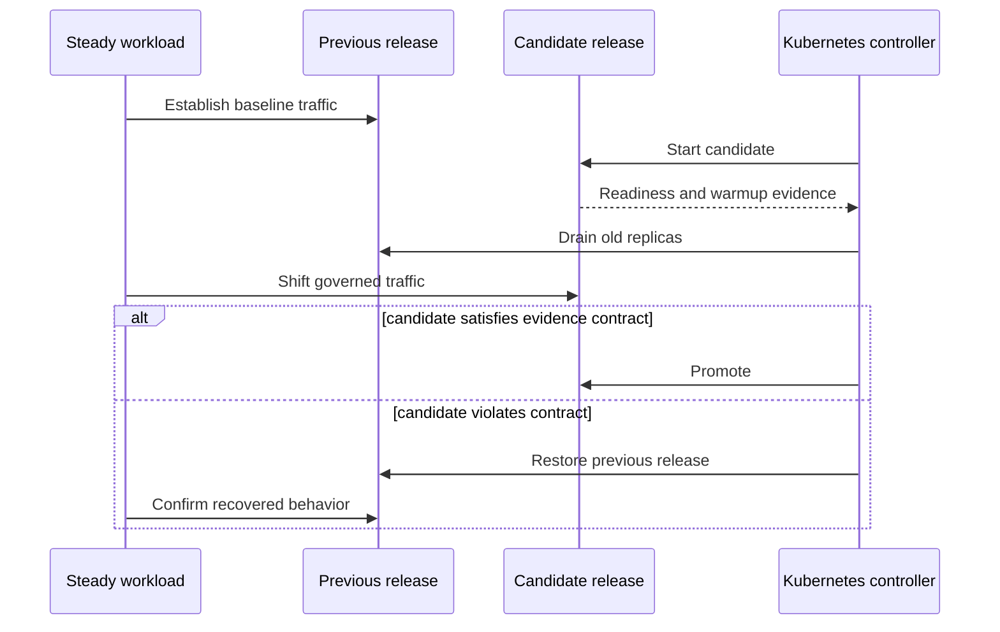
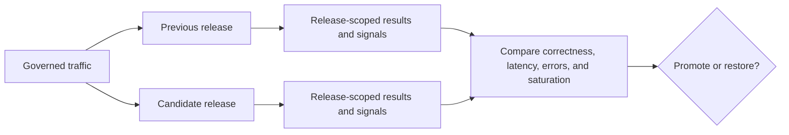

# Rollout and Rollback Under Load

Atlas tests both directions of release change under steady traffic. A rollout
proves that a candidate can enter service without violating the request
contract. A rollback proves that the previous release can restore behavior
without leaving partial runtime state. Control-plane completion alone proves
neither outcome.

Both scenarios require Kubernetes and use `warm-steady.js`:

| Scenario | Control action | Required outcome |
| --- | --- | --- |
| `load-under-rollout` | Rollout or restart to the candidate | Candidate becomes ready, receives traffic, and remains inside service budgets. |
| `load-under-rollback` | Rollback or undo to the previous release | Previous release becomes ready, receives traffic, restores correctness, and leaves no partial release state. |

## Change Sequence

Record the previous and candidate image digests, chart and profile identities,
start and completion timestamps, replica transitions, and traffic share by
release. Aggregated service metrics are insufficient: healthy old replicas can
hide a failing candidate.

## Release-Scoped Observation

The candidate must serve enough representative traffic to evaluate every
protected request class. Record zero-traffic, warmup, and readiness intervals
separately. They must not dilute the measurement window or let aggregate
service health conceal a candidate that never became useful.

## Acceptance Budget

Rollout and rollback use the same governed limits:

| Signal | Maximum |
| --- | ---: |
| p95 latency | 1,400 ms |
| p99 latency | 2,600 ms |
| Error rate | 5% |

These are service ceilings, not promotion targets. Correctness, readiness,
telemetry continuity, dataset availability, and configuration compatibility
remain mandatory even when latency and error rate are inside budget.

## Promotion Evidence

A rollout is acceptable only when the candidate:

- passes the profile's render, policy, and readiness contracts;
- becomes an active endpoint and serves a meaningful share of the workload;
- preserves request semantics, dataset resolution, and protected traffic;
- emits metrics, logs, traces, and release identity continuously; and
- stabilizes without restart loops, unresolved warmup, or hidden dependency
  failures.

## Rollback Evidence

A rollback is acceptable only when the previous release is restored, query
correctness and governed dataset access are recovered, the validation report is
complete, and no partial release state remains. Preserve the trigger and the
first violated signal; a successful recovery does not erase the candidate
failure.

Escalate instead of repeatedly cycling releases when shared data integrity is
uncertain, the previous release cannot become ready, or compatibility prevents
a clean revert.

## Invalidating Conditions

Reject the rollout experiment when release identity is missing from signals,
the traffic split is unknown, the dataset changes during the comparison,
telemetry gaps cover a transition, the old release is unhealthy before the
candidate starts, or an unrelated dependency change enters the window. Repeat
only after preserving and classifying the invalid run.

Use [Rollout Safety](../kubernetes/rollout-safety.md) for profile controls and
[Release Evidence](../release/release-evidence.md) for the packet required to
support a promotion decision.
