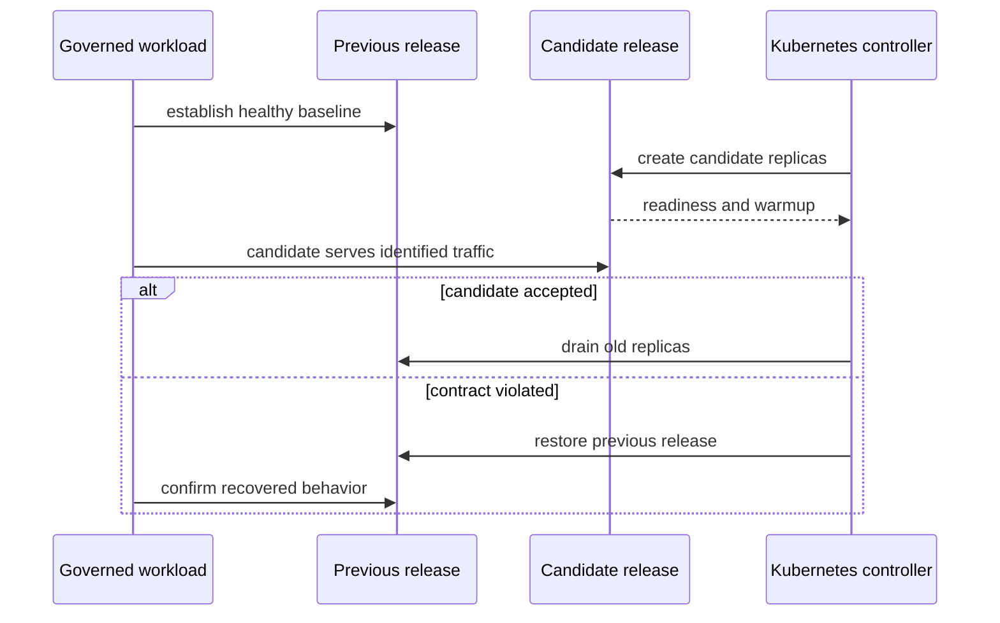
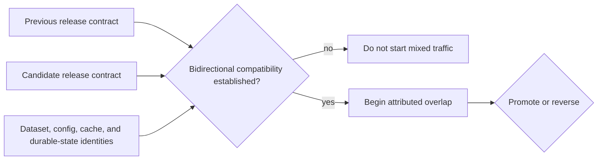
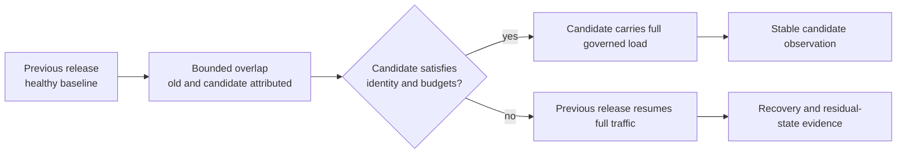

# Rollout and Rollback Under Load

These experiments evaluate both directions of a release change while governed
traffic remains active. Rollout asks whether a candidate becomes useful without
breaking the service contract. Rollback asks whether the previous release
restores that contract without leaving mixed state.

| Scenario | Control action | p95 | p99 | Error rate |
| --- | --- | ---: | ---: | ---: |
| `load-under-rollout` | move from previous release to candidate | 1,400 ms | 2,600 ms | 5% |
| `load-under-rollback` | restore previous release | 1,400 ms | 2,600 ms | 5% |

Both are marked mandatory in nightly load lanes. Latency and error ceilings are
service survival limits, not sufficient promotion criteria.

## Current Execution Boundary

The suite registry declares both entries as `script` runners, but each runner
path points to a Python file that is absent from the repository. Neither suite
is present in `ops/load/load.toml`, the executable manifest used by `ops load
run`. Their scenario records name `warm-steady.js`, but that k6 script does not
perform a rollout or rollback.

Therefore, the checked-in control plane does not currently execute either
end-to-end experiment. Generated suite manifests demonstrate registry
generation only. They are not measured rollout evidence. Do not claim nightly
coverage until a real runner performs the control action and emits the required
release-correlated result.

## Evidence Contract for a Real Runner

A runner must bind:

- previous and candidate image digests;
- chart, values profile, config digest, and dataset identity;
- workload script, query corpus, rate, duration, and cache state;
- rollout revision, replica history, endpoint membership, and timestamps;
- metrics, logs, traces, and request results labeled by release;
- the violated signal and rollback trigger when recovery occurs.

Healthy old replicas can hide a candidate that never becomes ready. Aggregate
service metrics are insufficient unless traffic and results can be attributed
to each release.

## Establish State Compatibility Before Traffic

Rollout reversal is safe only when the previous and candidate releases can use
the same selected dataset, catalog, configuration, cache namespace, and
persistent state without changing their meaning. Complete this compatibility
decision before the candidate receives governed traffic.

| Shared surface | Pre-traffic question | Rollback blocker |
| --- | --- | --- |
| API and response contract | Can both releases serve the same request and error envelopes? | candidate emits state or responses the previous release cannot interpret |
| dataset and catalog | Do both releases resolve the same immutable release tuple and manifest? | candidate advances an incompatible pointer or artifact schema |
| runtime configuration | Are keys, defaults, feature flags, and secrets understood in both directions? | candidate-only configuration becomes required for serving |
| cache | Are entries versioned by release and output contract? | candidate entries can be reused incorrectly by the previous release |
| durable writes and jobs | Can in-flight and completed mutations be read or replayed after reversal? | an irreversible mutation crosses the rollback boundary |

If the candidate can perform an irreversible publication, schema change, or
administrative mutation, disable that capability during reversible overlap or
use a separately governed forward-recovery plan. A deployment controller can
restore old pods while application rollback has already become impossible.

## Prove Traffic Assignment

For each request class and observation window, calculate the observed candidate
share:

\[
w_{observed} = \frac{N_{candidate}}{N_{candidate} + N_{previous}}
\]

`N` counts completed requests with an unambiguous release identity. Compare
`w_observed` with the controller's declared traffic weight and record a
tolerance before the run. Requests with missing or conflicting identity remain
in the service-level denominator but cannot support a candidate verdict.

Verify more than total request count. The candidate needs representative cheap,
heavy, error, dataset-resolution, cold-cache, and warm-cache traffic when those
classes are part of the release claim. A correct overall weight can still hide
a selector, session-affinity, or routing defect that sends one class only to
the previous release.

## Budget the Overlap

Mixed-version operation creates its own capacity condition. During overlap,
the previous release drains while the candidate starts, warms caches, opens
dependencies, and begins receiving traffic. The service-level result is useful
only when the run also attributes the capacity and behavior of each release.

| Overlap proof | Required evidence | Decision protected |
| --- | --- | --- |
| capacity supply | desired, ready, available, and serving replicas by release | the rollout never silently falls below the capacity assumed by the workload |
| candidate admission | completed requests and offered share by release and request class | healthy previous replicas cannot mask an unused candidate |
| startup pressure | startup duration, warmup, cache misses, store calls, and resource peaks | transient candidate cost fits inside the overlap budget |
| previous-release drain | endpoint withdrawal, in-flight completion, reset, and termination timing | capacity is not removed before accepted work is resolved |
| service outcome | correctness, latency, rejection, failure, and timeout by release | aggregate success cannot hide candidate-specific failure |
| reversal reserve | previous-release readiness, compatible state, and time to resume full traffic | rollback remains executable under the same governed load |

Set the allowed overlap duration and minimum capacity before the run. A slow
rollout that eventually succeeds can still violate the operational contract;
a quick rollback can still fail if the previous release returns with ambiguous
catalog, configuration, or store authority.

## Measurement Windows

Evaluate at least four windows: healthy baseline, candidate warmup, mixed
traffic, and stable candidate or restored previous release. Exclude zero-traffic
intervals from candidate latency calculations, but retain them as availability
evidence. The candidate must serve a meaningful sample of every protected
request class.

Correctness, dataset resolution, readiness, telemetry continuity, and
configuration compatibility are hard gates. A threshold pass cannot compensate
for a wrong dataset, missing release labels, an unobserved transition, or a
candidate that received no useful traffic.

Treat each window as a separate verdict:

| Window | Required evidence | Invalidating condition |
| --- | --- | --- |
| healthy baseline. | Previous release satisfies correctness and service budgets at governed load. | Baseline is already degraded or identity is incomplete. |
| candidate warmup. | Startup, cache and dependency pressure, readiness, and zero-traffic duration are retained. | Candidate becomes ready without its required warmup contract. |
| mixed traffic. | Both releases serve attributed representative requests within overlap capacity. | Declared weight is not observed or one request class bypasses the candidate. |
| steady candidate. | Candidate alone sustains the workload through the declared observation window. | Previous replicas still mask candidate behavior. |
| restored previous. | Previous release alone regains traffic, correctness, and stable readiness. | Candidate authority or incompatible shared state remains. |

## Rollback Completion

Rollback is complete only when the previous digest is active, governed queries
are correct, readiness is stable, and no candidate pods or partial config state
retain authority. Preserve the failed candidate evidence. Successful recovery
does not turn the rollout into a pass.

Escalate instead of cycling releases when data integrity is uncertain, the
previous release cannot become ready, or schema compatibility prevents a clean
revert.

Use [Rollout safety](../kubernetes/rollout-safety.md) for deployment controls
and [Release evidence](../release/release-evidence.md) for promotion custody.
