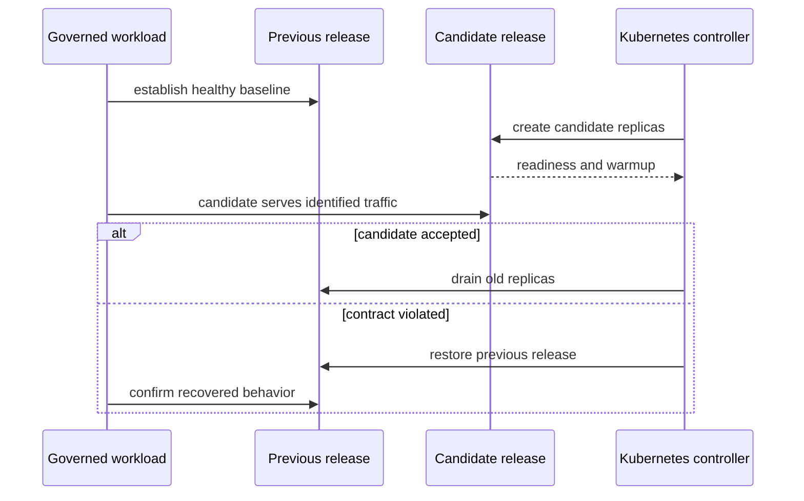

# Rollout and Rollback Under Load

These experiments evaluate both directions of a release change while governed
traffic remains active. Rollout asks whether a candidate becomes useful without
breaking the service contract. Rollback asks whether the previous release
restores that contract without leaving mixed state.

| Scenario | Control action | p95 | p99 | Error rate |
| --- | --- | ---: | ---: | ---: |
| `load-under-rollout` | move from previous release to candidate | 1,400 ms | 2,600 ms | 5% |
| `load-under-rollback` | restore previous release | 1,400 ms | 2,600 ms | 5% |

Both are marked mandatory in nightly load lanes. Latency and error ceilings are
service survival limits, not sufficient promotion criteria.

## Current execution boundary

The suite registry declares both entries as `script` runners, but each runner
path points to a Python file that is absent from the repository. Neither suite
is present in `ops/load/load.toml`, the executable manifest used by `ops load
run`. Their scenario records name `warm-steady.js`, but that k6 script does not
perform a rollout or rollback.

Therefore, the checked-in control plane does not currently execute either
end-to-end experiment. Generated suite manifests demonstrate registry
generation only. They are not measured rollout evidence. Do not claim nightly
coverage until a real runner performs the control action and emits the required
release-correlated result.

## Evidence contract for a real runner

A runner must bind:

- previous and candidate image digests;
- chart, values profile, config digest, and dataset identity;
- workload script, query corpus, rate, duration, and cache state;
- rollout revision, replica history, endpoint membership, and timestamps;
- metrics, logs, traces, and request results labeled by release;
- the violated signal and rollback trigger when recovery occurs.

Healthy old replicas can hide a candidate that never becomes ready. Aggregate
service metrics are insufficient unless traffic and results can be attributed
to each release.

## Measurement windows

Evaluate at least four windows: healthy baseline, candidate warmup, mixed
traffic, and stable candidate or restored previous release. Exclude zero-traffic
intervals from candidate latency calculations, but retain them as availability
evidence. The candidate must serve a meaningful sample of every protected
request class.

Correctness, dataset resolution, readiness, telemetry continuity, and
configuration compatibility are hard gates. A threshold pass cannot compensate
for a wrong dataset, missing release labels, an unobserved transition, or a
candidate that received no useful traffic.

## Rollback completion

Rollback is complete only when the previous digest is active, governed queries
are correct, readiness is stable, and no candidate pods or partial config state
retain authority. Preserve the failed candidate evidence. Successful recovery
does not turn the rollout into a pass.

Escalate instead of cycling releases when data integrity is uncertain, the
previous release cannot become ready, or schema compatibility prevents a clean
revert.

Use [Rollout safety](../kubernetes/rollout-safety.md) for deployment controls
and [Release evidence](../release/release-evidence.md) for promotion custody.
