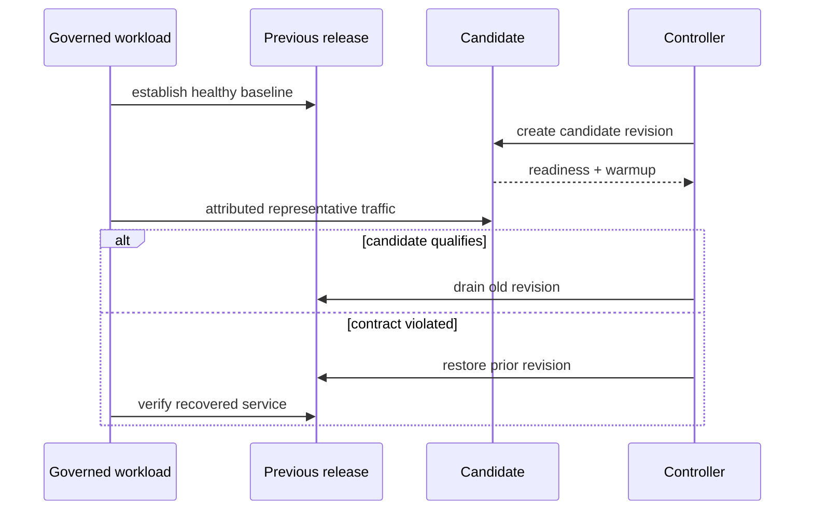

# Rollout and rollback under load

Rollout asks whether a candidate can become useful while governed traffic
continues. Rollback asks whether the previous release can recover full service
without mixed authority. Both need release-attributed traffic, not only
aggregate success.

| Scenario | Control action | p95 | p99 | Error rate |
| --- | --- | ---: | ---: | ---: |
| `load-under-rollout` | Previous release → candidate | 1,400 ms | 2,600 ms | 5% |
| `load-under-rollback` | Candidate → previous release | 1,400 ms | 2,600 ms | 5% |

These are service-survival ceilings. Correctness, identity, readiness,
telemetry, compatibility, and reversal remain hard gates.

## Current execution gap

Both suite entries are declared mandatory nightly `script` scenarios, but each
points to a Python runner file absent from the repository. Neither appears in
`ops/load/load.toml`, the executable manifest used by `ops load run`. Their
scenario records select `warm-steady.js`, which generates traffic but does not
perform rollout or rollback.

Generated manifests prove registry generation only. Atlas does not currently
execute these end-to-end experiments. A passing nightly lane cannot be cited as
rollout-under-load evidence until a real controller is wired into the command
surface and emits release-bound results.

## Contract for an executable runner

The runner must:

1. resolve previous and candidate digests, dataset, chart, profile, target,
   thresholds, and rollback identity;
2. prove a healthy previous-release baseline;
3. start and independently observe the Kubernetes control action;
4. join pod and endpoint identity to completed requests;
5. evaluate per-window correctness, latency, errors, saturation, and samples;
6. execute or verify the abort path under the same load;
7. emit workload, controller, release, dataset, target, and residual-state
   identity with a visible failure status.

The suite registry, `load.toml`, and scenario record must agree. Registration
proves discoverability; only a completed receipt proves behavior.

## Establish reversible state before traffic

| Shared surface | Required decision before overlap |
| --- | --- |
| API and responses | Both releases understand requests, errors, and response envelopes |
| dataset and catalog | Both resolve the same immutable tuple and manifest |
| configuration | Keys, defaults, flags, and secret references work in both directions |
| cache | Entries are versioned by release and output contract |
| durable writes | Candidate work remains readable or replayable after reversal |

If a candidate can perform an irreversible publication, schema change, or
administrative mutation, disable that capability during reversible overlap or
use an explicit forward-recovery plan. Restoring old pods does not guarantee
application rollback remains possible.

## Prove candidate traffic

For each protected request class and window, calculate candidate share from
completed requests with unambiguous release identity:

\[
w_{observed} = \frac{N_{candidate}}{N_{candidate} + N_{previous}}
\]

Compare it with declared routing weight under a pre-recorded tolerance. Keep
requests with missing release identity in service-level failure denominators,
but exclude them from candidate proof. Representative traffic includes cheap,
heavy, error, dataset-resolution, cold-cache, and warm-cache classes required
by the release claim.

## Evaluate each window

| Window | Required evidence |
| --- | --- |
| healthy baseline | Previous release alone satisfies identity, correctness, and budgets |
| candidate warmup | Startup, cache and dependency pressure, readiness, and zero-traffic duration |
| mixed traffic | Both releases serve attributed representative requests within capacity |
| steady candidate | Candidate alone sustains the workload for the required window |
| restored previous | Previous release regains full traffic and candidate authority is absent |

Aggregate metrics can hide a candidate that never served. Preserve desired,
ready, available, and serving replicas by release; endpoint withdrawal;
in-flight completion; reset and termination timing; resource peaks; and
reversal reserve.

Rollback completes only when the prior digest owns traffic, queries are
correct, readiness is stable, shared state is compatible, and no candidate pod
or configuration retains authority. Preserve failed-candidate evidence;
recovery does not turn the rollout into a pass.

Use [Rollout Safety](../kubernetes/rollout-safety.md) for deployment controls
and [Release Evidence](../release/release-evidence.md) for custody.
