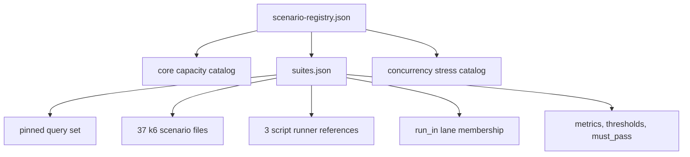
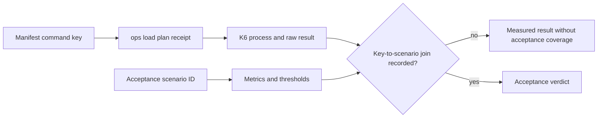
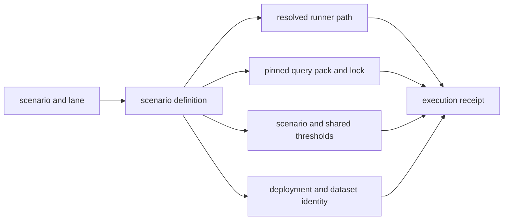

# Scenario Registry

The Atlas load surface is assembled from several catalogs. The top-level
registry points to those catalogs; it does not flatten them into one executable
manifest or prove that every referenced runner exists.

## Registry Layers

| Asset | Responsibility | Does not prove |
| --- | --- | --- |
| `scenario-registry.json` | names three registry inputs | that the inputs agree or are executable |
| `core-capacity-scenarios.json` | defines capacity-oriented scenario records | suite selection or execution |
| `concurrency-stress-scenarios.json` | defines generated concurrency cases | that generated cases are routed into a run |
| `suites/suites.json` | binds names to runners, lanes, metrics, thresholds, and pass policy | that a lane actually invokes every member |
| `queries/pinned-v1.json` | fixes the query workload identity used by the suite | deployment and dataset comparability |

## Current Suite Inventory

The suite manifest currently declares 40 scenarios:

- 37 `k6` scenarios
- 3 script-driven scenarios
- 39 with `must_pass: true`
- one comparative scenario, `redis-optional`, with `must_pass: false`

Lane membership is metadata in `run_in`: all 40 name `nightly` and
`load-nightly`, 32 name `full`, and only `mixed` and `cheap-only-survival` name
`pr`, `smoke`, and `load-ci`. Lane membership does not establish that the
corresponding GitHub workflow discovers and executes those records.

## Executability Gap

All 37 k6 scenario filenames referenced by the suite manifest exist under
`ops/load/scenarios/`. The three script runner paths currently do not exist:

- `cold-start-prefetch-5pods`
- `load-under-rollout`
- `load-under-rollback`

Those records still describe intended thresholds and lane membership, but they
are not executable from the declared paths. A registry validator that checks
JSON shape without resolving runner paths cannot close this gap.

## Current Command Boundary

The manifest consumed by `ops load plan`, `run`, and `report` exposes only
three command keys:

| Command key | K6 script | Acceptance scenario ID |
| --- | --- | --- |
| `mixed` | `ops/load/k6/suites/mixed-80-20.js` | `mixed` |
| `diff_heavy` | `ops/load/k6/suites/diff-heavy.js` | `diff-heavy` |
| `hpa_validation_short` | `ops/load/k6/suites/hpa-validation-short.js` | `hpa-validation-short` |

`ops load plan diff-heavy` and `ops load plan hpa-validation-short` are not
valid command selections; the underscore manifest keys are required. The
hyphenated IDs remain the acceptance-registry identities. This is a join that
evidence must state explicitly, not a naming variation operators should guess.

The current `ops load list-suites` output lists the broader operational suite
families `e2e`, `k8s`, `load`, and `obs`; it does not enumerate these three
manifest keys. Consult `ops/load/load.toml` or a successful `ops load plan`
receipt to establish current command executability.

## Scenario Identity

A performance result is comparable only when these identities agree:

| Identity | Why it matters |
| --- | --- |
| suite name and scenario file | selects traffic shape and executor |
| query set | fixes endpoint and parameter distribution |
| dataset and release | fixes data volume and query behavior |
| runtime, chart, and profile | fixes implementation and resource policy |
| thresholds and expected metrics | fixes pass semantics |
| duration, concurrency, and environment | fixes workload intensity and capacity context |

Do not join results by a human-friendly scenario label alone. Retain the source
revision and hashes for the scenario, query set, and thresholds with each run.

## Resolve a Scenario Before Running It

A runner should resolve one immutable execution record from the catalogs:

The receipt should contain the resolved paths and content hashes, not only the
registry names. This prevents a later catalog edit from changing the meaning of
an archived result.

Before starting traffic, validate these joins:

| Join | Required invariant |
| --- | --- |
| registry to catalog | every referenced catalog exists, parses, and declares the expected schema version |
| suite to scenario | every suite name resolves exactly once and its declared runner type is supported |
| scenario to runner | the file exists, is readable, and matches the declared runner kind |
| scenario to thresholds | required metrics have an owning comparison and no conflicting duplicate definition |
| scenario to query pack | the query-pack lock matches the selected pack bytes |
| lane to workflow | the workflow's resolved scenario list equals the intended lane membership |
| result to selection | the result repeats the same identities and hashes recorded before execution |

Fail closed on an unresolved or multiply owned join. Skipping a malformed
record and continuing with the rest of a lane changes the coverage claim.

## Separate Inventory From Execution

Atlas uses generated summaries to show registry coverage. These are valuable
for drift detection, but four distinct receipts are needed for a load claim:

1. inventory receipt: the scenario is declared and its dependencies resolve;
2. scheduling receipt: the selected lane included that exact scenario;
3. execution receipt: the runner started and completed against the named
   candidate;
4. verdict receipt: required metrics were present and the owning thresholds
   were evaluated.

Do not collapse these states into a single `covered` flag. Registry coverage
without an execution receipt proves catalog structure, while execution without
a verdict receipt proves only that a process ran.

## Promotion Rules

- A `must_pass` scenario blocks only when the promotion lane is proven to
  execute it and the result is fresh for the candidate.
- An informational scenario may influence a decision but must not silently
  acquire blocking semantics.
- Missing expected metrics make the result incomplete; they are not zero-value
  successes.
- A missing runner is a catalog integrity failure, not a skipped successful
  scenario.
- Generated catalog membership must be traced into an executable suite before
  it can support a coverage claim.
- A lane report must preserve selected, started, completed, invalid, rejected,
  and accepted counts independently; completed is not synonymous with passed.
- Changes to scenario, query, threshold, or profile hashes invalidate reuse of
  a cached verdict even when the scenario name is unchanged.

## Authorities

- `ops/load/scenario-registry.json`
- `ops/load/suites/suites.json`
- `ops/load/scenarios/`
- `ops/load/generated/concurrency-stress-scenarios.json`
- `ops/load/queries/pinned-v1.json`
