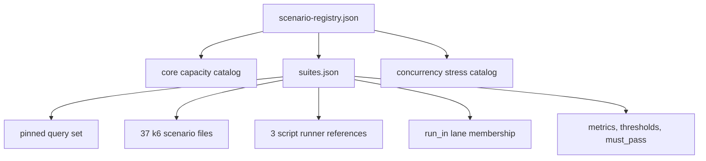

# Scenario Registry

The Atlas load surface is assembled from several catalogs. The top-level
registry points to those catalogs; it does not flatten them into one executable
manifest or prove that every referenced runner exists.

## Registry Layers

| Asset | Responsibility | Does not prove |
| --- | --- | --- |
| `scenario-registry.json` | names three registry inputs | that the inputs agree or are executable |
| `core-capacity-scenarios.json` | defines capacity-oriented scenario records | suite selection or execution |
| `concurrency-stress-scenarios.json` | defines generated concurrency cases | that generated cases are routed into a run |
| `suites/suites.json` | binds names to runners, lanes, metrics, thresholds, and pass policy | that a lane actually invokes every member |
| `queries/pinned-v1.json` | fixes the query workload identity used by the suite | deployment and dataset comparability |

## Current Suite Inventory

The suite manifest currently declares 40 scenarios:

- 37 `k6` scenarios
- 3 script-driven scenarios
- 39 with `must_pass: true`
- one comparative scenario, `redis-optional`, with `must_pass: false`

Lane membership is metadata in `run_in`: all 40 name `nightly` and
`load-nightly`, 32 name `full`, and only `mixed` and `cheap-only-survival` name
`pr`, `smoke`, and `load-ci`. Lane membership does not establish that the
corresponding GitHub workflow discovers and executes those records.

## Executability Gap

All 37 k6 scenario filenames referenced by the suite manifest exist under
`ops/load/scenarios/`. The three script runner paths currently do not exist:

- `cold-start-prefetch-5pods`
- `load-under-rollout`
- `load-under-rollback`

Those records still describe intended thresholds and lane membership, but they
are not executable from the declared paths. A registry validator that checks
JSON shape without resolving runner paths cannot close this gap.

## Scenario Identity

A performance result is comparable only when these identities agree:

| Identity | Why it matters |
| --- | --- |
| suite name and scenario file | selects traffic shape and executor |
| query set | fixes endpoint and parameter distribution |
| dataset and release | fixes data volume and query behavior |
| runtime, chart, and profile | fixes implementation and resource policy |
| thresholds and expected metrics | fixes pass semantics |
| duration, concurrency, and environment | fixes workload intensity and capacity context |

Do not join results by a human-friendly scenario label alone. Retain the source
revision and hashes for the scenario, query set, and thresholds with each run.

## Promotion Rules

- A `must_pass` scenario blocks only when the promotion lane is proven to
  execute it and the result is fresh for the candidate.
- An informational scenario may influence a decision but must not silently
  acquire blocking semantics.
- Missing expected metrics make the result incomplete; they are not zero-value
  successes.
- A missing runner is a catalog integrity failure, not a skipped successful
  scenario.
- Generated catalog membership must be traced into an executable suite before
  it can support a coverage claim.

## Authorities

- `ops/load/scenario-registry.json`
- `ops/load/suites/suites.json`
- `ops/load/scenarios/`
- `ops/load/generated/concurrency-stress-scenarios.json`
- `ops/load/queries/pinned-v1.json`
