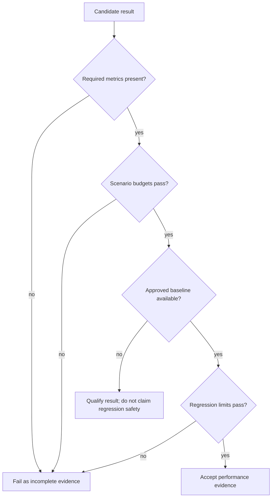

# Thresholds and Budgets

Atlas stores load budgets as versioned repository data. The result is a
reviewable acceptance contract: every release decision can identify the
scenario limit, the reference baseline, and the allowed regression.

## Decision Order

The scenario budget answers whether behavior is acceptable in absolute terms.
The regression budget answers whether the candidate became materially worse
than its approved reference. Neither substitutes for the other.

## Sources of Authority

| Contract | Responsibility |
| --- | --- |
| `ops/load/suites/suites.json` | Scenario membership, required metrics, execution lanes, and suite-level budgets |
| `ops/load/thresholds/*.thresholds.json` | Scenario-specific operational assertions, including survival and security signals |
| `ops/load/contracts/k6-thresholds.v1.json` | Shared latency and failure-rate values used by the K6 scenarios |
| `ops/load/baselines/` | Approved reference measurements for candidate comparison |
| `ops/load/contracts/performance-regression-thresholds.json` | Maximum candidate regression against the approved baseline |
| `ops/load/contracts/performance-regression-ci-contract.json` | Required baseline, run, and comparison command sequence and failure exit code |

When a scenario-specific file adds assertions beyond the shared K6 values,
those assertions are part of the pass decision. Do not copy a weaker threshold
into a local runner to make a candidate pass. Contract changes require an
explicit review of the operational expectation they alter.

## Current Regression Limits

The performance regression contract rejects a candidate when it exceeds any of
these limits:

| Dimension | Maximum change or state |
| --- | ---: |
| p99 latency regression | 15% |
| throughput reduction | 10% |
| error-rate increase | 2% |
| CPU saturation | 90% |
| memory growth | 20% |

These percentages compare a candidate with an approved baseline. They are not
the absolute scenario thresholds.

## Shared Scenario Budgets

The shared K6 contract contains per-scenario p95, p99, and failure-rate limits.
The range is intentional because a warm read and a store outage do not promise
the same service level. Representative budgets include:

| Scenario | p95 | p99 | Maximum failure rate |
| --- | ---: | ---: | ---: |
| `warm-steady-state-p99` | 800 ms | 1,500 ms | 1% |
| `mixed` | 900 ms | 1,300 ms | 2% |
| `cheap-only-survival` | 900 ms | 1,500 ms | 3% |
| `sharded-fanout` | 1,400 ms | 2,800 ms | 4% |
| `store-outage-mid-spike` | 1,500 ms | 3,000 ms | 10% |
| `thread-pool-exhaustion` | 1,800 ms | 3,400 ms | 8% |

The contract also sets global ceilings of 2,500 ms for cold start, 4,000 ms for
prefetch across five pods, and 256 MiB for soak memory growth.

Consult the checked-in contract for the complete set. Scenario names differ in
one historical case: the shared K6 key is `store-outage-mid-spike`, while the
suite and threshold file use `store-outage-under-spike`. Review both records
when evaluating that scenario.

## Failure Semantics

A candidate does not have valid passing evidence when:

- an expected metric is missing or cannot be parsed;
- any scenario-specific survival, saturation, or security assertion fails;
- it exceeds an absolute latency, error, startup, or memory budget;
- it exceeds any candidate-versus-baseline regression limit;
- the baseline belongs to a different dataset, query pack, profile, or
  environment;
- a rerun changes the workload or threshold contract without recording that
  change.

The regression command sequence is `load baseline`, `load run`, then
`load compare`, each with JSON output. Contract failure exits with code `2`, so
automation can distinguish a rejected candidate from a successful comparison.

## Reviewing a Budget Change

Before approving a changed threshold, require evidence that explains the new
boundary: workload identity, before-and-after distributions, resource
utilization, error behavior, and the user-visible tradeoff. A threshold change
is a service-policy decision, not a formatting correction or test adjustment.

See [Performance and Load](performance-and-load.md) for scenario selection and
the evidence required for a meaningful run.
