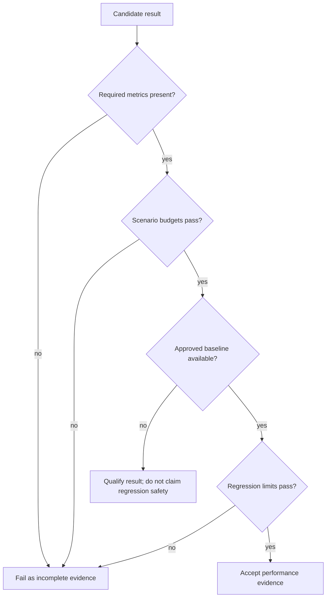
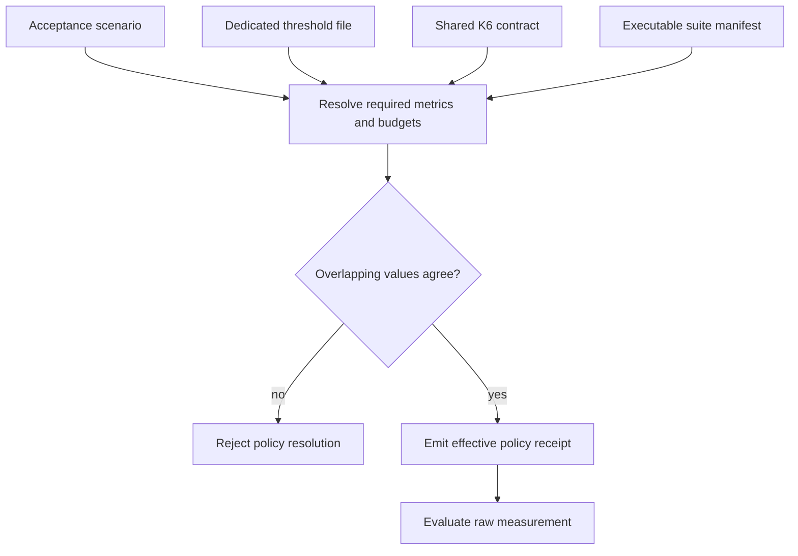

# Thresholds and Budgets

Atlas stores load budgets as versioned repository data. The result is a
reviewable acceptance contract: every release decision can identify the
scenario limit, the reference baseline, and the allowed regression.

## Decision Order

The scenario budget answers whether behavior is acceptable in absolute terms.
The regression budget answers whether the candidate became materially worse
than its approved reference. Neither substitutes for the other.

## Policy Layers

| Boundary | Question | Decision consequence |
| --- | --- | --- |
| Correctness invariant | Did the service return admissible results and preserve required survival behavior? | any violation rejects the run |
| Absolute service budget | Is this deployment useful under the named scenario? | any violation rejects promotion for that claim |
| Regression budget | Did behavior move materially against an approved, compatible baseline? | any violation requires investigation or explicit policy change |
| Capacity objective | Does the sustainable operating point retain the required headroom? | insufficient headroom blocks the capacity claim |
| Measurement requirement | Are the population, windows, and required signals complete? | missing evidence makes the decision invalid rather than passing |

Correctness comes first. Faster responses do not compensate for wrong results,
and a lower error rate does not compensate for the loss of a required cheap
route during overload. Performance tradeoffs are considered only inside the
service's correctness and degradation contract.

## Sources of Authority

| Contract | Responsibility |
| --- | --- |
| `ops/load/suites/suites.json` | Scenario membership, required metrics, execution lanes, and suite-level budgets |
| `ops/load/thresholds/*.thresholds.json` | Scenario-specific operational assertions, including survival and security signals |
| `ops/load/contracts/k6-thresholds.v1.json` | Shared latency and failure-rate values used by the K6 scenarios |
| `ops/load/baselines/` | Approved reference measurements for candidate comparison |
| `ops/load/contracts/performance-regression-thresholds.json` | Maximum candidate regression against the approved baseline |
| `ops/load/contracts/performance-regression-ci-contract.json` | Required baseline, run, and comparison command sequence and failure exit code |

When a scenario-specific file adds assertions beyond the shared K6 values,
those assertions are part of the pass decision. Do not copy a weaker threshold
into a local runner to make a candidate pass. Contract changes require an
explicit review of the operational expectation they alter.

## Resolve Policy Ownership Before Evaluation

The same scenario can appear in the acceptance registry, a dedicated threshold
file, the shared K6 contract, and an executable manifest. A trustworthy report
records which source supplied every comparison and whether overlapping values
agree.

The three currently executable suites have matching values across their
acceptance entries and dedicated threshold files. Their names are not fully
identical: `diff_heavy` and `hpa_validation_short` are executable manifest keys,
while the acceptance IDs and threshold filenames use hyphens. Preserve both
identities rather than normalizing one silently.

When overlapping sources disagree, do not choose the most permissive value or
assume that one file is newer. Classify the run as policy-invalid until the
owning contracts are reconciled. The effective policy receipt should include
source paths and hashes, resolved operators and units, required metrics, and
the exact comparison values used by the evaluator.

## Current Regression Limits

The performance regression contract rejects a candidate when it exceeds any of
these limits:

| Dimension | Maximum change or state |
| --- | ---: |
| p99 latency regression | 15% |
| throughput reduction | 10% |
| error-rate increase | 2% |
| CPU saturation | 90% |
| memory growth | 20% |

These percentages compare a candidate with an approved baseline. They are not
the absolute scenario thresholds.

## Interpreting Measurements

| Measurement | Required context |
| --- | --- |
| percentile latency | completed sample count, duration, request class, and failure treatment |
| throughput | offered rate, completed work, rejections, and concurrency |
| failure rate | denominator, status/error classes, deliberate shedding, and time window |
| CPU or memory | resource requests and limits, replicas, sampling method, and warmup state |
| recovery time | fault confirmation, removal timestamp, restored invariant, and observation window |

Percentiles are not comparable when request mix, sample population, or failure
filtering differs. Throughput is not comparable when offered load or completed
work semantics change. A threshold report must preserve these definitions with
the result.

## Boundary Outcomes

Use one of four outcomes rather than forcing every execution into pass or fail:

| Outcome | Meaning |
| --- | --- |
| accepted | measurement is valid and every required absolute and comparative boundary passes |
| rejected | measurement is valid and at least one required boundary fails |
| invalid | workload identity or measurement integrity cannot support the claim |
| qualified | absolute evidence is valid, but an optional comparison or required baseline is unavailable |

A qualified result may support local diagnosis or an explicitly narrower
claim. It must not be promoted as regression-safe. An invalid run may reveal a
real problem, but it cannot prove acceptance until the measurement defect is
removed and the experiment is repeated.

## Shared Scenario Budgets

The shared K6 contract contains per-scenario p95, p99, and failure-rate limits.
The range is intentional because a warm read and a store outage do not promise
the same service level. Representative budgets include:

| Scenario | p95 | p99 | Maximum failure rate |
| --- | ---: | ---: | ---: |
| `warm-steady-state-p99` | 800 ms | 1,500 ms | 1% |
| `mixed` | 900 ms | 1,300 ms | 2% |
| `cheap-only-survival` | 900 ms | 1,500 ms | 3% |
| `sharded-fanout` | 1,400 ms | 2,800 ms | 4% |
| `store-outage-mid-spike` | 1,500 ms | 3,000 ms | 10% |
| `thread-pool-exhaustion` | 1,800 ms | 3,400 ms | 8% |

The contract also sets global ceilings of 2,500 ms for cold start, 4,000 ms for
prefetch across five pods, and 256 MiB for soak memory growth.

Consult the checked-in contract for the complete set. Scenario names differ in
one historical case: the shared K6 key is `store-outage-mid-spike`, while the
suite and threshold file use `store-outage-under-spike`. Review both records
when evaluating that scenario.

## Failure Semantics

A candidate does not have valid passing evidence when:

- an expected metric is missing or cannot be parsed;
- any scenario-specific survival, saturation, or security assertion fails;
- it exceeds an absolute latency, error, startup, or memory budget;
- it exceeds any candidate-versus-baseline regression limit;
- the baseline belongs to a different dataset, query pack, profile, or
  environment;
- a rerun changes the workload or threshold contract without recording that
  change.

The regression command sequence is `load baseline`, `load run`, then
`load compare`, each with JSON output. Contract failure exits with code `2`, so
automation can distinguish a rejected candidate from a successful comparison.

The current non-`ops` `load baseline` and `load run` commands generate
deterministic synthetic measurements from the Rust harness model. Their
comparison proves calculation, artifact, and exit-code behavior. It does not
prove that a running Atlas service met the budgets. Bind an empirical release
decision to measured K6 or equivalent raw results, then apply the same absolute
and regression policy to that retained population.

## Bind Budgets to Raw Measurements

Every verdict needs an unbroken mapping from contract to observed population:

| Binding | Required identity |
| --- | --- |
| workload. | Scenario, query pack, traffic model, rate or concurrency, cache state, and duration. |
| measurement. | Raw samples, failures, timeouts, rejections, achieved load, and collection window. |
| policy. | Exact scenario threshold and regression-contract digests. |
| baseline. | Approved reference identity and comparability verdict. |
| evaluation. | Tool version, calculation method, raw precision, and machine-readable outcome. |

Reject a summary whose displayed values cannot be recalculated from retained
inputs. Re-running a synthetic model or copying a threshold into a result is
not a measurement lineage.

When a value lands exactly on a boundary, apply the comparison operator from
the owning machine-readable contract. Documentation summaries must not invent
rounding or tolerance. Preserve raw precision so display formatting cannot
change the verdict.

## Reviewing a Budget Change

Before approving a changed threshold, require evidence that explains the new
boundary: workload identity, before-and-after distributions, resource
utilization, error behavior, and the user-visible tradeoff. A threshold change
is a service-policy decision, not a formatting correction or test adjustment.

See [Performance and Load](performance-and-load.md) for scenario selection and
the evidence required for a meaningful run.
