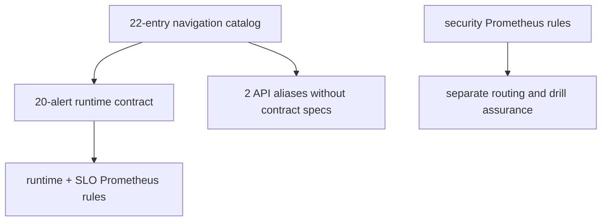
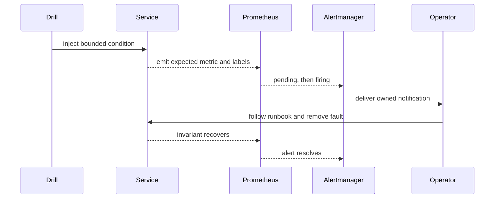

# Alert Rules

An actionable Atlas alert binds an executable expression to persistence,
severity, ownership, a runbook, a protected invariant, and a drill. Static
validation can prove that those references exist. Only a firing test can prove
that runtime telemetry reaches the intended operator.

## Governed runtime set

The runtime alert contract requires 20 identities across these domains:

| Domain | Protected behavior |
| --- | --- |
| API health | request availability and `/v1/genes` latency |
| SLO burn | cheap and standard fast, medium, and slow budget consumption |
| overload | deliberate shedding and cheap-path survival |
| store and cache | download, backend, and cache stability |
| registry and datasets | refresh freshness and usable dataset presence |
| integrity and recovery | ingest, query, disk, restart, and shard correctness |

The contract's `severity_tier` is the routing authority. The secondary alert
catalog uses different display severities for some entries. For example, the
contract pages cheap and standard fast or medium burn, while the catalog labels
those entries as warnings. Do not derive paging policy from the catalog label.

## Three alert inventories



`api.error-rate-high` and `api.latency-p95-high` are catalog-only aliases with
no specification in the 20-alert contract. Security rules for authentication,
authorization, integrity, and tamper conditions are also outside that contract.
They remain important, but they need separate notification and runbook proof.

## What static verification checks

The supported verifier writes a run-scoped contract report:

```bash
cargo run -p bijux-atlas-dev -- ops obs alerts verify \
  --allow-write \
  --run-id alert-contract-review \
  --format json
```

It parses the main runtime and SLO rule files, checks required alert identities,
and requires `severity`, `subsystem`, `alert_contract_version`, and a runbook
annotation. It does not evaluate PromQL against Prometheus, inspect Alertmanager
routing, deliver a notification, validate the security rule pack, or execute a
drill.

Treat its success as source-contract evidence only.

## Selected trigger semantics

- high 5xx rate pages above 0.5% for 10 minutes;
- `/v1/genes` p95 latency pages above 800 ms for 15 minutes;
- cheap-path survival pages below 99.99% during active shedding for five
  minutes;
- registry refresh warns after age exceeds 10 minutes for 15 minutes;
- store backend error rate pages above 2% for standard and heavy traffic over
  10 minutes;
- shard-integrity violation pages after five minutes.

Read the checked-in expression before mitigation. These summaries do not
replace label filters, denominators, or persistence windows in Prometheus.

## Prove the alert path



Retain the rule revision, metric sample, labels, pending and firing timestamps,
notification receipt, acknowledgement, runbook action, recovery, and resolved
event. Missing delivery or resolution evidence is a monitoring failure even
when the expression parsed successfully.

Silences need a narrow matcher, owner, justification, start, expiry, and review
trail. An acknowledgement is not a resolution, and a silence is not a repair.

Continue with [Telemetry drills](telemetry-drills.md) for current execution
limits and [Incident response](incident-response.md) for containment.
