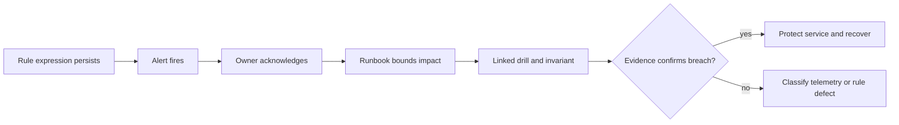
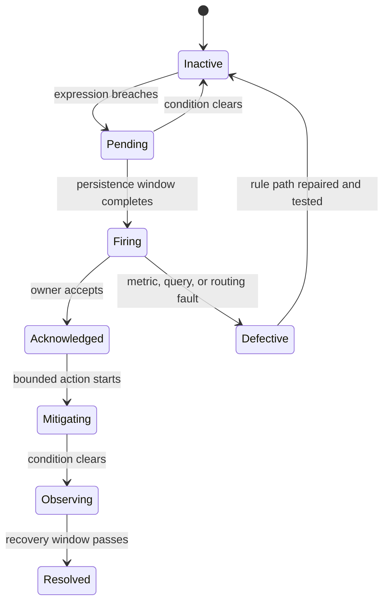

# Alert Rules

An Atlas alert is actionable only when its expression, persistence window,
severity tier, owner, runbook, drill, and protected invariant agree. The alert
contract binds those fields for the governed runtime and SLO surface.

## Governed Inventory

`ops/observe/contracts/alerts-contract.json` requires 20 alerts. Each belongs to
an operating family:

| Family | Representative alerts | Protected behavior |
| --- | --- | --- |
| API health | `BijuxAtlasHigh5xxRate`, `BijuxAtlasP95LatencyRegression` | Availability and request latency |
| SLO burn | Cheap and standard fast, medium, and slow burn alerts | Class-specific success budgets |
| Overload | `AtlasOverloadSustained`, `BijuxAtlasOverloadSurvivalViolated` | Deliberate shedding and cheap-path survival |
| Store and cache | Download failures, backend error spike, cache thrash | Dependency reliability and cache stability |
| Registry and datasets | Refresh stale, no datasets loaded | Discoverability and usable data presence |
| Runtime integrity | Ingest failures, query errors, disk pressure, restart loop, shard violation | Correctness and recoverability |

Fast and medium SLO burns page; slow burns warn. Integrity violations, restart
loops, ingest failure, query error spikes, overload-survival failure, high 5xx,
and store error spikes are paging conditions. The contract—not the severity
labels in a secondary inventory—is the routing authority.

## Alert Flow

On receipt, preserve the alert identity, expression value, start time, labels,
release, profile, and dataset context. Open the bound runbook, confirm the
protected invariant with independent signals, and capture the evidence before
mutating the system when safety permits.

## Alert Lifecycle

Acknowledgement is not resolution. Resolution requires the protected invariant
to recover and remain inside its boundary for the defined observation window.
If the expression, metric, or notification path is defective, record a
monitoring incident rather than silently muting the alert.

## Catalog and Security Boundaries

The alert catalog lists 22 entries: 20 governed rule identities plus
`api.error-rate-high` and `api.latency-p95-high`. Those two inventory entries do
not have specifications in the current alert contract and must not be presented
as contract-bound pages.

The security rule pack declares four additional conditions for authentication
failures, authorization denials, integrity violations, and tamper detection.
They are operationally important, but they are not members of the 20-alert
runtime contract or the 22-entry catalog. Validate their notification routing
and runbook resolution separately before relying on them as governed coverage.

## Selected Trigger Semantics

- High 5xx pages when the ratio exceeds 0.5% for 10 minutes.
- `/v1/genes` p95 latency pages above 800 ms for 15 minutes.
- Cheap-path survival pages below 99.99% success while overload shedding is
  active for five minutes.
- Registry refresh warns when age exceeds 10 minutes for 15 minutes.
- Store backend errors page above 2% of standard and heavy request volume for
  10 minutes.
- Any shard-integrity violation pages after the five-minute persistence window.

Read the checked-in rule expression before acting; summaries are navigation,
not substitutes for the executable rule.

## Accepting Alert Readiness

Alert files parsing successfully is necessary but insufficient. Readiness
requires the rule to receive its expected metric, fire during the linked drill,
reach the intended notification route, resolve when the condition clears, and
produce an evidence record. A missing metric, stale rule version, unresolved
runbook, or untested notification path is a monitoring failure even when the
application is healthy.

Silences and routing overrides need an owner, narrow matcher, justification,
start time, expiry, and review trail. A silence must not outlive the condition
that justified it, and it must not hide a broader label set than the operator
intended.

Continue to [Telemetry Drills](telemetry-drills.md) for firing evidence and
[Incident Response](incident-response.md) for containment and recovery.
