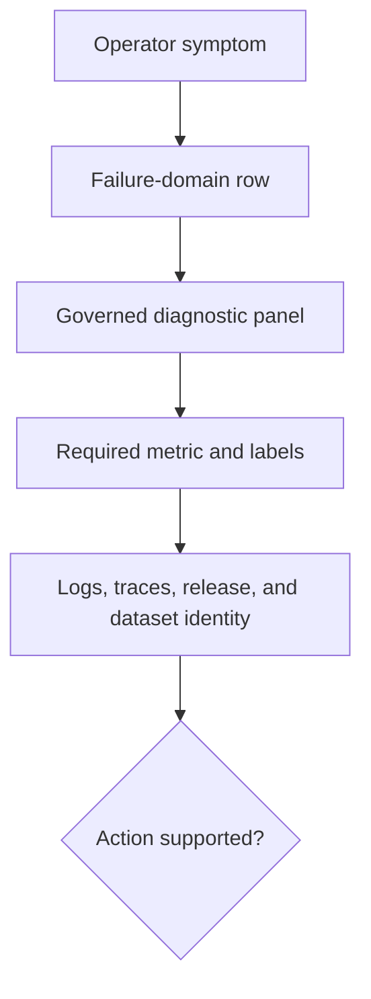

# Dashboards and Panels

Atlas dashboards are curated diagnostic views over governed metrics. They help
operators ask consistent questions, but a valid dashboard JSON file does not
prove that its datasource is populated, current, or complete.

## Dashboard Inventory

The registry declares ten Prometheus-backed dashboards:

| Domain | Dashboards |
| --- | --- |
| Runtime | Runtime health, system resources |
| Query | Query performance, latency distribution |
| Ingest | Ingest pipeline |
| Data and dependencies | Artifact registry, artifact-cache performance |
| Assurance | SLO compliance, error classification, drift detection |

The JSON validation contract governs the same ten files. The general
observability dashboard and its golden form are separate validation assets, and
the minimal dashboard is a fixture. Do not present fixtures or goldens as an
operator view.

## Diagnostic Contract

The panel contract requires 19 named panels across eight rows. It covers store,
cache, SQLite, admission and bulkhead pressure, Kubernetes resource pressure,
traffic and SLOs, and drill views. Every panel binds a diagnostic question,
failure signature, and required metric.

Representative decision paths include:

- request rate and status to identify traffic or 5xx shifts;
- route p95 and SQLite latency to separate API from query-engine regression;
- store fetch, open, and download latency to isolate backend pressure;
- cache hit ratio and cache size to identify thrash or disk pressure;
- queue depth, bulkhead saturation, and shed reason to explain overload;
- class-specific SLO health and burn to prioritize cheap-path survival; and
- rollout and drill views to align faults with request quality.

## Reading a Dashboard Safely

Confirm datasource health, scrape freshness, release and profile filters,
dataset identity, time zone, query interval, and missing-series behavior before
acting. Compare candidate and previous release separately during a rollout.
Averages can hide one failing replica or release cohort.

A blank panel is ambiguous. It may mean zero events, a missing metric, a broken
query, a label migration, a scrape outage, or a datasource failure. Resolve the
ambiguity through raw queries, collector health, and correlated signals.

## Change Acceptance

Validate JSON schema, dashboard registry membership, required rows and panels,
metric names and labels, query semantics, variables, and representative data.
Then inject at least one bound failure signature and preserve a rendered
snapshot with the source metric window.

Use [Metrics Contracts](metrics-packages.md) for signal ownership and
[Telemetry Drills](telemetry-drills.md) for fault-signature proof.
