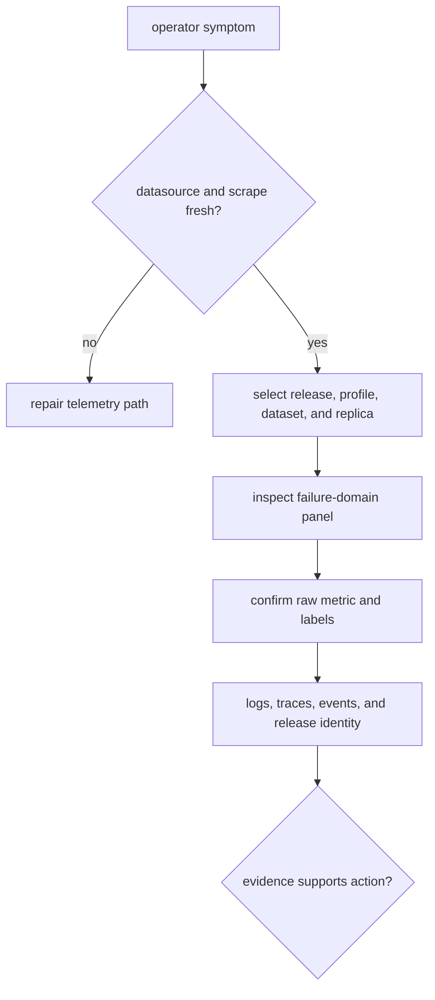

# Dashboards and Panels

Atlas dashboards are diagnostic views over Prometheus data. Their JSON can be
complete while the datasource, scrape path, label set, or underlying product is
unhealthy. Dashboard source validation and live diagnostic readiness are
different claims.

## Governed inventory

The registry and JSON validation contract name ten dashboards:

| Domain | Views |
| --- | --- |
| runtime | runtime health and system resources |
| query | query performance and latency distribution |
| ingest | ingest pipeline |
| artifacts | registry and cache performance |
| assurance | SLO compliance, error classification, and drift detection |

The standalone observability dashboard, its golden copy, the SLO dashboard,
and the minimal fixture are not members of this ten-dashboard registry. Do not
count fixtures or goldens as deployable operator coverage.

The panel contract separately requires eight failure-domain rows and 19 named
panels covering store, cache, SQLite, bulkheads, Kubernetes pressure, traffic,
SLO burn, and drills.

## Static verifier limitations

`observe dashboards verify` checks the ten contract paths. For each existing
JSON file, it records whether top-level `title`, `uid`, and a non-empty `panels`
array exist. It writes coverage, health, readiness, and telemetry summary files
under `artifacts/observe/`.

```bash
cargo run -p bijux-atlas-dev -- observe dashboards verify --format json
```

The current command loads the dashboard schema but does not apply full schema
validation. More importantly, its final exit status is based on missing files,
not failed title, UID, or panel checks. Its generated `ready` field also reflects
file presence only. A zero exit code is therefore not proof that every row is
valid or that the 19-panel contract is satisfied.

Review the generated rows directly and use the dedicated contracts before
accepting a dashboard change. Do not call the generated readiness file live
operational readiness.

## Diagnose with a dashboard



Before acting, verify datasource health, scrape age, query interval, time zone,
variables, release filters, dataset identity, and missing-series behavior.
Compare release cohorts separately during rollout. An average can hide one bad
replica or a candidate receiving no traffic.

A blank panel may mean zero events, missing metrics, query drift, label drift,
a scrape outage, or a broken datasource. Resolve that ambiguity with a raw
query and collector health before concluding the system is quiet.

## Change acceptance

Accept a dashboard change only after:

- full JSON schema and registry membership pass;
- required rows and panels are present;
- metric names and labels match the runtime contract;
- PromQL behaves correctly for zero, absent, and multi-replica series;
- representative live or replayed data renders as expected;
- one bound failure signature is exercised and correlated;
- a rendered snapshot and source metric window are retained.

Use [Metrics packages](metrics-packages.md) for signal ownership and
[Telemetry drills](telemetry-drills.md) for failure-signature proof.
