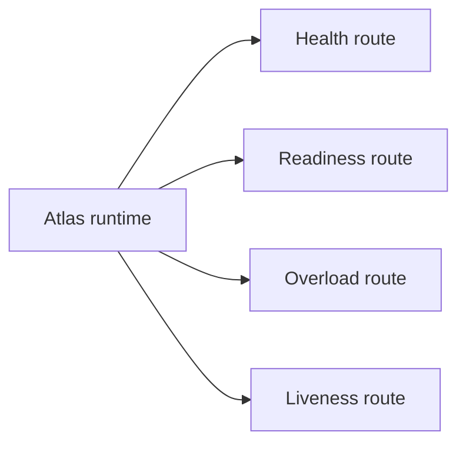
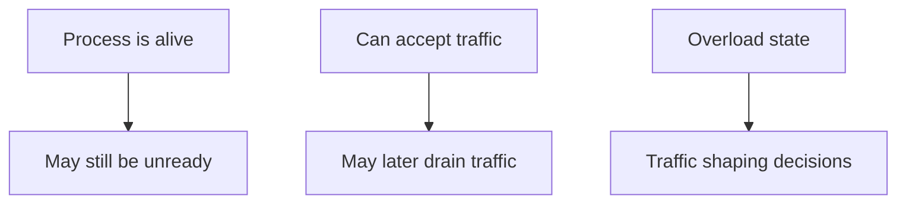

# Health, Readiness, and Drain

Atlas exposes separate ideas that operators should not collapse into one boolean:

- health
- readiness
- overload or drain state

## Endpoint Model



This endpoint model is here to stop one of the most common operator mistakes: treating every probe
as if it were answering the same operational question.

## Why the Distinction Matters



This distinction diagram explains why Atlas exposes multiple routes. A runtime can be alive, unready,
or intentionally shedding work in different combinations, and traffic policy should respond
accordingly.

Health answers “is the process alive enough to answer basic liveness checks?”

Readiness answers “should this instance currently receive normal traffic?”

Drain or overload state answers “is the instance reducing or refusing certain work classes?”

Operators get into trouble when they collapse those into a single success signal. Atlas exposes
separate endpoints because a process can be alive, not yet ready, and already overloaded in
meaningfully different combinations.

## Operational Usage

- use liveness checks to detect dead processes
- use readiness checks to gate traffic
- use overload or drain signals to avoid making a bad situation worse
- decide traffic routing from readiness and overload, not from liveness alone

## Practical Checks

```bash
curl -s http://127.0.0.1:8080/healthz
curl -s http://127.0.0.1:8080/readyz
curl -s http://127.0.0.1:8080/healthz/overload
```

## Operator Advice

- do not route normal traffic based only on liveness
- treat readiness regression as a first-class operational signal
- observe overload behavior under stress before calling a deployment “ready for production”
- do not declare an incident resolved just because `/healthz` came back

## What a Healthy Probe Story Looks Like

- liveness stays boring and stable
- readiness reflects whether the instance should receive normal traffic
- overload and drain signals help prevent healthy-looking saturation failures

## Purpose

This page explains the Atlas material for health, readiness, and drain and points readers to the canonical checked-in workflow or boundary for this topic.

## Source of Truth

- `ops/observe/readiness.json`
- `ops/observe/contracts/endpoint-observability-contract.json`
- `ops/observe/contracts/overload-behavior-contract.json`
- `docs/bijux-atlas-ops/kubernetes/rollout-safety.md`

## Probe and Decision Map

Use the endpoint surfaces for different operational decisions:

- liveness decides whether the process should be restarted
- readiness decides whether the instance should receive normal traffic
- overload or drain state decides whether the instance should shed or limit work
  even while it remains alive

These signals should feed rollout and service-routing decisions differently.

## When Readiness Passes but User Latency Fails

Treat this as a real operational mismatch, not as a false alarm. It usually
means:

- the instance is technically available but overloaded
- the readiness contract is narrower than the user-facing performance contract
- load, alert, or dashboard evidence must be consulted before promotion

In that situation, do not promote just because readiness is green. Cross-check
overload behavior, latency alerts, and rollout-under-load evidence first.

## Stability

This page is part of the canonical Atlas docs spine. Keep it aligned with the current repository behavior and adjacent contract pages.
