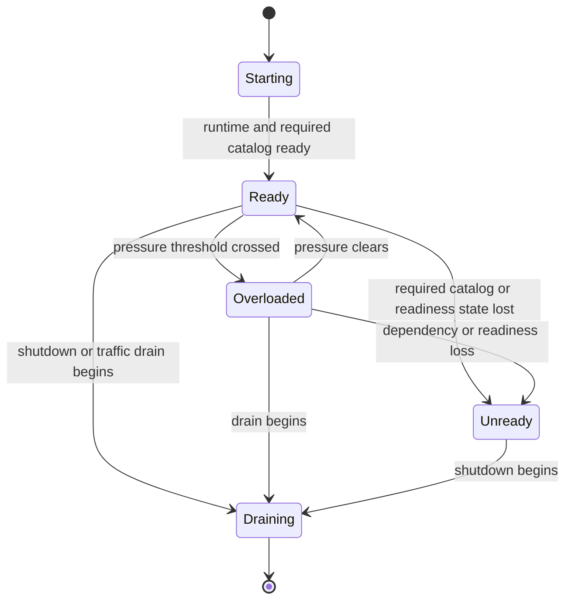
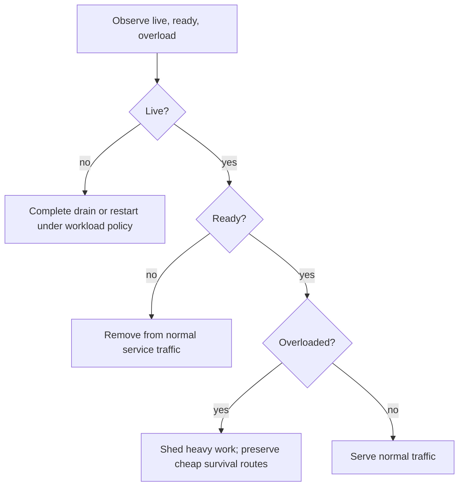

# Health, Readiness, and Drain

Atlas exposes separate process, traffic-admission, catalog, and overload
signals. They answer different questions and must drive different actions.

## Endpoint Semantics

| Endpoint | Question | Success | Failure meaning |
| --- | --- | --- | --- |
| `/health` and `/healthz` | can the process answer a basic health request? | `200` with `ok` | no deeper dependency or traffic claim is made |
| `/live` | is the process accepting requests rather than draining? | `200` with `live: true` | `503` with `draining: true` |
| `/ready` and `/readyz` | should normal traffic reach this instance? | `200` when runtime state and required catalog state are ready | `503` while startup, catalog, or readiness policy is unsatisfied |
| `/healthz/overload` | is overload shedding active, and what are live/ready/drain states? | `200` when not overloaded | `503` when overload is active |

Readiness requires a catalog when `readiness_requires_catalog` is enabled and
the runtime is not in cached-only mode. Cached-only mode can remain ready
without a live catalog because its contract limits serving to retained cache
state.

## State Model


```mermaid
stateDiagram-v2
    [*] --> Starting
    Starting --> Ready: runtime and required catalog ready
    Ready --> Overloaded: pressure threshold crossed
    Overloaded --> Ready: pressure clears
    Ready --> Unready: required catalog or readiness state lost
    Overloaded --> Unready: dependency or readiness loss
    Ready --> Draining: shutdown or traffic drain begins
    Overloaded --> Draining: drain begins
    Unready --> Draining: shutdown begins
    Draining --> [*]
```

These states are not mutually reducible to process health. An overloaded
instance can still be alive. An unready instance can still answer diagnostics.
A draining instance may intentionally refuse work without having crashed.

## Traffic Policy


```mermaid
flowchart TD
    Probe[Observe live, ready, overload] --> Live{Live?}
    Live -->|no| Replace[Complete drain or restart under workload policy]
    Live -->|yes| Ready{Ready?}
    Ready -->|no| Remove[Remove from normal service traffic]
    Ready -->|yes| Load{Overloaded?}
    Load -->|yes| Shed[Shed heavy work; preserve cheap survival routes]
    Load -->|no| Serve[Serve normal traffic]
```

The overload contract preserves cheap routes such as `/v1/version`,
`/healthz`, `/readyz`, and `/v1/datasets` with successful responses. Heavy
routes may refuse work with `422`, `429`, or `503` and a stable policy code.
This lets operators distinguish deliberate load shedding from a dead process.

## Kubernetes Probe Use

- Use liveness to decide whether a process is irrecoverably stuck, not whether
  it should receive user traffic.
- Use readiness for service endpoints and rollout progression.
- Use overload state, latency, saturation, and error signals for traffic shaping
  and promotion decisions.
- Give drain enough time to remove the pod from endpoints and complete bounded
  in-flight work before termination.

## Promotion and Recovery

A green readiness probe is necessary but not sufficient for promotion. Review
user-path latency, overload activity, store errors, catalog freshness, cheap
route survival, and rollout-under-load evidence. Recovery is complete only when
the intended traffic classes work and the signals that detected the incident
have returned to their expected state.

```bash
curl -fsS http://127.0.0.1:8080/healthz
curl -fsS http://127.0.0.1:8080/live
curl -fsS http://127.0.0.1:8080/readyz
curl -sS http://127.0.0.1:8080/healthz/overload
```

Continue with [Alert Rules](alert-rules.md),
[Performance and Load](../load/performance-and-load.md), and
[Rollout Safety](../kubernetes/rollout-safety.md).
