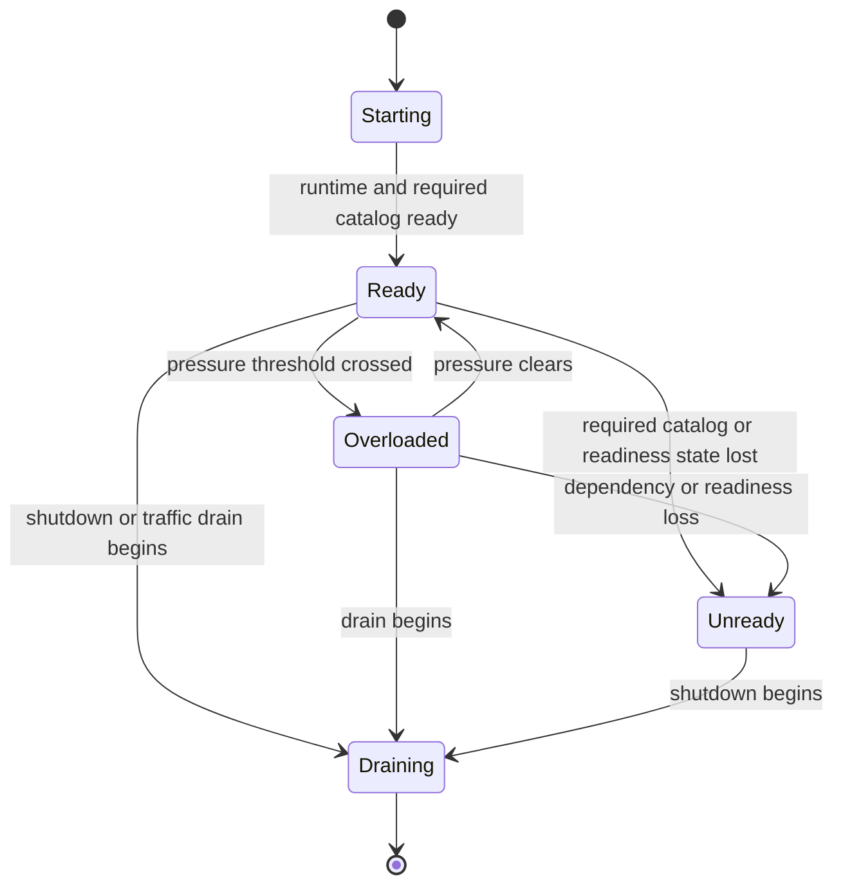
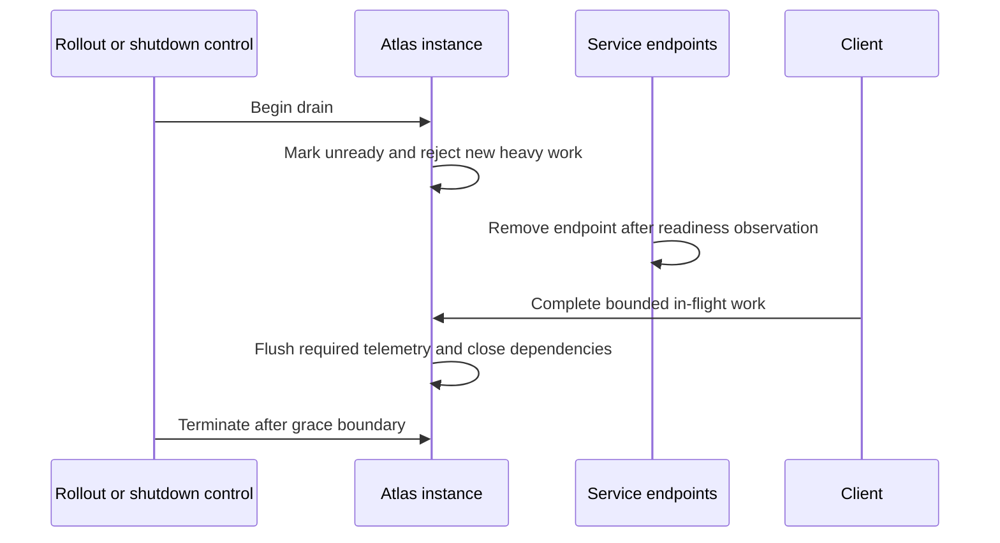
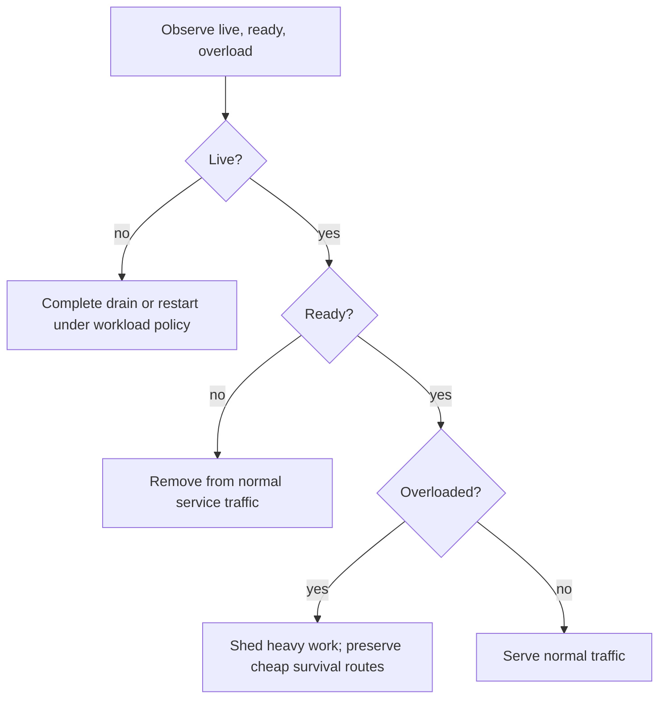

# Health, Readiness, and Drain

Atlas exposes separate process, traffic-admission, catalog, and overload
signals. They answer different questions and must drive different actions.

## Endpoint Semantics

### `/health` and `/healthz`

These endpoints answer whether the process can handle a basic health request.
They return `200` with `ok`; they make no deeper dependency or traffic claim.

### `/live`

Liveness answers whether the process is accepting requests rather than
draining. It returns `200` with `live: true`, or `503` with `draining: true`.

### `/ready` and `/readyz`

Readiness decides whether normal traffic should reach the instance. It returns
`200` when runtime state and any required catalog state are ready. Startup, an
unavailable required catalog, or an unsatisfied readiness policy returns `503`.

### `/healthz/overload`

The overload endpoint reports shedding together with live, ready, and drain
state. It returns `200` when overload is inactive and `503` when overload is
active.

Readiness requires a catalog when `readiness_requires_catalog` is enabled and
the runtime is not in cached-only mode. Cached-only mode can remain ready
without a live catalog because its contract limits serving to retained cache
state.

## State Model


```mermaid
stateDiagram-v2
    [*] --> Starting
    Starting --> Ready: runtime and required catalog ready
    Ready --> Overloaded: pressure threshold crossed
    Overloaded --> Ready: pressure clears
    Ready --> Unready: required catalog or readiness state lost
    Overloaded --> Unready: dependency or readiness loss
    Ready --> Draining: shutdown or traffic drain begins
    Overloaded --> Draining: drain begins
    Unready --> Draining: shutdown begins
    Draining --> [*]
```

These states are not mutually reducible to process health. An overloaded
instance can still be alive. An unready instance can still answer diagnostics.
A draining instance may intentionally refuse work without having crashed.

## Probe Interpretation Matrix

| Observation | What is established | Operator action |
| --- | --- | --- |
| health fails | the process cannot answer its basic health path | inspect process state before replacement policy acts |
| health passes, liveness fails | the process responds but is intentionally draining | keep it out of new traffic and allow bounded shutdown |
| liveness passes, readiness fails | the process lives but must not receive normal traffic | inspect startup, catalog, profile, and readiness policy |
| readiness passes, overload fails | the instance is configured to serve but is actively shedding | protect cheap routes and reduce or redistribute heavy work |
| all probes pass | basic process, admission, and overload checks pass at that instant | still verify user paths, dependencies, latency, and correctness |

Probe results are point observations. A promotion or recovery decision needs a
window long enough to expose flapping, catalog refresh failures, overload
recurrence, and rollout transitions.

## Drain Timeline


```mermaid
sequenceDiagram
    participant Control as Rollout or shutdown control
    participant Pod as Atlas instance
    participant Service as Service endpoints
    participant Client
    Control->>Pod: Begin drain
    Pod->>Pod: Mark unready and reject new heavy work
    Service->>Service: Remove endpoint after readiness observation
    Client->>Pod: Complete bounded in-flight work
    Pod->>Pod: Flush required telemetry and close dependencies
    Control->>Pod: Terminate after grace boundary
```

Drain ordering prevents a terminating instance from receiving new traffic
while preserving bounded in-flight work. The grace period must cover endpoint
propagation, request limits, and required shutdown evidence. Extending it
indefinitely hides stuck work rather than making shutdown graceful.

## Traffic Policy


```mermaid
flowchart TD
    Probe[Observe live, ready, overload] --> Live{Live?}
    Live -->|no| Replace[Complete drain or restart under workload policy]
    Live -->|yes| Ready{Ready?}
    Ready -->|no| Remove[Remove from normal service traffic]
    Ready -->|yes| Load{Overloaded?}
    Load -->|yes| Shed[Shed heavy work; preserve cheap survival routes]
    Load -->|no| Serve[Serve normal traffic]
```

The overload contract preserves cheap routes such as `/v1/version`,
`/healthz`, `/readyz`, and `/v1/datasets` with successful responses. Heavy
routes may refuse work with `422`, `429`, or `503` and a stable policy code.
This lets operators distinguish deliberate load shedding from a dead process.

## Kubernetes Probe Use

- Use liveness to decide whether a process is irrecoverably stuck, not whether
  it should receive user traffic.
- Use readiness for service endpoints and rollout progression.
- Use overload state, latency, saturation, and error signals for traffic shaping
  and promotion decisions.
- Give drain enough time to remove the pod from endpoints and complete bounded
  in-flight work before termination.

Avoid probe coupling that turns a recoverable dependency delay into a restart
loop. Liveness should not depend on remote catalog or store health. Readiness
may depend on them when the selected mode requires those dependencies for
correct traffic service.

Readiness flapping is a traffic-control incident even when liveness stays
green. Preserve transition counts and timestamps, catalog freshness, endpoint
membership, dependency errors, and rollout identity. Raising probe thresholds
without identifying the failing invariant can hide instability and extend the
time that bad instances receive traffic.

Probe success can also be false confidence when the check bypasses the normal
service path, resolves no governed dataset, or is cached by an intermediary.
Verify endpoint, network, and request behavior in the deployed topology.

## Promotion and Recovery

A green readiness probe is necessary but not sufficient for promotion. Review
user-path latency, overload activity, store errors, catalog freshness, cheap
route survival, and rollout-under-load evidence. Recovery is complete only when
the intended traffic classes work and the signals that detected the incident
have returned to their expected state.

```bash
curl -fsS http://127.0.0.1:8080/healthz
curl -fsS http://127.0.0.1:8080/live
curl -fsS http://127.0.0.1:8080/readyz
curl -sS http://127.0.0.1:8080/healthz/overload
```

Continue with [Alert Rules](alert-rules.md),
[Performance and Load](../load/performance-and-load.md), and
[Rollout Safety](../kubernetes/rollout-safety.md).
