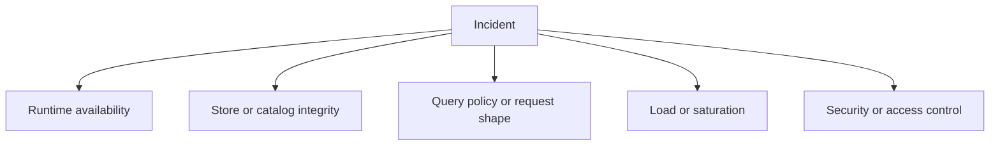
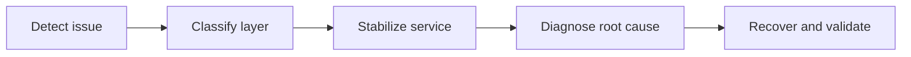

# Incident Response

Incident response in Atlas is easier when operators classify failures by layer before reaching for fixes.

## Incident Classification

This incident-classification diagram keeps the first response structured. Atlas incidents are easier
to stabilize when operators decide early whether they are facing availability, correctness, policy,
capacity, or security trouble.

## Response Flow

This response flow emphasizes order. Stabilization and recovery are faster when operators classify
the layer first instead of changing runtime, store, and traffic controls all at once.

## First Questions to Ask

1. Is the process alive?
2. Is the instance ready?
3. Is the catalog discoverable?
4. Are queries failing because of policy, data absence, or runtime problems?
5. Is this a correctness incident, a capacity incident, or a security incident?

## Stabilization Order

- preserve evidence
- avoid making store state more ambiguous
- reduce traffic or drain when necessary
- restore safe readiness before declaring success

## Operator Reminder

During incidents, do not confuse:

- cache loss with store loss
- policy rejection with dataset absence
- liveness with readiness
- runtime rollback with store rollback

## A Good Incident Habit

- preserve evidence before making broad changes
- keep the serving store and catalog state understandable during mitigation
- validate recovery with readiness and key query paths before you declare the incident over

## Purpose

This page explains the Atlas material for incident response and points readers to the canonical checked-in workflow or boundary for this topic.

## Source of Truth

- `ops/observe/alert-catalog.json`
- `ops/observe/dashboard-registry.json`
- `ops/observe/drills/result.schema.json`
- `ops/observe/generated/telemetry-index.json`
- `ops/observe/readiness.json`

## Minimum Incident Artifact Set

Every significant observability-backed incident should leave behind:

- the alert or symptom that opened the investigation
- the dashboard or signal views used during diagnosis
- the readiness or health evidence that shows service state
- log, metric, and trace references or snapshots
- any drill-style or debug-bundle evidence captured during mitigation

## Asset-Grounded Response Flow

Use the alert catalog to classify urgency, use the dashboard registry to open
canonical views, and use the telemetry index to confirm the required signal pack
is still present. If a signal is missing, record that as part of the incident,
not just as investigative friction.

## Stability

This page is part of the canonical Atlas docs spine. Keep it aligned with the current repository behavior and adjacent contract pages.
