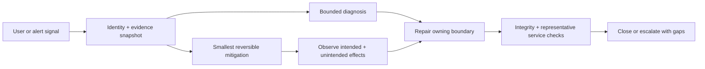
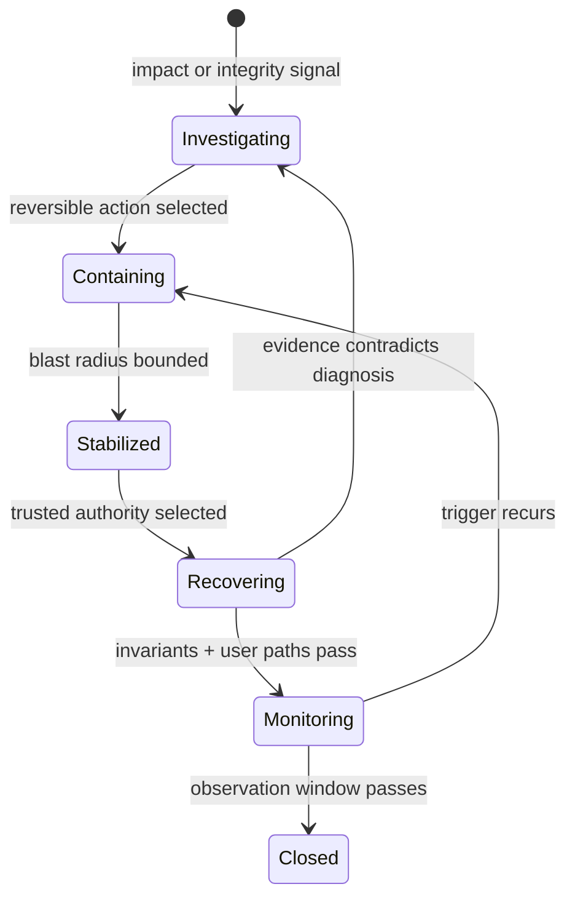

# Incident response

Atlas incident response protects users while preserving the identity needed to
understand and recover the system. Classify the failing boundary before
changing runtime, catalog, store, cache, policy, credentials, or traffic.

## Run mitigation and evidence together

```mermaid
flowchart LR
    Signal[User or alert signal] --> Snapshot[Identity + evidence snapshot]
    Snapshot --> Mitigate[Smallest reversible mitigation]
    Snapshot --> Hypothesis[Bounded diagnosis]
    Mitigate --> Effect[Observe intended + unintended effects]
    Hypothesis --> Repair[Repair owning boundary]
    Effect --> Repair
    Repair --> Validate[Integrity + representative service checks]
    Validate --> Close[Close or escalate with gaps]
```

One track reduces harm; the other preserves facts. Name an incident lead and
permit one active mitigation at a time. Before each change, record owner,
target, expected effect, start time, observation window, and reversal condition.

When immediate safety prevents capture, record which evidence was sacrificed
and why. Successful mitigation can prove reduced impact; it cannot establish
the original cause retrospectively.

## Preserve authority before mutation

| Before changing | Capture | Verify afterward |
| --- | --- | --- |
| traffic or drain | Endpoints, route volume, in-flight work, probe transitions | Which requests moved and whether impact fell |
| workload revision | Pod, image, config, events, release-scoped signals | Restored revision, readiness, dataset, and behavior |
| cache | Entry identity, hits, misses, evictions, store pressure | Cold correctness, refill load, and freshness |
| catalog or dataset | Tuple, catalog epoch, manifest, hashes, serving evidence | Restored tuple and identity-bearing queries |
| credentials or network | Principal class, policy, decisions, exposure | Required success, forbidden denial, audit continuity |

Broad simultaneous changes destroy attribution. Runtime rollback and dataset
rollback are separate decisions; cache eviction cannot repair store integrity.

## Classify the first failing boundary

| Symptom | First evidence | Do not confuse with |
| --- | --- | --- |
| process availability | Liveness, restarts, termination reason, runtime events | Readiness or catalog failure |
| traffic admission | Readiness, overload, endpoints, and drain state | Dead process |
| catalog or store | Catalog freshness, reads, manifests, and hashes | Redis or local cache loss |
| query correctness | Request, dataset, query class, error code, and trace | Generic availability |
| capacity | Latency, saturation, queue, cache, breaker, and overload | Data corruption |
| security | Identity, authorization, exposure, admin posture, and audit | Ordinary query rejection |
| release drift | Image, chart, values, dataset, checksums, and provenance | Transient dependency failure |

The same HTTP status may require different recovery. Group failures by first
rejecting boundary before status code.

## Incident states

```mermaid
stateDiagram-v2
    [*] --> Investigating: impact or integrity signal
    Investigating --> Containing: reversible action selected
    Containing --> Stabilized: blast radius bounded
    Stabilized --> Recovering: trusted authority selected
    Recovering --> Monitoring: invariants + user paths pass
    Monitoring --> Closed: observation window passes
    Monitoring --> Containing: trigger recurs
    Recovering --> Investigating: evidence contradicts diagnosis
```

A quiet alert does not establish stability. Healthy probes do not establish
query correctness. Record the decision owner and invariant for each transition.

## Minimum incident record

- start time, detection source, affected paths, severity, and user impact;
- runtime, image, chart, values, target, workload revision, and config identity;
- dataset tuple, catalog epoch, manifest, and artifact hashes;
- alerts, probes, raw metric queries, logs, representative traces, and gaps;
- dependency, cache, store, queue, saturation, and overload state;
- observed facts, bounded hypotheses, disconfirming evidence, and decisions;
- every drain, isolation, rollback, restore, credential, or policy action;
- recovery checks, monitoring window, unresolved risk, and closure owner.

Observations belong to the identity active at event time. Split timelines when
traffic, revision, dataset, config, credential, or backend changes. A healthy
replacement must not hide the failed revision's behavior.

## Respond through signal loss

| Available source | Preserve first | Limit |
| --- | --- | --- |
| client | Status, correlation headers, timing, route class, redacted body | One response does not measure population impact |
| Kubernetes | Workload identity, endpoints, events, restarts, probes | Control-plane health does not prove queries |
| pod output | Bounded logs from affected and healthy replicas | Missing logs may reflect process or collection loss |
| metrics | Raw query, evaluation time, source window, labels, series | Empty result is not an observed zero |
| traces | Representative full traces, sampling, retention context | Unsampled requests cannot be ruled out |
| catalog and store | Active identity, manifest, hashes, freshness, reads | Availability does not prove runtime consumption |

Record missing sources and narrow claims to what remains observable. Restoring
telemetry is a recovery gate when promotion, security, or integrity requires
continuous evidence.

## Recover and close

Mitigation reduces harm. Stabilization holds bounded behavior for a stated
window. Recovery restores coherent runtime, dataset, and security authority.
Closure adds a recurrence-free monitoring window and owners for residual risk.

Close only when traffic admission is intentional, runtime and dataset identity
are known, representative cheap and heavy queries pass, security controls are
restored, and required signals show no trigger recurrence. “Unknown” is a valid
bounded conclusion; do not rewrite it as “not observed.”

Escalate when integrity cannot be established, credentials or administrative
routes may be compromised, rollback cannot restore the objective, blast radius
grows, or evidence is too incomplete to select a safe action.

Continue with [Operational Evidence Reports](operational-evidence-reports.md),
[Debug Bundles](../kubernetes/debug-bundles.md), and
[Backup and Recovery](../release/backup-and-recovery.md).
