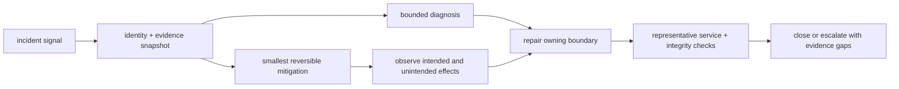
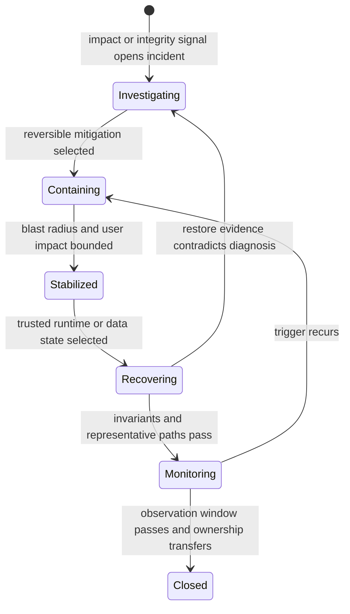
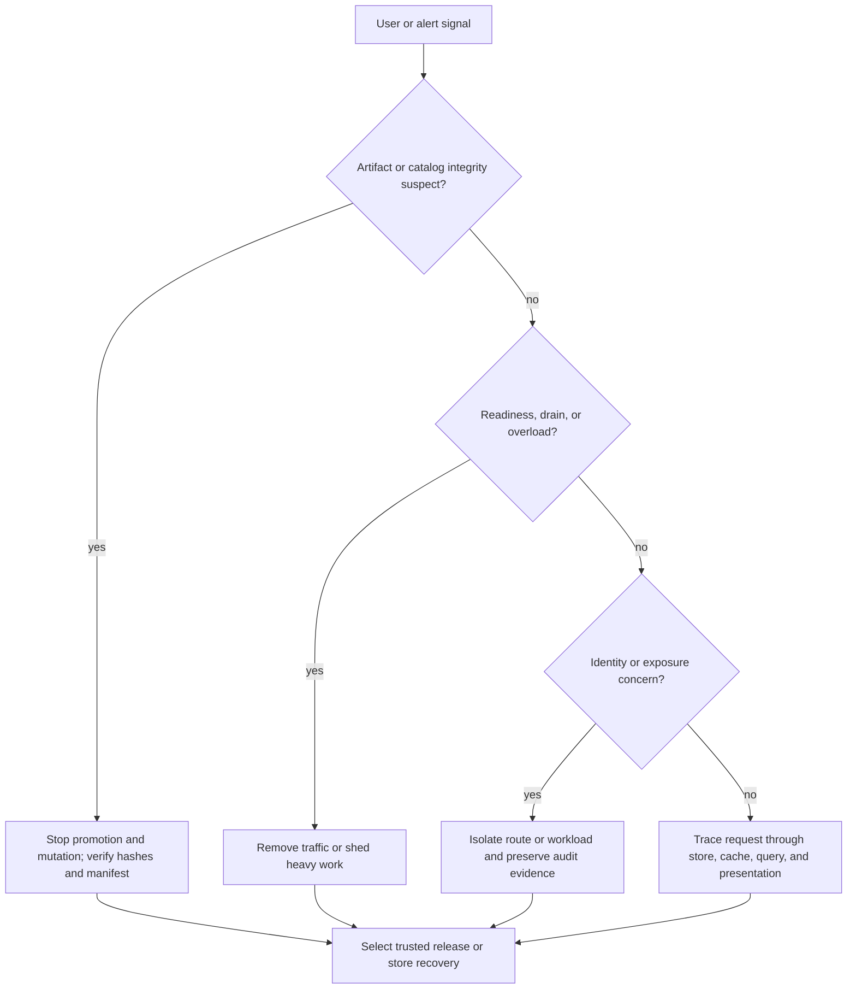
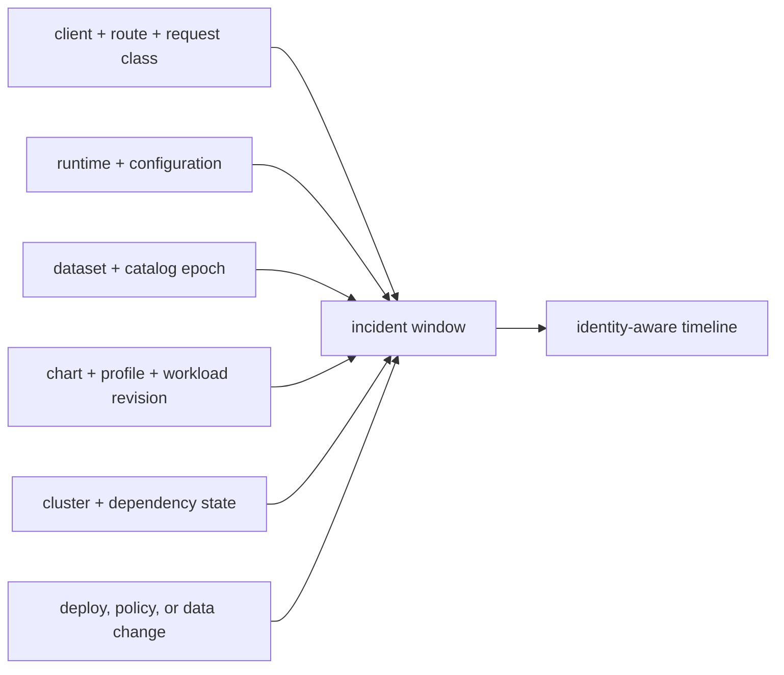
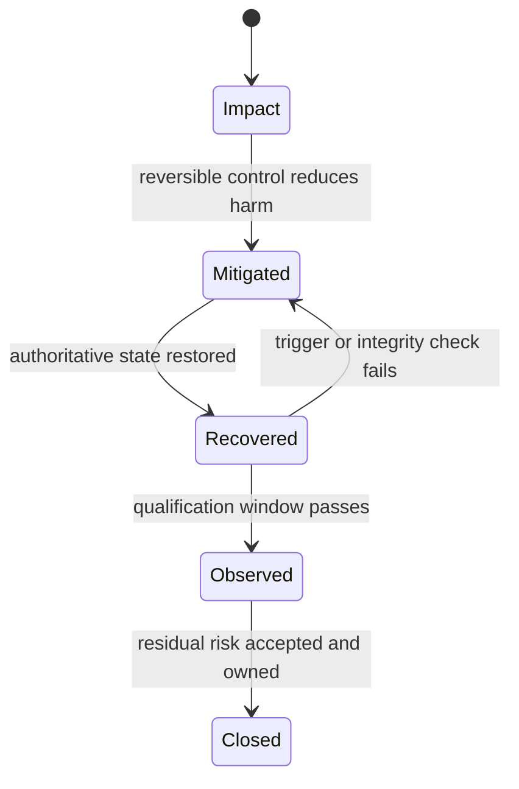

# Incident Response

Atlas incident response preserves release and serving-state identity during
stabilization. Operators first classify the failing boundary. Only then should
they change runtime, catalog, store, cache, policy, or traffic controls.

## Response Sequence

```mermaid
flowchart LR
    Detect[Detect and timestamp] --> Preserve[Preserve release, profile, signal, and trace identity]
    Preserve --> Classify[Classify failing boundary]
    Classify --> Stabilize[Drain, shed, isolate, or roll back]
    Stabilize --> Diagnose[Correlate metrics, logs, traces, and artifact state]
    Diagnose --> Recover[Restore one authoritative boundary]
    Recover --> Validate[Recheck probes and representative user paths]
    Validate --> Record[Retain decision and prevention evidence]
```

Broad simultaneous changes destroy diagnostic value. Stabilize user impact
with the smallest reversible control. Then repair the boundary that owns the
failure.

## Run Two Tracks in Parallel

Response must protect users without destroying the state needed to understand
the incident. The mitigation track changes service state; the evidence track
captures the before-and-after record.

```mermaid
flowchart LR
    signal["incident signal"] --> snapshot["identity + evidence snapshot"]
    snapshot --> mitigate["smallest reversible mitigation"]
    snapshot --> hypothesis["bounded diagnosis"]
    mitigate --> effect["observe intended and unintended effects"]
    hypothesis --> repair["repair owning boundary"]
    effect --> repair
    repair --> validate["representative service + integrity checks"]
    validate --> close["close or escalate with evidence gaps"]
```

| Before changing | Capture | After changing |
| --- | --- | --- |
| traffic or drain state | endpoints, probe transitions, route volume and in-flight work | whether impact fell and which requests moved |
| workload revision | pod identity, image, configuration, events and candidate-scoped signals | readiness, dataset identity and behavior of the restored revision |
| cache state | hit/miss/eviction evidence, object identity and store pressure | cheap-path survival, refill load and object freshness |
| catalog or dataset pointer | active tuple, epoch, manifest, hashes and serving observations | restored tuple plus representative identity-bearing queries |
| credentials or network policy | principal class, decision logs, policy revision and exposure | required success, forbidden denial and audit continuity |

When immediate safety prevents a full snapshot, record exactly which evidence
was sacrificed and why. A successful mitigation can establish reduced impact;
it cannot retroactively establish the original cause.

## Command and Decision Control

Name an incident lead and one active mitigation at a time. Record the expected
effect, owner, start time, observation window, and reversal condition before
each change. Emergency access and administrative endpoints remain subject to
the security boundary; urgency does not turn an ungoverned route into an
acceptable control.

If evidence is incomplete, label the working diagnosis as a hypothesis. A
timeline should distinguish observed facts, interpretations, decisions, and
actions so later review does not turn an early guess into incident truth.

## Operating States

```mermaid
stateDiagram-v2
    [*] --> Investigating: impact or integrity signal opens incident
    Investigating --> Containing: reversible mitigation selected
    Containing --> Stabilized: blast radius and user impact bounded
    Stabilized --> Recovering: trusted runtime or data state selected
    Recovering --> Monitoring: invariants and representative paths pass
    Monitoring --> Closed: observation window passes and ownership transfers
    Monitoring --> Containing: trigger recurs
    Recovering --> Investigating: restore evidence contradicts diagnosis
```

State transitions require evidence. A quiet alert does not by itself establish
stability, and restored probes do not by themselves establish correctness.
Record who authorized each transition and which invariant supported it.

## Response Roles

One person may hold several roles in a small incident, but each responsibility
must remain explicit:

| Responsibility | Decision authority | Required record |
| --- | --- | --- |
| Incident lead | priority, active mitigation, and state transition | decision, owner, timestamp, and reversal condition |
| Operations | traffic, runtime, dependency, and rollback controls | exact action, target identity, and observed effect |
| Evidence custodian | capture, redaction, hashing, and retention | source window, chain of custody, and evidence gaps |
| Communications | user impact and status cadence | audience, known facts, uncertainty, and next update |
| Domain owner | correctness of runtime, dataset, catalog, or security diagnosis | hypothesis, supporting signals, and disconfirming evidence |

Separate authorization from execution for destructive recovery whenever the
response window permits. The operator performing a store restore or dataset
pointer change should be able to name the approving incident decision and the
pre-change evidence capture.

## Classification Matrix

| Symptom class | First evidence | Do not confuse with |
| --- | --- | --- |
| process availability | `/live`, restart history, termination reason, runtime logs | readiness or catalog loss |
| traffic admission | `/readyz`, `/healthz/overload`, endpoint membership, drain state | a dead process |
| catalog or store | catalog freshness, store requests, manifest and checksum evidence | Redis or local cache loss |
| query correctness | request identity, dataset identity, query class, stable error code, trace spans | generic availability |
| capacity | latency histograms, saturation, bulkhead, queue, cache, and overload metrics | data corruption |
| security | authentication and authorization decisions, ingress exposure, admin posture, audit logs | ordinary policy rejection |
| release drift | image, chart, values, dataset, toolchain, checksum, and provenance identity | transient dependency failure |

## Triage Decision Tree

```mermaid
flowchart TD
    Incident[User or alert signal] --> Integrity{Artifact or catalog integrity suspect?}
    Integrity -->|yes| Freeze[Stop promotion and mutation; verify hashes and manifest]
    Integrity -->|no| Admission{Readiness, drain, or overload?}
    Admission -->|yes| Shape[Remove traffic or shed heavy work]
    Admission -->|no| Security{Identity or exposure concern?}
    Security -->|yes| Isolate[Isolate route or workload and preserve audit evidence]
    Security -->|no| Runtime[Trace request through store, cache, query, and presentation]
    Freeze --> Recover[Select trusted release or store recovery]
    Shape --> Recover
    Isolate --> Recover
    Runtime --> Recover
```

## Minimum Incident Record

Retain enough evidence for another operator to reconstruct the decision:

- Incident start, detection source, affected user paths, and severity.
- Runtime version, image digest, chart, values profile, and cluster identity.
- Dataset release, species, assembly, catalog epoch, and artifact hashes.
- Opening alert, probe state, dashboards, logs, metric snapshots, and trace IDs.
- Cache, store, dependency, saturation, and overload state.
- Commands or deployment actions used to drain, isolate, roll back, or recover.
- Recovery validation and the signal that closed the incident.
- Missing or unavailable telemetry, recorded as an explicit evidence gap.

Observability drill results use a structured contract. It records start and end
time, status, metric/log/trace snapshot paths, trace IDs, and expected signals.
Real incidents should preserve at least the same correlation quality.

Maintain a hypothesis ledger for ambiguous failures. Each entry states the
suspected boundary, predicted signal, evidence that would disprove it, and the
next safe observation or action. Close hypotheses as supported, rejected, or
unresolved. This keeps diagnostic exploration separate from the authoritative
incident timeline.

## Accept Evidence from Drills and Experiments

An incident may begin during a fault drill, load run, recovery exercise, or
rollout experiment. Reuse its observations without pretending the controlled
test still owns the event after the blast radius or abort contract fails.

| Incoming evidence | Accept when | Preserve as a limitation |
| --- | --- | --- |
| experiment timeline | monotonic markers and wall-clock correlation are retained | clock offset, missing marker, or controller-only confirmation |
| workload observations | request class, release, dataset, offer, and generator health are known | dropped or unattributed requests |
| fault confirmation | an independent signal confirms target and removal | requested action without observed effect |
| baseline comparison | environment, topology, release, dataset, and workload match | any changed authority or supply |
| cleanup result | residual state was checked before further mutation | incomplete cleanup or environment reuse |

Create one incident identity that references the original run receipt and first
escaped-impact timestamp. Hash or otherwise identify imported artifacts, note
their original custody, and continue the same timeline. Experiment thresholds
remain useful context, but incident stabilization is governed by current user
impact, integrity, security, and recovery authority—not by finishing the test
plan.

## Incident Identity Envelope

An incident may span several releases, datasets, replicas, or traffic routes.
Preserve each identity transition rather than assigning one convenient label to
the whole event.

```mermaid
flowchart LR
    Client["client + route + request class"] --> Window["incident window"]
    Runtime["runtime + configuration"] --> Window
    Dataset["dataset + catalog epoch"] --> Window
    Deploy["chart + profile + workload revision"] --> Window
    Target["cluster + dependency state"] --> Window
    Change["deploy, policy, or data change"] --> Window
    Window --> Timeline["identity-aware timeline"]
```

| Identity change | Required timeline marker |
| --- | --- |
| traffic shift | source, destination, percentage, and endpoint membership |
| workload rollout | old and new revision, image digest, and replica transition |
| dataset promotion | old and new tuple, catalog epoch, manifest, and hashes |
| configuration change | previous and effective digest plus activating event |
| credential rotation | non-secret old and new version identities |
| dependency failover | old and new endpoint or backend identity |

An observation belongs to the identity active at its event time, not the state
visible when the operator later queries it. Split metrics and conclusions at
each transition. Otherwise a healthy replacement can hide the behavior of the
failed revision, or stale telemetry can be blamed on the restored one.

## Preserve Evidence During Signal Loss

Telemetry degradation often accompanies overload, network isolation, or a
collector failure. Preserve independent observations before restarting a pod,
clearing a cache, changing traffic, or widening network access. Those actions
can erase the state that distinguishes a runtime failure from an observation
failure.

| Available source | Preserve first | Interpretation limit |
| --- | --- | --- |
| client response. | Status, correlation headers, timing, route class, and a redacted body. | One response does not measure population impact. |
| Kubernetes control plane. | Admitted workload identity, endpoints, events, restart state, and probe transitions. | Control-plane health does not prove request correctness. |
| workload output. | Bounded logs from affected and healthy replicas with release identity. | Missing logs may reflect collection or process loss. |
| metrics backend. | Raw query, evaluation time, source window, labels, and returned series. | An empty result is not an observed zero. |
| trace backend. | Full representative traces plus sampling and retention context. | Unsampled requests cannot be ruled out. |
| catalog or store. | Active identity, manifest, hashes, freshness, and read results. | Availability alone does not prove runtime consumption. |

If only one source remains available, narrow the claim to what that source can
establish. Record the missing sources and choose mitigations that do not depend
on unobserved correctness. Restoration of telemetry is itself a recovery gate
when promotion, integrity, or security decisions require those signals.

## Recovery Rules

- Cache loss does not authorize store rollback.
- Store unavailability does not establish artifact corruption.
- Policy rejection does not establish dataset absence.
- A healthy process does not establish readiness or acceptable latency.
- Runtime rollback and dataset-store rollback are separate decisions.
- Recovery is incomplete until representative cheap and heavy user paths match
  their expected status, latency, and provenance behavior.

## Mitigation, Recovery, and Closure

These are separate decisions with separate evidence:

| Decision | Establishes | Does not establish |
| --- | --- | --- |
| mitigation | user harm or blast radius was reduced | root cause or trusted state |
| stabilization | operating signals remain bounded for a stated window | permanent repair |
| recovery | selected runtime, data, and security authorities are coherent | recurrence prevention |
| closure | monitoring window passed and remaining work has owners | that uncertainty disappeared |

```mermaid
stateDiagram-v2
    [*] --> Impact
    Impact --> Mitigated: reversible control reduces harm
    Mitigated --> Recovered: authoritative state restored
    Recovered --> Observed: qualification window passes
    Observed --> Closed: residual risk accepted and owned
    Recovered --> Mitigated: trigger or integrity check fails
```

Closure records unresolved hypotheses and lost evidence explicitly. “Unknown”
is a valid bounded conclusion; converting it to “not observed” or “resolved”
weakens the incident record and the next release decision.

## Exit and Escalation Criteria

Leave active response only when traffic admission is intentional, the selected
dataset and runtime identities are known, representative queries pass, required
security controls are restored, and the monitoring window shows no trigger
recurrence. Assign every deferred repair or evidence gap an owner and durable
tracking record.

Escalate when artifact or catalog integrity cannot be established, credentials
or administrative routes may be compromised, rollback cannot restore the
service objective, the blast radius is still growing, or required telemetry is
too incomplete to choose a safe action. Escalation is a risk decision, not an
admission of diagnostic failure.

Continue with [Dashboards and Panels](dashboards-and-panels.md),
[Debug Bundles](../kubernetes/debug-bundles.md), and
[Backup and Recovery](../release/backup-and-recovery.md).
