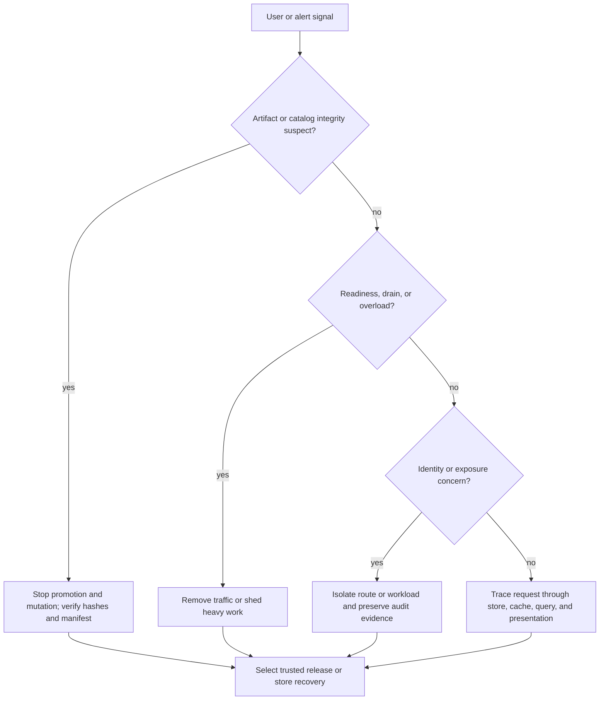

# Incident Response

Atlas incident response preserves release and serving-state identity during
stabilization. Operators first classify the failing boundary. Only then should
they change runtime, catalog, store, cache, policy, or traffic controls.

## Response Sequence

```mermaid
flowchart LR
    Detect[Detect and timestamp] --> Preserve[Preserve release, profile, signal, and trace identity]
    Preserve --> Classify[Classify failing boundary]
    Classify --> Stabilize[Drain, shed, isolate, or roll back]
    Stabilize --> Diagnose[Correlate metrics, logs, traces, and artifact state]
    Diagnose --> Recover[Restore one authoritative boundary]
    Recover --> Validate[Recheck probes and representative user paths]
    Validate --> Record[Retain decision and prevention evidence]
```

Broad simultaneous changes destroy diagnostic value. Stabilize user impact
with the smallest reversible control. Then repair the boundary that owns the
failure.

## Classification Matrix

| Symptom class | First evidence | Do not confuse with |
| --- | --- | --- |
| process availability | `/live`, restart history, termination reason, runtime logs | readiness or catalog loss |
| traffic admission | `/readyz`, `/healthz/overload`, endpoint membership, drain state | a dead process |
| catalog or store | catalog freshness, store requests, manifest and checksum evidence | Redis or local cache loss |
| query correctness | request identity, dataset identity, query class, stable error code, trace spans | generic availability |
| capacity | latency histograms, saturation, bulkhead, queue, cache, and overload metrics | data corruption |
| security | authentication and authorization decisions, ingress exposure, admin posture, audit logs | ordinary policy rejection |
| release drift | image, chart, values, dataset, toolchain, checksum, and provenance identity | transient dependency failure |

## Triage Decision Tree

```mermaid
flowchart TD
    Incident[User or alert signal] --> Integrity{Artifact or catalog integrity suspect?}
    Integrity -->|yes| Freeze[Stop promotion and mutation; verify hashes and manifest]
    Integrity -->|no| Admission{Readiness, drain, or overload?}
    Admission -->|yes| Shape[Remove traffic or shed heavy work]
    Admission -->|no| Security{Identity or exposure concern?}
    Security -->|yes| Isolate[Isolate route or workload and preserve audit evidence]
    Security -->|no| Runtime[Trace request through store, cache, query, and presentation]
    Freeze --> Recover[Select trusted release or store recovery]
    Shape --> Recover
    Isolate --> Recover
    Runtime --> Recover
```

## Minimum Incident Record

Retain enough evidence for another operator to reconstruct the decision:

- Incident start, detection source, affected user paths, and severity.
- Runtime version, image digest, chart, values profile, and cluster identity.
- Dataset release, species, assembly, catalog epoch, and artifact hashes.
- Opening alert, probe state, dashboards, logs, metric snapshots, and trace IDs.
- Cache, store, dependency, saturation, and overload state.
- Commands or deployment actions used to drain, isolate, roll back, or recover.
- Recovery validation and the signal that closed the incident.
- Missing or unavailable telemetry, recorded as an explicit evidence gap.

Observability drill results use a structured contract. It records start and end
time, status, metric/log/trace snapshot paths, trace IDs, and expected signals.
Real incidents should preserve at least the same correlation quality.

## Recovery Rules

- Cache loss does not authorize store rollback.
- Store unavailability does not establish artifact corruption.
- Policy rejection does not establish dataset absence.
- A healthy process does not establish readiness or acceptable latency.
- Runtime rollback and dataset-store rollback are separate decisions.
- Recovery is incomplete until representative cheap and heavy user paths match
  their expected status, latency, and provenance behavior.

Continue with [Dashboards and Panels](dashboards-and-panels.md),
[Debug Bundles](../kubernetes/debug-bundles.md), and
[Backup and Recovery](../release/backup-and-recovery.md).
