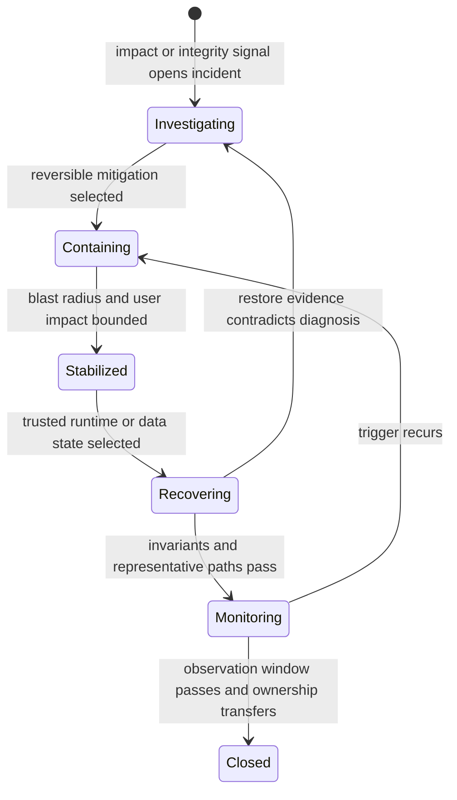
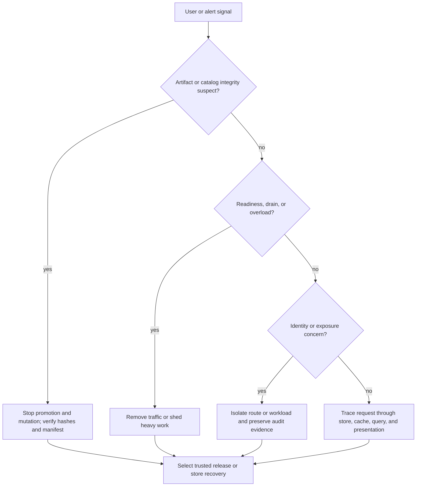

# Incident Response

Atlas incident response preserves release and serving-state identity during
stabilization. Operators first classify the failing boundary. Only then should
they change runtime, catalog, store, cache, policy, or traffic controls.

## Response Sequence

```mermaid
flowchart LR
    Detect[Detect and timestamp] --> Preserve[Preserve release, profile, signal, and trace identity]
    Preserve --> Classify[Classify failing boundary]
    Classify --> Stabilize[Drain, shed, isolate, or roll back]
    Stabilize --> Diagnose[Correlate metrics, logs, traces, and artifact state]
    Diagnose --> Recover[Restore one authoritative boundary]
    Recover --> Validate[Recheck probes and representative user paths]
    Validate --> Record[Retain decision and prevention evidence]
```

Broad simultaneous changes destroy diagnostic value. Stabilize user impact
with the smallest reversible control. Then repair the boundary that owns the
failure.

## Command and Decision Control

Name an incident lead and one active mitigation at a time. Record the expected
effect, owner, start time, observation window, and reversal condition before
each change. Emergency access and administrative endpoints remain subject to
the security boundary; urgency does not turn an ungoverned route into an
acceptable control.

If evidence is incomplete, label the working diagnosis as a hypothesis. A
timeline should distinguish observed facts, interpretations, decisions, and
actions so later review does not turn an early guess into incident truth.

## Operating States

```mermaid
stateDiagram-v2
    [*] --> Investigating: impact or integrity signal opens incident
    Investigating --> Containing: reversible mitigation selected
    Containing --> Stabilized: blast radius and user impact bounded
    Stabilized --> Recovering: trusted runtime or data state selected
    Recovering --> Monitoring: invariants and representative paths pass
    Monitoring --> Closed: observation window passes and ownership transfers
    Monitoring --> Containing: trigger recurs
    Recovering --> Investigating: restore evidence contradicts diagnosis
```

State transitions require evidence. A quiet alert does not by itself establish
stability, and restored probes do not by themselves establish correctness.
Record who authorized each transition and which invariant supported it.

## Response Roles

One person may hold several roles in a small incident, but each responsibility
must remain explicit:

| Responsibility | Decision authority | Required record |
| --- | --- | --- |
| Incident lead | priority, active mitigation, and state transition | decision, owner, timestamp, and reversal condition |
| Operations | traffic, runtime, dependency, and rollback controls | exact action, target identity, and observed effect |
| Evidence custodian | capture, redaction, hashing, and retention | source window, chain of custody, and evidence gaps |
| Communications | user impact and status cadence | audience, known facts, uncertainty, and next update |
| Domain owner | correctness of runtime, dataset, catalog, or security diagnosis | hypothesis, supporting signals, and disconfirming evidence |

Separate authorization from execution for destructive recovery whenever the
response window permits. The operator performing a store restore or dataset
pointer change should be able to name the approving incident decision and the
pre-change evidence capture.

## Classification Matrix

| Symptom class | First evidence | Do not confuse with |
| --- | --- | --- |
| process availability | `/live`, restart history, termination reason, runtime logs | readiness or catalog loss |
| traffic admission | `/readyz`, `/healthz/overload`, endpoint membership, drain state | a dead process |
| catalog or store | catalog freshness, store requests, manifest and checksum evidence | Redis or local cache loss |
| query correctness | request identity, dataset identity, query class, stable error code, trace spans | generic availability |
| capacity | latency histograms, saturation, bulkhead, queue, cache, and overload metrics | data corruption |
| security | authentication and authorization decisions, ingress exposure, admin posture, audit logs | ordinary policy rejection |
| release drift | image, chart, values, dataset, toolchain, checksum, and provenance identity | transient dependency failure |

## Triage Decision Tree

```mermaid
flowchart TD
    Incident[User or alert signal] --> Integrity{Artifact or catalog integrity suspect?}
    Integrity -->|yes| Freeze[Stop promotion and mutation; verify hashes and manifest]
    Integrity -->|no| Admission{Readiness, drain, or overload?}
    Admission -->|yes| Shape[Remove traffic or shed heavy work]
    Admission -->|no| Security{Identity or exposure concern?}
    Security -->|yes| Isolate[Isolate route or workload and preserve audit evidence]
    Security -->|no| Runtime[Trace request through store, cache, query, and presentation]
    Freeze --> Recover[Select trusted release or store recovery]
    Shape --> Recover
    Isolate --> Recover
    Runtime --> Recover
```

## Minimum Incident Record

Retain enough evidence for another operator to reconstruct the decision:

- Incident start, detection source, affected user paths, and severity.
- Runtime version, image digest, chart, values profile, and cluster identity.
- Dataset release, species, assembly, catalog epoch, and artifact hashes.
- Opening alert, probe state, dashboards, logs, metric snapshots, and trace IDs.
- Cache, store, dependency, saturation, and overload state.
- Commands or deployment actions used to drain, isolate, roll back, or recover.
- Recovery validation and the signal that closed the incident.
- Missing or unavailable telemetry, recorded as an explicit evidence gap.

Observability drill results use a structured contract. It records start and end
time, status, metric/log/trace snapshot paths, trace IDs, and expected signals.
Real incidents should preserve at least the same correlation quality.

Maintain a hypothesis ledger for ambiguous failures. Each entry states the
suspected boundary, predicted signal, evidence that would disprove it, and the
next safe observation or action. Close hypotheses as supported, rejected, or
unresolved. This keeps diagnostic exploration separate from the authoritative
incident timeline.

## Recovery Rules

- Cache loss does not authorize store rollback.
- Store unavailability does not establish artifact corruption.
- Policy rejection does not establish dataset absence.
- A healthy process does not establish readiness or acceptable latency.
- Runtime rollback and dataset-store rollback are separate decisions.
- Recovery is incomplete until representative cheap and heavy user paths match
  their expected status, latency, and provenance behavior.

## Exit and Escalation Criteria

Leave active response only when traffic admission is intentional, the selected
dataset and runtime identities are known, representative queries pass, required
security controls are restored, and the monitoring window shows no trigger
recurrence. Assign every deferred repair or evidence gap an owner and durable
tracking record.

Escalate when artifact or catalog integrity cannot be established, credentials
or administrative routes may be compromised, rollback cannot restore the
service objective, the blast radius is still growing, or required telemetry is
too incomplete to choose a safe action. Escalation is a risk decision, not an
admission of diagnostic failure.

Continue with [Dashboards and Panels](dashboards-and-panels.md),
[Debug Bundles](../kubernetes/debug-bundles.md), and
[Backup and Recovery](../release/backup-and-recovery.md).
