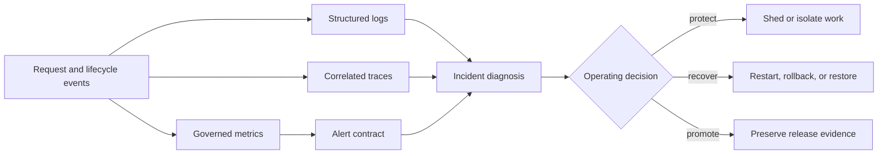

# Observability

Atlas observability is an operating system for decisions, not a collection of
charts. Runtime signals are joined to endpoint contracts, cardinality limits,
alert ownership, drills, and evidence records so an operator can move from a
symptom to a bounded action.

## Signal-to-Decision Model

No signal is authoritative by itself. Metrics quantify scope, traces localize a
request path, and logs explain discrete events and policy decisions. Release,
dataset, profile, and request-class identity must remain visible across them.

## Choose the Operating Question

| Question | Start here | Decision supported |
| --- | --- | --- |
| Is the service safe to receive traffic? | [Health, Readiness, and Drain](health-readiness-and-drain.md) | Admit, drain, or remove an instance. |
| Which runtime path is failing? | [Logging, Metrics, and Tracing](logging-metrics-and-tracing.md) | Localize request, store, cache, or policy behavior. |
| What must a structured event contain? | [Logging Contracts](logging-contracts.md) | Validate event identity, required fields, and data handling. |
| Which metric and labels are governed? | [Metrics Packages](metrics-packages.md) | Validate metric ownership and cardinality. |
| How does trace context move? | [Tracing Pipelines](tracing-pipelines.md) | Validate propagation, correlation, and exporter behavior. |
| Does a signal require action? | [Alert Rules](alert-rules.md) | Page, investigate, or monitor. |
| Which view explains the impact? | [Dashboards and Panels](dashboards-and-panels.md) | Correlate service, dependency, and saturation signals. |
| Can the telemetry path survive failure? | [Telemetry Drills](telemetry-drills.md) | Accept or reject monitoring readiness. |
| What must accompany a decision? | [Operational Evidence Reports](operational-evidence-reports.md) | Preserve reproducible incident or release evidence. |

## Contracted Surface

The checked-in contracts currently define:

- 15 HTTP endpoints with request classes, required metrics, and path spans;
- 39 required metrics with label sets, owners, semantics, and cardinality
  budgets;
- structured log fields and registered request and policy events;
- six required request-path spans plus ten stable lifecycle span identities;
- 20 governed alert specifications tied to an owner, runbook, drill, and
  invariant; and
- two telemetry-path drills for an OpenTelemetry outage and Prometheus gap.

The generated telemetry index inventories the alert catalog, dashboard,
readiness, SLO, and drill artifacts. It proves that those assets are discoverable;
it does not prove that a deployed collector, rule engine, or notification path
is working. Use drills and captured runtime evidence for that claim.

## Investigation Discipline

Preserve the observation window, release and dataset identities, selected
profile, alert and rule versions, dashboard snapshot, representative trace IDs,
and relevant structured logs. Treat missing telemetry as a finding: an incident
cannot be declared understood when the evidence needed to distinguish runtime,
store, catalog, or policy failure is absent.

For incident execution, continue to [Incident Response](incident-response.md).
