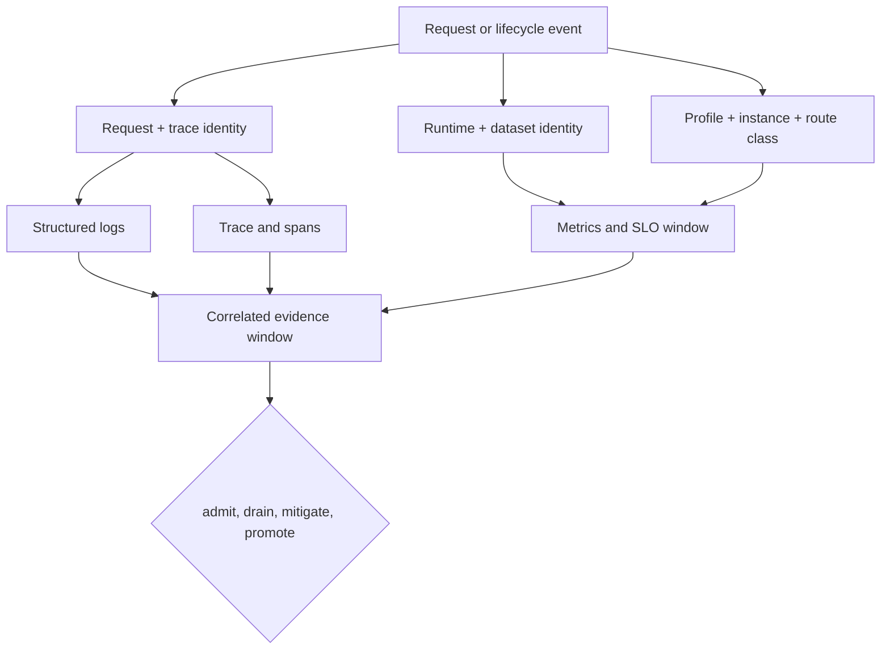
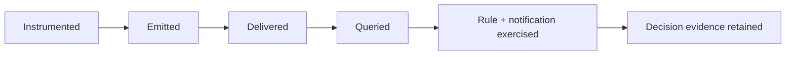

# Observability

Atlas observability connects runtime events to an operator decision. Metrics
quantify scope, traces localize request paths, and structured logs explain
discrete events and policy outcomes. None is sufficient alone. Release,
dataset, profile, route class, and time must remain joinable across the
evidence window.

## Correlation spine

High-cardinality request and trace identifiers belong in logs and traces.
Metrics use bounded dimensions defined by their contracts. A signal that
cannot be joined to the release and observation window is diagnostic material,
not promotion evidence.

## Qualify each signal path

| Level | Evidence | Claim supported |
| --- | --- | --- |
| declared | Registry, rule, dashboard, or drill validates | Intended signal, dimensions, and owner are specified |
| emitted | A known event produces the expected signal | Instrumentation is active for that path |
| delivered | A backend query returns the signal with expected identity and time | Transport, ingestion, and retention worked for the window |
| exercised | A controlled condition reaches rule, notification, view, and correlated context | The response path worked in the named environment |
| retained | Immutable evidence binds the exercise to release, dataset, profile, and time | The decision can be reconstructed after live data expires |

Qualification is per required path. A latency metric cannot establish audit
completeness; one delivered trace cannot establish a population error rate.
Promotion policy must name the minimum level for every required signal.

## Signal-loss decisions

| Missing boundary | Surviving evidence can establish | Claim that remains blocked |
| --- | --- | --- |
| metrics delivery | Individual failures from logs, traces, probes, and clients | Population rate, saturation trend, or SLO compliance |
| trace export | Rates and event classes from metrics and logs | Causal localization across runtime and dependencies |
| centralized logs | Aggregate health and sampled paths | Complete event, audit, or policy-decision history |
| alert notification | Rule state and direct backend queries | That the assigned owner received and acted on the page |
| dashboard rendering | Raw queries and validated panel definitions | That the operator view rendered the same window |
| all telemetry backends | Clients, Kubernetes, pod output, and integrity checks | Promotion, security closure, or absence of hidden failures |

Restoring a path is not retrospective evidence for its blind interval. Record
source and collection clocks, the gap, emergency observation methods, and the
time normal evidence resumed. Start a new continuous qualification window when
policy requires one.

## Contracted surface

The checked-in contracts define 15 HTTP endpoint entries, 39 required metrics,
structured event fields, six request-path spans, ten lifecycle span identities,
20 governed alerts, and two telemetry-path drills. The generated telemetry
index proves that these contracts are discoverable. It does not prove that a
deployed collector, backend, rule engine, dashboard, or notification route is
working.

## Route by operating question

| Question | Read |
| --- | --- |
| May an instance receive traffic? | [Health, Readiness, and Drain](health-readiness-and-drain.md) |
| Which runtime path is failing? | [Logging, Metrics, and Tracing](logging-metrics-and-tracing.md) |
| What must a structured event retain? | [Logging Contracts](logging-contracts.md) |
| Which metric dimensions are governed? | [Metrics Packages](metrics-packages.md) |
| Is the service within budget? | [Service Objectives and Error Budgets](service-objectives-and-error-budgets.md) |
| How does context cross process boundaries? | [Tracing Pipelines](tracing-pipelines.md) |
| Which signal requires action? | [Alert Rules](alert-rules.md) |
| Which view explains impact? | [Dashboards and Panels](dashboards-and-panels.md) |
| Can the evidence path survive failure? | [Telemetry Drills](telemetry-drills.md) |
| What must accompany a decision? | [Operational Evidence Reports](operational-evidence-reports.md) |

Preserve the observation window, release and dataset identities, rule and
dashboard revisions, representative trace IDs, structured events, gaps, and
decision record. Missing telemetry is an operating finding, not an empty pass.
