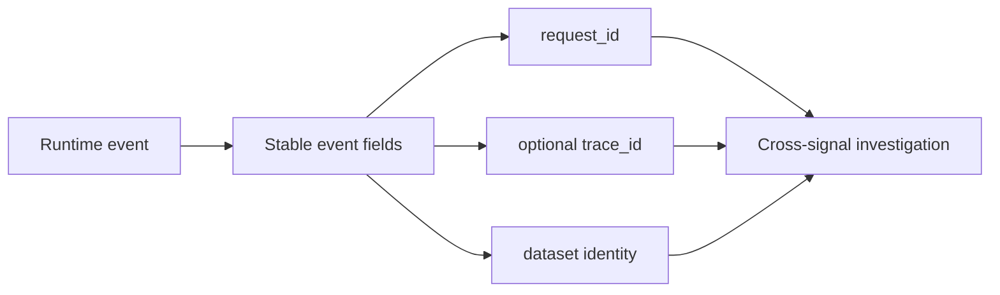

# Logging Contracts

Atlas logs are intended to be structured, correlatable, classifiable, and free
of sensitive fields. The repository currently carries two overlapping format
contracts. Operators must understand their disagreement before treating a log
stream as contract-valid.

## Contract Layers

| Contract | Required shape | Additional control |
| --- | --- | --- |
| Log-field schema | `level`, `msg`, `request_id`; registry also names `event_name` | Uppercase levels, registered events, prohibited PII fields |
| Format-validator contract | `timestamp`, `level`, `target`, `message`, `request_id`, `event_name` | Uppercase or lowercase levels; blocks password, secret, and token content |
| Classification contract | Registered event prefix | Unknown classes are violations |

The field schema uses `msg`; the validator expects `message`. The validator also
requires `timestamp` and `target`, which are not required by the field schema.
The checked-in sample uses `msg`, omits `target`, and uses `ts` rather than
`timestamp` in its first record. It therefore illustrates events but does not
prove one stream satisfies both format contracts.

Until the contracts converge, preserve the validator and schema results
separately. Do not claim complete logging conformance from a pass against only
one of them.

## Event Semantics

The field contract registers six events: request start, request end, policy
rejection, cache lookup, store fetch, and SQLite query. It defines additional
required fields for three:

| Event | Required context |
| --- | --- |
| `request_start` | request ID, path, method |
| `request_end` | request ID, status, latency in milliseconds |
| `policy_rejection` | request ID, policy, mode, reason, limit |

The classification contract separately recognizes runtime, query, ingest,
artifact, configuration, startup, shutdown, and security prefixes. The six
registered event names do not use those prefixes. Registration and
classification are therefore distinct checks rather than one taxonomy.

## Correlation and Data Safety

The field schema prohibits email, phone, IP address, social-security number,
and personal name fields. The validator additionally blocks password, secret,
and token content. These sets are cumulative. Sensitive values must be excluded
before emission, not scrubbed only when evidence is packaged.

## Acceptance

Validate syntax, both required-field contracts, event-specific context,
classification, redaction, and correlation. Include successful and failing
samples for request, policy, store, and query paths. Reject unknown events,
missing identifiers, ambiguous field aliases, or secret-bearing records.

See [Logging, Metrics, and Tracing](logging-metrics-and-tracing.md) for
cross-signal diagnosis and [Operational Evidence Reports](operational-evidence-reports.md)
for retained snapshots.
