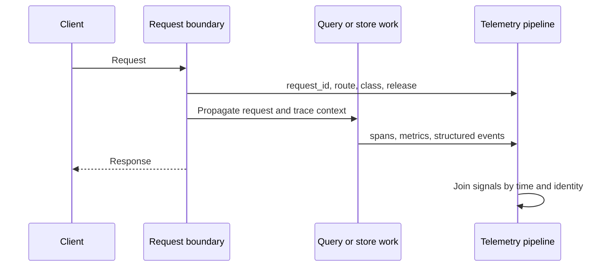
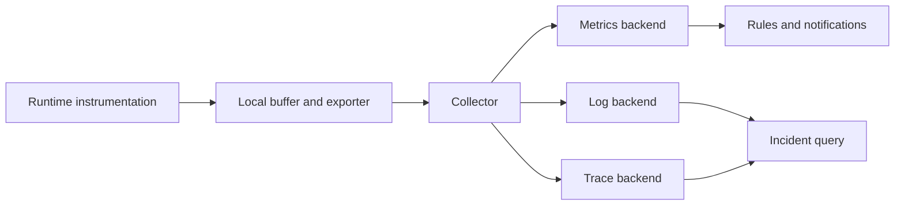
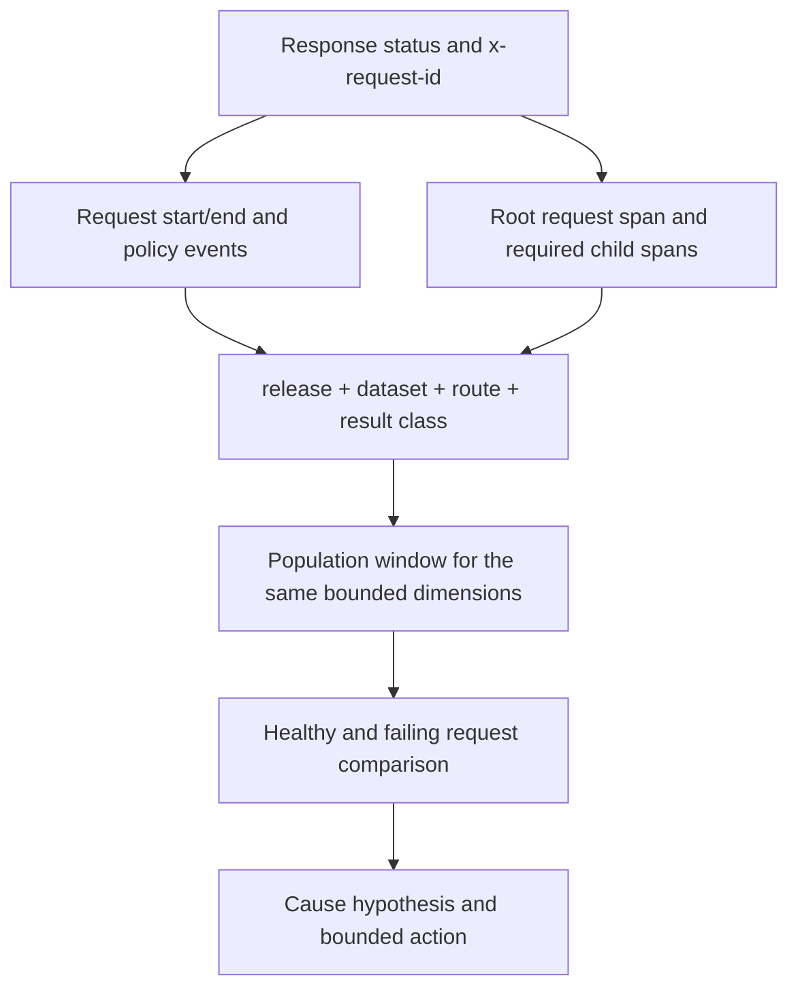

# Logging, Metrics, and Tracing

Atlas uses three complementary signal types. Metrics establish population-level
impact, traces expose a request's execution path, and structured logs retain
event and policy context. Correlation—not volume—is what turns them into useful
operational evidence.

## Request Correlation

Request identifiers are required for request, query, and error spans and must
cross asynchronous boundaries. Logs must correlate with traces; traces must
correlate with request and latency metrics. Metrics intentionally do not carry
request or trace IDs because per-request labels would create unbounded series.

Atlas returns the correlation identity in both `x-request-id` and `x-trace-id`
response headers. Structured error bodies also carry `request_id`. Preserve
the header even for a successful request selected as the healthy comparison;
diagnosis is stronger when failing and successful paths share the same release,
dataset, route class, and time window.

## Telemetry Pipeline Boundaries

Instrumentation success does not establish backend ingestion. Backend
ingestion does not establish retention, queryability, alert evaluation, or
notification delivery. Monitor and drill each boundary required by the
operating claim.

## Failure by Telemetry Boundary

| Boundary | Typical evidence | Safe conclusion |
| --- | --- | --- |
| Instrumentation | expected event, metric, or span is absent from a direct runtime exercise | coverage is missing or disabled; backend health is still unknown |
| Export or scrape | runtime reports drops, exporter errors, queue pressure, or scrape failure | signal left the request path incompletely |
| Backend ingestion | collector accepted data but backend query returns no current series or spans | delivery is not established |
| Retention | recent signals exist but the incident window is missing | current health cannot reconstruct historical behavior |
| Rule evaluation | source series exists but the alert state does not match its expression | rule, labels, or evaluation timing requires investigation |
| Notification | rule fires but no owned notification receipt exists | paging readiness is not established |

A telemetry-path failure should not be rewritten as a runtime success. It is a
separate operational defect that reduces the strength of any release or
incident claim depending on that signal.

## Detect Broken Correlation

Having all three signal types is insufficient when their identities or clocks
cannot join. Test correlation as an operational contract, including failure
paths and non-sampled requests.

| Failure pattern | Consequence | Required correction |
| --- | --- | --- |
| request ID changes across a boundary. | Logs and spans describe separate apparent requests. | Propagate the accepted ingress identity and test asynchronous work. |
| release or dataset identity is absent. | Healthy baseline traffic can mask a failing candidate or artifact. | Attach stable low-cardinality identity at the producing boundary. |
| trace exists but request-end log is absent. | Completion, status, or log delivery is unproven. | Inspect process termination, log export, and event registration. |
| metric window and trace time disagree. | The representative trace cannot support the population claim. | Record clock skew and query a corrected bounded window. |
| only successful traces are retained. | Sampling biases diagnosis away from errors and rare paths. | Preserve error-aware sampling and quantify its policy. |
| a join requires an unbounded metric label. | Cardinality and privacy controls would be weakened. | Join through bounded dimensions, then use logs or traces for request identity. |

A correlation drill passes only when an operator can move from a response
identifier to its logs and trace, then place that request inside the correct
bounded metric population. A dashboard hyperlink alone does not prove the
join.

## Structured Logs

Every governed log record carries `level`, `msg`, and `request_id`; registered
events also carry `event_name`. The event registry defines request start,
request end, policy rejection, cache lookup, store fetch, and SQLite query.
Request-end records include status and latency. Policy rejection records include
the policy, mode, reason, and limit.

Do not emit email, phone, IP address, social-security number, or personal name
fields. Keep high-cardinality request context in logs and traces, not metric
labels. See [Logging Contracts](logging-contracts.md) for the complete event
schema.

## Metrics

The metrics contract declares 39 required signals and their label sets. The
surface covers HTTP behavior, admission and shedding, cache use, registry age,
store requests and errors, dataset state, policy and invariant violations,
resource pressure, and request-stage latency.

Route, status, query type, stage, and error code are permitted dynamic
dimensions in the metric contract. Gene and transcript identifiers, raw names
and regions, IP addresses, request IDs, and trace IDs are forbidden. The
separate global cardinality policy caps the approved label vocabulary at 200
values; each metric also carries its own maximum-series and growth budget.

Use [Metrics Packages](metrics-packages.md) for the registry and golden scrape
surfaces.

## Traces

The endpoint contract assigns each of 15 routes to a cheap, medium, or heavy
class and names the spans required for that path. These include request root,
admission control, dataset resolution, cache lookup, store fetch, SQLite query,
and response serialization.

The tracing registry separately governs stable lifecycle identities for runtime,
HTTP, query, ingest, artifact, registry, configuration, startup, shutdown, and
structured-error spans. Stable trace identifiers are immutable; additions are
allowed, while a rename or deletion requires migration documentation. The two
layers answer different questions: endpoint spans prove request-path coverage,
while stable identities preserve longitudinal incident analysis.

Use [Tracing Pipelines](tracing-pipelines.md) for propagation and exporter
behavior.

## Diagnose with All Three Signals

1. Bound impact with request class, status, latency, saturation, and dependency
   metrics.
2. Select representative failing and successful traces from the same release
   and time window.
3. Correlate their request IDs with structured logs and policy events.
4. Compare dataset, release, and configuration identity before assigning cause.
5. Record sampling gaps, missing labels, or absent events as telemetry defects.

A dashboard can show correlation without establishing causation. Confirm the
fault through the governed contract, a controlled drill, or reproducible
request evidence before changing traffic or data.

## Correlation Walk

Start from the client-visible identifier rather than a broad log search. Check
that the trace contains the spans required by the endpoint contract, then use
bounded metric labels to measure how representative that request is. Never add
gene IDs, transcript IDs, raw regions, request IDs, or trace IDs to metrics to
make this join easier; those values belong in logs and traces.

## Signal Loss and Sampling

Record exporter failures, dropped events, queue saturation, scrape gaps, clock
skew, sampling policy, and retention limits with the observation window. A
missing trace may be sampling; a missing metric series may be instrumentation,
collection, or query failure. Classify the telemetry boundary before inferring
that the runtime event did not happen.

Sampling must preserve error and rare-path diagnostic value. Aggregate metrics
remain necessary for population impact because traces cannot be assumed to
represent the full request distribution.
